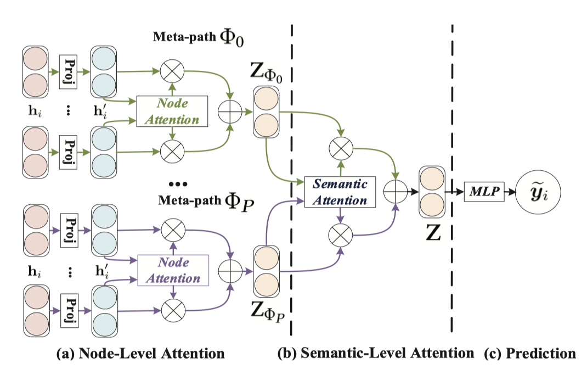
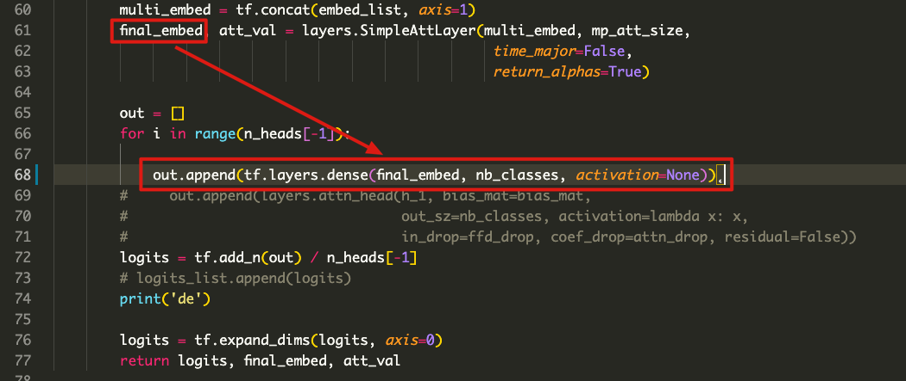

# Baseline: HAN

> by WangYC
>
> @NWPU changan Apr.18th 2022

## 一、文章思路



## 二、代码框架

这篇工作的开源代码可谓是十分粗糙未加工了，不过开源精神还是值得赞赏的哈。

修改后的代码仓库：

https://github.com/Frederick-the-Fox/HAN_baseline

使用说明见readme

## 三、数据集处理

类比dmgi的数据处理。

这里为了保证用在节点分类任务上的数据集的统一来保证对比的公平公正，将我们处理好的基准数据集中的eval数据集分成三份来对HAN进行训练。

这里模型的训练用eval，模型的测试用test

## 四、实验设置修改

HAN的最后是一个MLP，用来将自己的embedding也就是Z做最后的分类效果。



但是仔细观察后发现虽然文章中写的是mlp，然而他竟然也只有一层。。

所以索性直接把mlp前的attn层直接从128维改成64维，从而保持统一。

dropout改成和我们一样的设置：feat_drop 0.3 attn_drop 0.5

开源的代码是在main函数中直接给的参数，我们也直接给参数：

```python
fd3 = {lbl_in: y_train[tr_step * batch_size:(tr_step + 1) * batch_size],
msk_in: train_mask[tr_step * batch_size:(tr_step + 1) * batch_size],
is_train: True,
attn_drop: 0.6,
ffd_drop: 0.6}
```

到最后这里有一个戏剧性的问题出现：

文章中说自己是端到端的模型，也就是从输入直接到分类结果的模型。

然而幸亏我又仔细看了一下他的代码，发现它的test是用knn做的。

他所谓的端到端其实是得到embedding以后再算一个loss，和我们之前理解的端到端是不一样的。

因此转为选择直接保存最中的embedding结果，直接用之前的logreg来做分类。

```python
np.save('dblp_new.npy', jhy_final_embedding)
embed = np.load('dblp_new.npy')
```


## 五、实验结果

### 5.1 dblp

**patience = 100:**

NMI: 0.7610 , ARI : 0.8184, HO :0.7585

[Classification] Macro-F1_mean: 0.9061 var: 0.0040  Micro-F1_mean: 0.9134 var: 0.0034 auc 0.9813
[Classification] Macro-F1_mean: 0.8995 var: 0.0040  Micro-F1_mean: 0.9076 var: 0.0044 auc 0.9818
[Classification] Macro-F1_mean: 0.8993 var: 0.0046  Micro-F1_mean: 0.9066 var: 0.0043 auc 0.9814

**patience = 50:**

NMI: 0.7649 , ARI : 0.8220, HO :0.7627

[Classification] Macro-F1_mean: 0.9048 var: 0.0043  Micro-F1_mean: 0.9120 var: 0.0039 auc 0.9811
[Classification] Macro-F1_mean: 0.9000 var: 0.0042  Micro-F1_mean: 0.9076 var: 0.0042 auc 0.9818
[Classification] Macro-F1_mean: 0.8989 var: 0.0040  Micro-F1_mean: 0.9065 var: 0.0040 auc 0.9813

**patience = 30:**

NMI: 0.7138 , ARI : 0.7656, HO :0.7158

[Classification] Macro-F1_mean: 0.9036 var: 0.0039  Micro-F1_mean: 0.9102 var: 0.0033 auc 0.9805

[Classification] Macro-F1_mean: 0.8995 var: 0.0037  Micro-F1_mean: 0.9063 var: 0.0033 auc 0.9802

[Classification] Macro-F1_mean: 0.8996 var: 0.0034  Micro-F1_mean: 0.9063 var: 0.0032 auc 0.9804

### 5.2 imdb

**patience = 100:**

NMI: 0.1157 , ARI : 0.0912, HO :0.1320

[Classification] Macro-F1_mean: 0.5170 var: 0.0052  Micro-F1_mean: 0.5165 var: 0.0047 auc 0.7062

[Classification] Macro-F1_mean: 0.5152 var: 0.0042  Micro-F1_mean: 0.5148 var: 0.0051 auc 0.7054

[Classification] Macro-F1_mean: 0.5157 var: 0.0040  Micro-F1_mean: 0.5178 var: 0.0039 auc 0.7105

**patience = 50:**

NMI: 0.1046 , ARI : 0.0834, HO :0.1195

[Classification] Macro-F1_mean: 0.5170 var: 0.0052  Micro-F1_mean: 0.5165 var: 0.0047 auc 0.7062

[Classification] Macro-F1_mean: 0.5152 var: 0.0042  Micro-F1_mean: 0.5148 var: 0.0051 auc 0.7054

[Classification] Macro-F1_mean: 0.5157 var: 0.0040  Micro-F1_mean: 0.5178 var: 0.0039 auc 0.7105

**patience = 30:**

NMI: 0.1354 , ARI : 0.1161, HO :0.1552

[Classification] Macro-F1_mean: 0.5131 var: 0.0057  Micro-F1_mean: 0.5098 var: 0.0067 auc 0.7127

[Classification] Macro-F1_mean: 0.5217 var: 0.0054  Micro-F1_mean: 0.5192 var: 0.0067 auc 0.7196

[Classification] Macro-F1_mean: 0.5303 var: 0.0063  Micro-F1_mean: 0.5302 var: 0.0066 auc 0.7204

### 5.3 freebase

**patience = 100:**

NMI: 0.0600 , ARI : -0.0095, HO :0.0434

[Classification] Macro-F1_mean: 0.5735 var: 0.0075  Micro-F1_mean: 0.6089 var: 0.0133 auc 0.7382

[Classification] Macro-F1_mean: 0.5842 var: 0.0055  Micro-F1_mean: 0.6209 var: 0.0072 auc 0.7400

[Classification] Macro-F1_mean: 0.5808 var: 0.0037  Micro-F1_mean: 0.6226 var: 0.0041 auc 0.7386

**patience = 50:**

NMI: 0.1790 , ARI : 0.1687, HO :0.1659

[Classification] Macro-F1_mean: 0.5674 var: 0.0124  Micro-F1_mean: 0.6012 var: 0.0169 auc 0.7384

[Classification] Macro-F1_mean: 0.5764 var: 0.0056  Micro-F1_mean: 0.6118 var: 0.0113 auc 0.7423

[Classification] Macro-F1_mean: 0.5785 var: 0.0054  Micro-F1_mean: 0.6162 var: 0.0092 auc 0.7417

**patience = 30:**

[Classification] Macro-F1_mean: 0.6409  Micro-F1_mean: 0.6930  auc 0.8092

[Classification] Macro-F1_mean: 0.6325  Micro-F1_mean: 0.6850  auc 0.8150

[Classification] Macro-F1_mean: 0.6440  Micro-F1_mean: 0.7030  auc 0.8248

## 六、疑问

为什么这样的模型叫做端到端模型呢。

