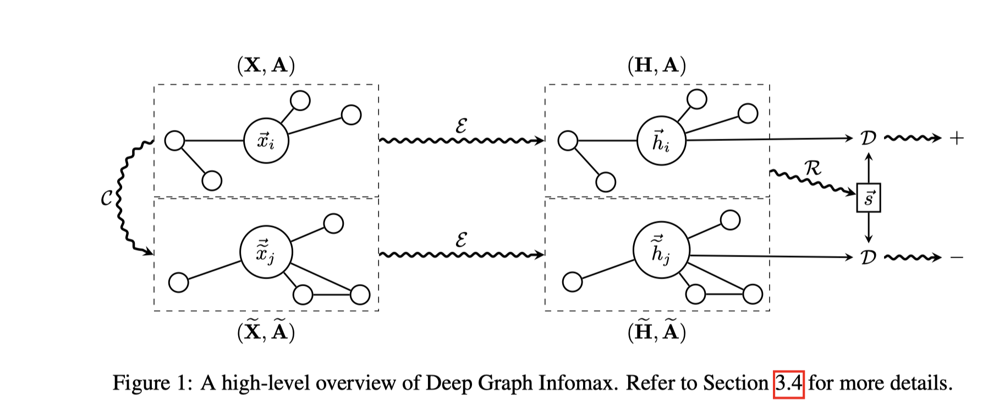
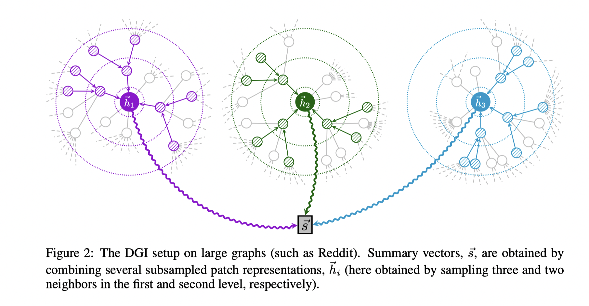

# Baseline:DGI

> by WangYC
>
> @NWPU changan Apr.20th 2022

## 一、文章思路





如果之前看过HDGI再来看DGI，那会发现HDGI基本没有什么特别的创新思路，如果再看过二者的开源代码，那么能够很快发现HDGI其实就是把异质图中的metapath聚合起来作为DGI中的邻接矩阵了。

## 二、baseline代码仓库

## 三、数据处理

与HDGI的数据处理基本相同，以dblp为例：

```python
import numpy as np
import scipy.sparse 
from sklearn.preprocessing import OneHotEncoder
import pickle as pkl
import sys
import scipy.io as scio
from sklearn.metrics import roc_curve, f1_score

def encode_onehot(labels):
    labels = labels.reshape(-1, 1)
    enc = OneHotEncoder()
    enc.fit(labels)
    labels_onehot = enc.transform(labels).toarray()
    return labels_onehot

path = '/home/hangni/HeCo-main/data/dblp/'

#APA
apa = np.load(path + 'apa.npz')
APA = scipy.sparse.coo_matrix((apa['data'].astype(float), (apa['row'], apa['col'])), shape=(apa['shape'][0], apa['shape'][1]))
# APA = (APA.A).astype(float)
# adjs.append(APA)

#APCPA
apcpa = np.load(path + 'apcpa.npz')
APCPA = scipy.sparse.coo_matrix((apcpa['data'].astype(float), (apcpa['row'], apcpa['col'])), shape=(apcpa['shape'][0], apcpa['shape'][1]))
# APCPA = (APCPA.A).astype(float)
# adjs.append(APCPA)

#APTPA
aptpa = np.load(path + 'aptpa.npz')
APTPA = scipy.sparse.coo_matrix((aptpa['data'].astype(float), (aptpa['row'], aptpa['col'])), shape=(aptpa['shape'][0], aptpa['shape'][1]))
# APTPA = (APTPA.A).astype(float)
# adjs.append(APTPA)

#feature
feat = np.load(path + 'a_feat.npz')
feature = scipy.sparse.csr_matrix((feat['data'].astype(float),feat['indices'], feat['indptr']), shape=(feat['shape'][0], feat['shape'][1]))
# feature = (feature.A).astype(float)
print('feature:{}'.format(feature))

#label
labels = np.load(path + 'labels.npy')
label = encode_onehot(labels).astype(int)
print("label:{}".format(label))

#idx_20
test_idx_20 = np.load('/home/hangni/HeCo-main/data/my_data/dblp/test_20.npy')
train_idx_20 = np.load('/home/hangni/HeCo-main/data/my_data/dblp/train_20.npy')
val_idx_20 = np.load('/home/hangni/HeCo-main/data/my_data/dblp/val_20.npy')

#idx_40
test_idx_40 = np.load('/home/hangni/HeCo-main/data/my_data/dblp/test_40.npy')
train_idx_40 = np.load('/home/hangni/HeCo-main/data/my_data/dblp/train_40.npy')
val_idx_40 = np.load('/home/hangni/HeCo-main/data/my_data/dblp/val_40.npy')

#idx_60
test_idx_60 = np.load('/home/hangni/HeCo-main/data/my_data/dblp/test_60.npy')
train_idx_60 = np.load('/home/hangni/HeCo-main/data/my_data/dblp/train_60.npy')
val_idx_60 = np.load('/home/hangni/HeCo-main/data/my_data/dblp/val_60.npy')

#idx_eval
test_idx_eval = np.load('/home/hangni/HeCo-main/data/my_data/dblp/eval_test_40.npy')
train_idx_eval = np.load('/home/hangni/HeCo-main/data/my_data/dblp/eval_train_40.npy')
val_idx_eval = np.load('/home/hangni/HeCo-main/data/my_data/dblp/eval_val_40.npy')

idx_train_list = []
idx_val_list = []
idx_test_list = []
idx_train_list.append(train_idx_eval)
idx_train_list.append(train_idx_20)
idx_train_list.append(train_idx_40)
idx_train_list.append(train_idx_60)
idx_test_list.append(test_idx_eval)
idx_test_list.append(test_idx_20)
idx_test_list.append(test_idx_40)
idx_test_list.append(test_idx_60)
idx_val_list.append(val_idx_eval)
idx_val_list.append(val_idx_20)
idx_val_list.append(val_idx_40)
idx_val_list.append(val_idx_60)

file_data = {'features':feature, 'labels':label,
            'APA':APA, 'APCPA':APCPA, 'APTPA':APTPA,
            'idx_train_list':idx_train_list, 'idx_val_list':idx_val_list, 'idx_test_list':idx_test_list
            }
pkl.dump(file_data, open('dblp.pkl',"wb"), protocol=4)
print('saved')
```

## 四、实验设置

将原本用loss设计早停的方案改为做val任务早停。

同时

## 五、实验结果

### 5.1 dblp(APCPA)

30

​		[Classification] Macro-F1_mean: 0.9058 var: 0.0057  Micro-F1_mean: 0.9156 var: 0.0046 auc 0.9826
​        [Classification] Macro-F1_mean: 0.9062 var: 0.0064  Micro-F1_mean: 0.9155 var: 0.0046 auc 0.9806
​        [Classification] Macro-F1_mean: 0.9046 var: 0.0065  Micro-F1_mean: 0.9147 var: 0.0052 auc 0.9807

50

​		[Classification] Macro-F1_mean: 0.9069 var: 0.0024  Micro-F1_mean: 0.9178 var: 0.0020 auc 0.9853
​        [Classification] Macro-F1_mean: 0.9073 var: 0.0035  Micro-F1_mean: 0.9174 var: 0.0025 auc 0.9842
​        [Classification] Macro-F1_mean: 0.9064 var: 0.0035  Micro-F1_mean: 0.9168 var: 0.0026 auc 0.9839

100

​		[Classification] Macro-F1_mean: 0.9068 var: 0.0036  Micro-F1_mean: 0.9177 var: 0.0028 auc 0.9853
​        [Classification] Macro-F1_mean: 0.9072 var: 0.0027  Micro-F1_mean: 0.9179 var: 0.0020 auc 0.9849
​        [Classification] Macro-F1_mean: 0.9061 var: 0.0026  Micro-F1_mean: 0.9165 var: 0.0022 auc 0.9839

### 5.2 freebase(MAM)

30

​		[Classification] Macro-F1_mean: 0.4875 var: 0.0189  Micro-F1_mean: 0.5358 var: 0.0473 auc 0.6778
​        [Classification] Macro-F1_mean: 0.5063 var: 0.0213  Micro-F1_mean: 0.5500 var: 0.0377 auc 0.6832
​        [Classification] Macro-F1_mean: 0.5226 var: 0.0142  Micro-F1_mean: 0.5554 var: 0.0352 auc 0.6927

50

​		[Classification] Macro-F1_mean: 0.5116 var: 0.0126  Micro-F1_mean: 0.5397 var: 0.0400 auc 0.7141
​        [Classification] Macro-F1_mean: 0.5127 var: 0.0224  Micro-F1_mean: 0.5478 var: 0.0482 auc 0.7139
​        [Classification] Macro-F1_mean: 0.5133 var: 0.0164  Micro-F1_mean: 0.5490 var: 0.0401 auc 0.7124

100

​		[Classification] Macro-F1_mean: 0.5111 var: 0.0125  Micro-F1_mean: 0.5384 var: 0.0347 auc 0.7147
​        [Classification] Macro-F1_mean: 0.5011 var: 0.0176  Micro-F1_mean: 0.5362 var: 0.0454 auc 0.7044
​        [Classification] Macro-F1_mean: 0.5051 var: 0.0117  Micro-F1_mean: 0.5331 var: 0.0399 auc 0.7126

### 5.3 imdbMKM

​		[Classification] Macro-F1_mean: 0.4604 var: 0.0062  Micro-F1_mean: 0.4639 var: 0.0054 auc 0.6589
​        [Classification] Macro-F1_mean: 0.4720 var: 0.0036  Micro-F1_mean: 0.4762 var: 0.0034 auc 0.6789
​        [Classification] Macro-F1_mean: 0.5016 var: 0.0065  Micro-F1_mean: 0.4978 var: 0.0095 auc 0.6803

50

​		[Classification] Macro-F1_mean: 0.4778 var: 0.0036  Micro-F1_mean: 0.4851 var: 0.0032 auc 0.6875
​        [Classification] Macro-F1_mean: 0.4909 var: 0.0112  Micro-F1_mean: 0.5087 var: 0.0042 auc 0.6976
​        [Classification] Macro-F1_mean: 0.4801 var: 0.0071  Micro-F1_mean: 0.4877 var: 0.0066 auc 0.6909

100

​		[Classification] Macro-F1_mean: 0.4722 var: 0.0071  Micro-F1_mean: 0.4799 var: 0.0067 auc 0.6877
​        [Classification] Macro-F1_mean: 0.5009 var: 0.0043  Micro-F1_mean: 0.5059 var: 0.0041 auc 0.7008
​        [Classification] Macro-F1_mean: 0.4910 var: 0.0068  Micro-F1_mean: 0.4947 var: 0.0067 auc 0.6942

