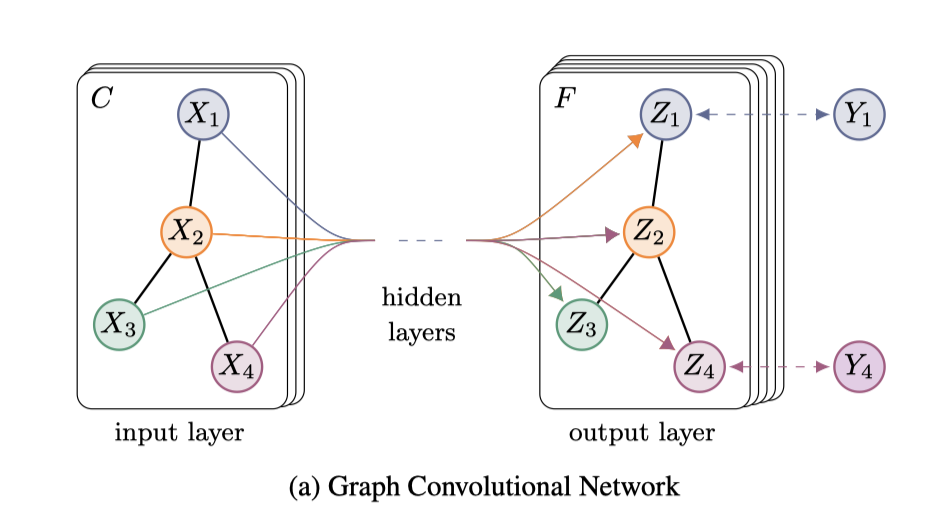

# Baseline:GCN

> by WangYC
>
> @NWPU changan Apr.19th 2022

## 一、文章思路

关于GCN相比无需多言，精简的结构和精简的文章给人印象深刻。



## 二、代码仓库

修改后的代码见仓库：

使用方法见readme

## 三、数据处理

gcn的demo里面cora数据集只有cite和content

label是通过feature的最后一个维度体现的

idx是制定好的数据

因此这里把数据处理中的相应部分做出了改动：

使用时仅需要改path、dataset、metapath即可

```python
def load_data(path="../data/dblp/", dataset="dblp"):
    """Load citation network dataset (cora only for now)"""
    metapath = 'APA'
    print('Loading {} dataset...'.format(dataset))

    idx_features_labels = np.genfromtxt("{}{}.content".format(path, dataset),
                                        dtype=np.dtype(str))
    features = sp.csr_matrix(idx_features_labels[:, 1:-1], dtype=np.float32)
    labels = np.genfromtxt("{}{}.label".format(path, dataset), dtype=np.dtype(str))
    labels = encode_onehot(labels[:, -1])

    # build graph
    idx = np.array(idx_features_labels[:, 0], dtype=np.int32)
    idx_map = {j: i for i, j in enumerate(idx)}
    edges_unordered = np.genfromtxt("{}{}.cites".format(path, metapath),
                                    dtype=np.int32)
    edges = np.array(list(map(idx_map.get, edges_unordered.flatten())),
                     dtype=np.int32).reshape(edges_unordered.shape)
    adj = sp.coo_matrix((np.ones(edges.shape[0]), (edges[:, 0], edges[:, 1])),
                        shape=(labels.shape[0], labels.shape[0]),
                        dtype=np.float32)

    # build symmetric adjacency matrix
    adj = adj + adj.T.multiply(adj.T > adj) - adj.multiply(adj.T > adj)

    features = normalize(features)
    adj = normalize(adj + sp.eye(adj.shape[0]))

    # idx_train = range(140)
    # idx_val = range(200, 500)
    # idx_test = range(500, 1500)

    idx_test = np.load('/home/hangni/HeCo-main/data/my_data/' + dataset + '/eval_test_40.npy').tolist()
    idx_train = np.load('/home/hangni/HeCo-main/data/my_data/' + dataset + '/eval_train_40.npy').tolist()
    idx_val = np.load('/home/hangni/HeCo-main/data/my_data/' + dataset + '/eval_val_40.npy').tolist()

    features = torch.FloatTensor(np.array(features.todense()))
    labels = torch.LongTensor(np.where(labels)[1])
    adj = sparse_mx_to_torch_sparse_tensor(adj)

    idx_train = torch.LongTensor(idx_train)
    idx_val = torch.LongTensor(idx_val)
    idx_test = torch.LongTensor(idx_test)

    return adj, features, labels, idx_train, idx_val, idx_test
```

最后每个数据集有五个相应的文件：

```shell
.
|-- cora
|   |-- README
|   |-- cora.cites
|   `-- cora.content
|-- dblp
|   |-- APA.cites
|   |-- APCPA.cites
|   |-- APTPA.cites
|   |-- data_gen_dblp.py
|   |-- dblp.content
|   `-- dblp.label
|-- freebase
|   |-- MAM.cites
|   |-- MDM.cites
|   |-- MWM.cites
|   |-- data_gen_freebase.py
|   |-- freebase.content
|   `-- freebase.label
`-- imdb
    |-- MAM.cites
    |-- MDM.cites
    |-- MKM.cites
    |-- data_gen_imdb.py
    |-- freebase.content
    `-- freebase.label
```

## 四、实验设置

由于GCN是针对同质图网络，而我们要拿他作为异质图的baseline，因此分别采用不同的metapath作为adj来跑结果，取其中最好的作为成绩。

return 不要logsoft了

反向传播前用xent

val用两个f1和acc加和做早停

test也是输出f1和acc

优化器保持一致

lr保持原模型的

~~同时由于他是端到端的节点分类模型以及训练结果，因此在模型中加入函数来获取hidden层，将其理解为embedding，并改其维度为64，以和其他模型保持统一。~~

```python
class GCN(nn.Module):
    def __init__(self, nfeat, nhid, nclass, dropout):
        super(GCN, self).__init__()

        self.gc1 = GraphConvolution(nfeat, nhid)
        self.gc2 = GraphConvolution(nhid, nclass)
        self.dropout = dropout

    def forward(self, x, adj):
        x = F.relu(self.gc1(x, adj))
        x = F.dropout(x, self.dropout, training=self.training)
        x = self.gc2(x, adj)
        return F.log_softmax(x, dim=1)

    def get_embeds(self, x, adj):
        ebd = F.relu(self.gc1(x, adj))
        return ebd.detach()
```

每次训练完保存当前dataset和当前metapath的结果

更新：经过讨论后决定修改两层卷积后的层数为64，最后加一层linear层和log softmax

```python
class GCN(nn.Module):
    def __init__(self, nfeat, nhid, nclass, dropout):
        super(GCN, self).__init__()

        self.gc1 = GraphConvolution(nfeat, nhid)
        self.gc2 = GraphConvolution(nhid, 64)
        self.Li = nn.Linear(64, nclass)
        self.dropout = dropout

    def forward(self, x, adj):
        x = F.relu(self.gc1(x, adj))
        x = F.dropout(x, self.dropout, training=self.training)
        x = F.relu(self.gc2(x, adj))
        x = F.dropout(x, self.dropout, training=self.training)
        x = self.Li(x)
        return F.log_softmax(x, dim=1)
```

实验的测试改为我们自己的指标：

```python
def test():
    model.eval()
    output = model(features, adj)
    # # print(output.detach().numpy())
    # loss_test = F.nll_loss(output[idx_test], labels[idx_test])
    # acc_test = accuracy(output[idx_test], labels[idx_test])
    # print("Test set results:",
    #       "loss= {:.4f}".format(loss_test.item()),
    #       "accuracy= {:.4f}".format(acc_test.item()))
    output_soft = F.softmax(output, dim = 1).cpu().detach().numpy()
    output = torch.argmax(output, dim=1)
    output = output.cpu().detach().numpy()

    labels_c = labels.cpu().detach().numpy()
    idx_train_c = idx_train.cpu().detach().numpy()
    idx_val_c = idx_val.cpu().detach().numpy()
    idx_test_c = idx_test.cpu().detach().numpy()
    # print("output:{}, labels:{}".format(output, labels_c))
    auc = roc_auc_score(y_true=labels_c[idx_test_c], y_score=output_soft[idx_test_c], multi_class='ovr')
    f1_macro = f1_score(output[idx_test_c], labels_c[idx_test_c], average='macro')
    f1_micro = f1_score(output[idx_test_c], labels_c[idx_test_c], average='micro')
    print("\t[Classification] Macro-F1_mean: {:.4f}  Micro-F1_mean: {:.4f}  auc {:.4f}"
            .format(f1_macro, f1_micro, auc))
```

再更新：

```python
class GCN(nn.Module):
    def __init__(self, nfeat, nhid, nclass, dropout):
        super(GCN, self).__init__()

        self.gc1 = GraphConvolution(nfeat, nhid)
        self.gc2 = GraphConvolution(nhid, 64)
        self.Li = nn.Linear(64, nclass)
        self.dropout = dropout

    def forward(self, x, adj):
        x = F.relu(self.gc1(x, adj))
        x = F.dropout(x, self.dropout, training=self.training)
        x = F.relu(self.gc2(x, adj))
        x = F.dropout(x, self.dropout, training=self.training)
        x = self.Li(x)
        # return F.log_softmax(x, dim=1)
        return x
```


## 五、实验结果

~~ 评估的方式为保存hiddenlayers后用它作为embedding，跑我们自己的下游分类任务以及聚类任务，代码分别为evaluate.py 和clustering.py  ~~

### 5.1 dblp

**APA**

Patience = 30:

​        [Classification] Macro-F1_mean: 0.7144  Micro-F1_mean: 0.7270  auc 0.8922
​        [Classification] Macro-F1_mean: 0.7459  Micro-F1_mean: 0.7530  auc 0.9079
​        [Classification] Macro-F1_mean: 0.7809  Micro-F1_mean: 0.7900  auc 0.9232

**APCPA**

Patience = 30:
        [Classification] Macro-F1_mean: 0.8751  Micro-F1_mean: 0.8850  auc 0.9788
        [Classification] Macro-F1_mean: 0.8861  Micro-F1_mean: 0.8950  auc 0.9832
        [Classification] Macro-F1_mean: 0.8842  Micro-F1_mean: 0.8930  auc 0.9838

Patience = 50:

​		[Classification] Macro-F1_mean: 0.8804  Micro-F1_mean: 0.8910  auc 0.9827
​        [Classification] Macro-F1_mean: 0.8874  Micro-F1_mean: 0.8960  auc 0.9841
​        [Classification] Macro-F1_mean: 0.8872  Micro-F1_mean: 0.8960  auc 0.9847

Patience = 100:

​		[Classification] Macro-F1_mean: 0.8880  Micro-F1_mean: 0.8990  auc 0.9784
​        [Classification] Macro-F1_mean: 0.9086  Micro-F1_mean: 0.9160  auc 0.9835
​        [Classification] Macro-F1_mean: 0.9134  Micro-F1_mean: 0.9210  auc 0.9830

**APTPA**

Patience = 30:

​		[Classification] Macro-F1_mean: 0.0763  Micro-F1_mean: 0.1800  auc 0.7304
​        [Classification] Macro-F1_mean: 0.1103  Micro-F1_mean: 0.2830  auc 0.7530
​        [Classification] Macro-F1_mean: 0.1121  Micro-F1_mean: 0.2890  auc 0.7127

### 5.2 imdb

**MAM**

Patience = 30

​		[Classification] Macro-F1_mean: 0.4271  Micro-F1_mean: 0.4557  auc 0.6154
​        [Classification] Macro-F1_mean: 0.4314  Micro-F1_mean: 0.4386  auc 0.6251
​        [Classification] Macro-F1_mean: 0.4332  Micro-F1_mean: 0.4472  auc 0.6164

**MDM**

Patience = 30

​		[Classification] Macro-F1_mean: 0.3944  Micro-F1_mean: 0.4002  auc 0.5987
​        [Classification] Macro-F1_mean: 0.4263  Micro-F1_mean: 0.4354  auc 0.6201
​        [Classification] Macro-F1_mean: 0.4438  Micro-F1_mean: 0.4450  auc 0.6412

**MKM**

Patience = 30

​		[Classification] Macro-F1_mean: 0.4940  Micro-F1_mean: 0.4920  auc 0.6729
​        [Classification] Macro-F1_mean: 0.4996  Micro-F1_mean: 0.4963  auc 0.6721
​        [Classification] Macro-F1_mean: 0.4878  Micro-F1_mean: 0.4973  auc 0.6808

Patience = 50:

​		[Classification] Macro-F1_mean: 0.4813  Micro-F1_mean: 0.4792  auc 0.6757
​        [Classification] Macro-F1_mean: 0.4790  Micro-F1_mean: 0.4749  auc 0.6754
​        [Classification] Macro-F1_mean: 0.4892  Micro-F1_mean: 0.4963  auc 0.6809

Patience = 100:

​		[Classification] Macro-F1_mean: 0.4740  Micro-F1_mean: 0.4739  auc 0.6718
​        [Classification] Macro-F1_mean: 0.4858  Micro-F1_mean: 0.4888  auc 0.6726
​        [Classification] Macro-F1_mean: 0.4892  Micro-F1_mean: 0.4909  auc 0.6810

### 5.3 freebase

**MAM**

Patience = 30:

​		[Classification] Macro-F1_mean: 0.5497  Micro-F1_mean: 0.6010  auc 0.7349
​        [Classification] Macro-F1_mean: 0.5793  Micro-F1_mean: 0.6090  auc 0.7423
​        [Classification] Macro-F1_mean: 0.5973  Micro-F1_mean: 0.6300  auc 0.7709

Patience = 50:

​		[Classification] Macro-F1_mean: 0.5294  Micro-F1_mean: 0.6050  auc 0.7489
​        [Classification] Macro-F1_mean: 0.5903  Micro-F1_mean: 0.6210  auc 0.7611
​        [Classification] Macro-F1_mean: 0.6141  Micro-F1_mean: 0.6480  auc 0.7835

Patience = 100:

​		[Classification] Macro-F1_mean: 0.5630  Micro-F1_mean: 0.6170  auc 0.7396
​        [Classification] Macro-F1_mean: 0.5683  Micro-F1_mean: 0.6080  auc 0.7457
​        [Classification] Macro-F1_mean: 0.5928  Micro-F1_mean: 0.6130  auc 0.7650

**MDM**

Patience = 30:

​		[Classification] Macro-F1_mean: 0.3178  Micro-F1_mean: 0.3600  auc 0.5222
​        [Classification] Macro-F1_mean: 0.2973  Micro-F1_mean: 0.4890  auc 0.5302
​        [Classification] Macro-F1_mean: 0.3292  Micro-F1_mean: 0.5040  auc 0.5411

**MWM**

Patience = 30:

​		[Classification] Macro-F1_mean: 0.3155  Micro-F1_mean: 0.4430  auc 0.5264
​        [Classification] Macro-F1_mean: 0.3172  Micro-F1_mean: 0.4180  auc 0.5663
​        [Classification] Macro-F1_mean: 0.3843  Micro-F1_mean: 0.4210  auc 0.5773

## 六、疑问

为什么GCN可以在节点分类上做的这么好？？