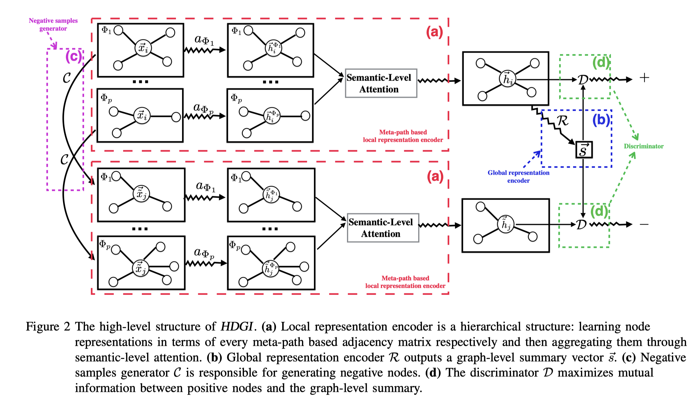

# Baseline:HDGI

> by WangYC
>
> @NWPU changan Apr.20th 2022

### 一、文章思路



从图中可以很直观的看出来他的处理思路。原图结构作为正样本，处理后的图结构作为负样本。首先分别用不同的metapath做了一个encoder，得到所有target节点的embedding，然后利用正样本用了一个全局的聚合处理得到一个全局的embedding。训练的过程就是最大化这个全局的embedding与正样本之间的互信息，最小化全局embedding与负样本之间的互信息。

### 二、baseline代码仓库

https://github.com/Frederick-the-Fox/HDGI_Baseline

### 三、数据处理

HDGI要求的数据大多为稀疏矩阵，因此采用sparse库进行处理

其中的adjs为所有meta-path的邻接关系列表

以dblp为例：

```python
import numpy as np
import scipy.sparse 
from sklearn.preprocessing import OneHotEncoder
import pickle as pkl
import sys
import scipy.io as scio
from sklearn.metrics import roc_curve, f1_score

def encode_onehot(labels):
    labels = labels.reshape(-1, 1)
    enc = OneHotEncoder()
    enc.fit(labels)
    labels_onehot = enc.transform(labels).toarray()
    return labels_onehot

path = '/home/hangni/HeCo-main/data/dblp/'

#adjs
adjs = []

#APA
apa = np.load(path + 'apa.npz')
APA = scipy.sparse.coo_matrix((apa['data'].astype(float), (apa['row'], apa['col'])), shape=(apa['shape'][0], apa['shape'][1]))
# APA = (APA.A).astype(float)
adjs.append(APA)

#APCPA
apcpa = np.load(path + 'apcpa.npz')
APCPA = scipy.sparse.coo_matrix((apcpa['data'].astype(float), (apcpa['row'], apcpa['col'])), shape=(apcpa['shape'][0], apcpa['shape'][1]))
# APCPA = (APCPA.A).astype(float)
adjs.append(APCPA)

#APTPA
aptpa = np.load(path + 'aptpa.npz')
APTPA = scipy.sparse.coo_matrix((aptpa['data'].astype(float), (aptpa['row'], aptpa['col'])), shape=(aptpa['shape'][0], aptpa['shape'][1]))
# APTPA = (APTPA.A).astype(float)
adjs.append(APTPA)

#feature
feat = np.load(path + 'a_feat.npz')
feature = scipy.sparse.csr_matrix((feat['data'].astype(float),feat['indices'], feat['indptr']), shape=(feat['shape'][0], feat['shape'][1]))
# feature = (feature.A).astype(float)
print('feature:{}'.format(feature))

#label
labels = np.load(path + 'labels.npy')
label = encode_onehot(labels).astype(int)
print("label:{}".format(label))

#idx_20
test_idx_20 = np.load('/home/hangni/HeCo-main/data/my_data/dblp/test_20.npy')
train_idx_20 = np.load('/home/hangni/HeCo-main/data/my_data/dblp/train_20.npy')
val_idx_20 = np.load('/home/hangni/HeCo-main/data/my_data/dblp/val_20.npy')

#idx_40
test_idx_40 = np.load('/home/hangni/HeCo-main/data/my_data/dblp/test_40.npy')
train_idx_40 = np.load('/home/hangni/HeCo-main/data/my_data/dblp/train_40.npy')
val_idx_40 = np.load('/home/hangni/HeCo-main/data/my_data/dblp/val_40.npy')

#idx_60
test_idx_60 = np.load('/home/hangni/HeCo-main/data/my_data/dblp/test_60.npy')
train_idx_60 = np.load('/home/hangni/HeCo-main/data/my_data/dblp/train_60.npy')
val_idx_60 = np.load('/home/hangni/HeCo-main/data/my_data/dblp/val_60.npy')

#idx_eval
test_idx_eval = np.load('/home/hangni/HeCo-main/data/my_data/dblp/eval_test_40.npy')
train_idx_eval = np.load('/home/hangni/HeCo-main/data/my_data/dblp/eval_train_40.npy')
val_idx_eval = np.load('/home/hangni/HeCo-main/data/my_data/dblp/eval_val_40.npy')

idx_train_list = []
idx_val_list = []
idx_test_list = []
idx_train_list.append(train_idx_eval)
idx_train_list.append(train_idx_20)
idx_train_list.append(train_idx_40)
idx_train_list.append(train_idx_60)
idx_test_list.append(test_idx_eval)
idx_test_list.append(test_idx_20)
idx_test_list.append(test_idx_40)
idx_test_list.append(test_idx_60)
idx_val_list.append(val_idx_eval)
idx_val_list.append(val_idx_20)
idx_val_list.append(val_idx_40)
idx_val_list.append(val_idx_60)

file_data = {'adjs':adjs, 'features':feature, 'labels':label,
            'idx_train_list':idx_train_list, 'idx_val_list':idx_val_list, 'idx_test_list':idx_test_list
            }
pkl.dump(file_data, open('dblp.pkl',"wb"), protocol=4)
print('saved')
```

### 四、实验设置

修改之前的无监督学习为半监督学习，

将之前单纯用loss做early stop的机制改为用节点分类任务做监督。

测试环节采用与val相同的实验设置，仅用一层liner层做逻辑回归。

### 五、实验结果

### 5.1 dblp

30

​		[Classification] Macro-F1_mean: 0.8712 var: 0.0029  Micro-F1_mean: 0.8787 var: 0.0025 auc 0.9695
​        [Classification] Macro-F1_mean: 0.8879 var: 0.0029  Micro-F1_mean: 0.8941 var: 0.0026 auc 0.9754
​        [Classification] Macro-F1_mean: 0.8891 var: 0.0030  Micro-F1_mean: 0.8947 var: 0.0038 auc 0.9757

50

​		[Classification] Macro-F1_mean: 0.8715 var: 0.0034  Micro-F1_mean: 0.8788 var: 0.0034 auc 0.9696
​        [Classification] Macro-F1_mean: 0.8867 var: 0.0040  Micro-F1_mean: 0.8929 var: 0.0046 auc 0.9750
​        [Classification] Macro-F1_mean: 0.8897 var: 0.0035  Micro-F1_mean: 0.8959 var: 0.0037 auc 0.9762

100

​		[Classification] Macro-F1_mean: 0.8718 var: 0.0025  Micro-F1_mean: 0.8792 var: 0.0023 auc 0.9697
​        [Classification] Macro-F1_mean: 0.8871 var: 0.0030  Micro-F1_mean: 0.8932 var: 0.0032 auc 0.9754
​        [Classification] Macro-F1_mean: 0.8895 var: 0.0028  Micro-F1_mean: 0.8950 var: 0.0036 auc 0.9758

### 5.2 freebase

30

​		[Classification] Macro-F1_mean: 0.5161 var: 0.0088  Micro-F1_mean: 0.5354 var: 0.0093 auc 0.7095
​        [Classification] Macro-F1_mean: 0.5344 var: 0.0063  Micro-F1_mean: 0.5505 var: 0.0096 auc 0.7253
​        [Classification] Macro-F1_mean: 0.5489 var: 0.0066  Micro-F1_mean: 0.5664 var: 0.0069 auc 0.7338

50

​		[Classification] Macro-F1_mean: 0.5139 var: 0.0076  Micro-F1_mean: 0.5355 var: 0.0110 auc 0.7047
​        [Classification] Macro-F1_mean: 0.5344 var: 0.0041  Micro-F1_mean: 0.5514 var: 0.0080 auc 0.7225
​        [Classification] Macro-F1_mean: 0.5478 var: 0.0070  Micro-F1_mean: 0.5645 var: 0.0068 auc 0.7352

100

​		[Classification] Macro-F1_mean: 0.5153 var: 0.0088  Micro-F1_mean: 0.5368 var: 0.0111 auc 0.7105
​        [Classification] Macro-F1_mean: 0.5335 var: 0.0054  Micro-F1_mean: 0.5495 var: 0.0076 auc 0.7270
​        [Classification] Macro-F1_mean: 0.5505 var: 0.0062  Micro-F1_mean: 0.5655 var: 0.0062 auc 0.7349

### 5.3 imdb

30

​		[Classification] Macro-F1_mean: 0.4899 var: 0.0078  Micro-F1_mean: 0.4881 var: 0.0091 auc 0.6887
​        [Classification] Macro-F1_mean: 0.4937 var: 0.0073  Micro-F1_mean: 0.4934 var: 0.0072 auc 0.6948
​        [Classification] Macro-F1_mean: 0.5170 var: 0.0040  Micro-F1_mean: 0.5168 var: 0.0045 auc 0.7099

50

​		[Classification] Macro-F1_mean: 0.4834 var: 0.0106  Micro-F1_mean: 0.4857 var: 0.0089 auc 0.6842
​        [Classification] Macro-F1_mean: 0.4851 var: 0.0067  Micro-F1_mean: 0.4891 var: 0.0073 auc 0.6936
​        [Classification] Macro-F1_mean: 0.5144 var: 0.0109  Micro-F1_mean: 0.5157 var: 0.0091 auc 0.7018

100

​		[Classification] Macro-F1_mean: 0.4822 var: 0.0098  Micro-F1_mean: 0.4832 var: 0.0103 auc 0.6812
​        [Classification] Macro-F1_mean: 0.4821 var: 0.0070  Micro-F1_mean: 0.4861 var: 0.0060 auc 0.6925
​        [Classification] Macro-F1_mean: 0.5108 var: 0.0100  Micro-F1_mean: 0.5120 var: 0.0120 auc 0.6988

