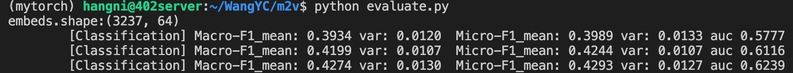

# Baseline:mp2vec

> by WangYC_99
>
> @NWPU chang'an May.9th

## 实验设置

### 1. imdb

batchsize20 lr0.01 

### 2. freebase

Batchsize10 lr0.01

### 3. dblp

batchsize 20 lr 0.01

	[Classification] Macro-F1_mean: 0.4801 var: 0.0071  Micro-F1_mean: 0.4999 var: 0.0067 auc 0.7377
	[Classification] Macro-F1_mean: 0.4809 var: 0.0075  Micro-F1_mean: 0.5059 var: 0.0051 auc 0.7508
	[Classification] Macro-F1_mean: 0.4910 var: 0.0078  Micro-F1_mean: 0.5159 var: 0.0077 auc 0.7800