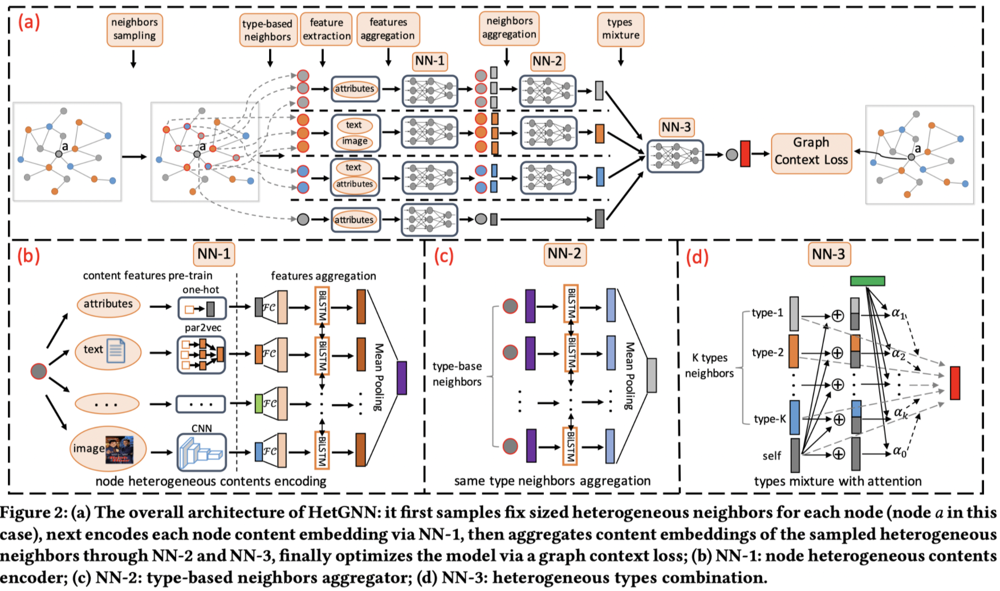

# Baseline：HetGNN

> by WangYC
>
> @NWPU changan Apr.16th 2022
>
> 原文：https://www3.nd.edu/~dial/publications/zhang_2019_heterogeneous.pdf

## 1. 文章工作概述

文章发表于2019年的KDD会议，当时的异质图研究还局限于研究结构/研究属性，hetgnn将结构以及属性特征结合起来，并且利用了attention的机制在里面。hetgnn的内容：首先利用randomwalk对每个目标节点生成固定数量的邻居，随后利用了三层网络对这个每个节点进行embedding，最后通过graph context loss来计算误差。



## 2. 代码结构思路

```shell
.
|-- README.md
|-- code
|   |-- DeepWalk.py
|   |-- HetGNN.py
|   |-- __pycache__
|   |   |-- args.cpython-38.pyc
|   |   |-- data_generator.cpython-38.pyc
|   |   `-- tools.cpython-38.pyc
|   |-- application.py
|   |-- args.py
|   |-- args.pyc
|   |-- data_generator.py
|   |-- data_generator.pyc
|   |-- input_data_process.py
|   |-- link_prediction_model.py
|   |-- link_prediction_model.pyc
|   |-- node_classification_model.py
|   |-- node_classification_model.pyc
|   |-- node_clustering_model.py
|   |-- node_clustering_model.pyc
|   |-- raw_data_process.py
|   |-- tools.py
|   `-- tools.pyc
|-- data
|   `-- academic
|       |-- a_a_list_test.txt
|       |-- a_a_list_train.txt
|       |-- a_class_test.txt
|       |-- a_class_train.txt
|       |-- a_p_cite_list_test.txt
|       |-- a_p_cite_list_train.txt
|       |-- a_p_list_test.txt
|       |-- a_p_list_train.txt
|       |-- a_v_list_test.txt
|       |-- a_v_list_train.txt
|       |-- het_neigh_train.txt
|       |-- het_random_walk.txt
|       |-- node_net_embedding.txt
|       |-- p_a_list_test.txt
|       |-- p_a_list_train.txt
|       |-- p_abstract_embed.txt
|       |-- p_p_citation_list.txt
|       |-- p_p_cite_list_test.txt
|       |-- p_p_cite_list_train.txt
|       |-- p_time.txt
|       |-- p_title_embed.txt
|       |-- p_v.txt
|       `-- v_p_list_train.txt
`-- model_save
```

参数解析的部分有一个小亮点是提供了help接口：

```python
parser.add_argument('--train_test_label', type= int, default = 0,
help='train/test label: 0 - train, 1 - test, 2 - code test/generate negative ids for evaluation')
```

主文件HetGNN.py：

定义了网络建立以及模型训练函数。

其中main函数引用args.py来进行参数读取，网络建立函数利用tools.py来读取模型、利用input_data_process.py来进行数据获取。

算法思路：

```
input :pre-trained content features of v ∈ V , triplets set T walk 
output :optimized model parameters Θ (for inferring node embeddings E) 
  1 while not done do 
    2 sample a batch of (v, v c , v c ′ ) in T walk 
    3 formulate embeddings of v, v c , and v c ′ by Eq. 
    4 accumulate the objective by Eq. 
    5 update the parameters Θ by Adam 
    6 end 
  7 return optimized Θ
```

## 3. 数据处理

以dblp为例：

目标数据形式为txt文件

```yaml
a_p_list_train.txt: paper neighbor list of each author in training data

p_a_list_train.txt: author neighbor list of each paper in training data

p_p_citation_list.txt: paper citation neighbor list of each paper 

v_p_list_train.txt: paper neighbor list of each venue in training data

p_v.txt: venue of each paper

p_title_embed.txt: pre-trained paper title embedding

p_abstract_embed.txt: pre-trained paper abstract embedding

node_net_embedding.txt: pre-trained node embedding by network embedding

het_neigh_train.txt: generated neighbor set of each node by random walk with re-start 

het_random_walk.txt: generated random walks as node sequences (corpus) for model training
```

### 3.1 邻接关系：

以p_a_train为例子：思路就是循环查找匹配

```python
#p_a_list
pa = np.loadtxt('/home/hangni/WangYC/HeCo-main/data/dblp/pa.txt')
pa = pa.astype(int)
pa = pa.astype(str)
## p_a_list_train
### train_20
flag_now = -1
target = open('./p_a_list_train_20.txt', 'w', encoding='utf-8')
for each in pa:
    i = each[0].astype(int)
    if i in train_20:
        if i > flag_now:    
            target.writelines('\n' + str(i) + ':' + each[1])
            flag_now = i
        else:
            target.writelines(',' + each[1])
target.close()
###
```

关于数据集中同类型节点之间的cite关系里面没有，会不会有影响？

### 3.2 预训练特征信息

统一用feature来代替.

## 4. 代码修改

由于数据部分与我们的工作实在是太不一致了，而开源的方法与数据的绑定关系太过于密切，因此性价比较低，做出以上尝试以后到此停止了对此baseline的研究。

## 5. 疑问

* Args.train_test_label == 2的时候到底是什么意思？ 是负样本还是随机游走生成邻居？
* hetgnn的数据集中要求有同类型节点之间的邻接关系，而目标数据集中都没有，会不会有影响？
* 数据中node_net_embedding的第一个索引没看懂

