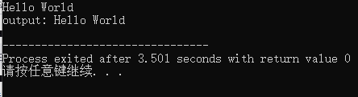
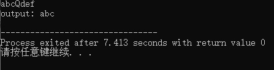
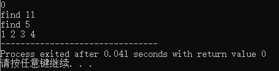

# C++ 部分数据结构与操作回顾整理

> by WangYC
>
> @NWPU changan Mar.16th-Mar.19th 2022

cpp相比于c要自己构建数据结构不同，它的stl对一些较为复杂的数据结构与操作进行了很好地封装。

本文以各场合笔试为出发点，对cpp的数据结构与一些常用操作进行回顾整理。

## 一、数组与字符串操作

### 1.1 数组作为函数形参的三种写法

1. 直接用指针

   ```cpp
   void Function (int *arr)
   ```

2. 用已知大小数组

   ```cpp
   void Function (int arr[10])
   ```

3. 用未知大小数组（数组名字[]）

   ```cpp
   void Function (int arr[])
   ```

### 1.2 数组作为函数返回值

函数声明必须使用指针形式

```cpp
int* Function(parameters)
```

### 1.3 字符串存储结构

以'\0'结尾的数组。其中'\0'null字符的ascii码值。

### 1.4 C风格的字符串定义

```cpp
char site[7] = {'R', 'U', 'N', 'O', 'O', 'B', '\0'};
```

```cpp
char site[] = "RUNOOB";
```

直接cout数组名即可：（自动检测到末尾是\0因此以字符串的格式输出）

```cpp
char site[7] = {'R', 'U', 'N', 'O', 'O', 'B', '\0'};
cout << site << endl;
```

### 1.5 C++ 标准库中的 String 类

```cpp
string s1, s2;
```

### 1.6 C++ 用来操作以null 结尾的字符串的函数

包含头文件cstring

| 序号 | 函数 & 目的                                                  |
| :--- | :----------------------------------------------------------- |
| 1    | **strcpy(s1, s2);**<br /> 复制字符串 s2 到字符串 s1。        |
| 2    | **strcat(s1, s2);** <br />连接字符串 s2 到字符串 s1 的末尾。连接字符串也可以用 **+** 号，例如: `string str1 = "runoob"; string str2 = "google"; string str = str1 + str2;` |
| 3    | **strlen(s1);** <br />返回字符串 s1 的长度。                 |
| 4    | **strcmp(s1, s2);**<br /> 如果 s1 和 s2 是相同的，则返回 0；如果 s1<s2 则返回值小于 0；如果 s1>s2 则返回值大于 0。 |
| 5    | **strchr(s1, ch);** <br />返回一个指针，指向字符串 s1 中字符 ch 的第一次出现的位置。 |
| 6    | **strstr(s1, s2);** <br />返回一个指针，指向字符串 s1 中字符串 s2 的第一次出现的位置。 |

### 1.7 strcmp中所谓字符串的大于、小于和等于的判断依据

两个字符串自左向右逐个字符相比（按 ASCII 值大小相比较），直到出现不同的字符或遇 **\0** 为止。如：

```
1."A"<"B" 
2."A"<"AB" 
3."Apple"<"Banana" 
4."A"<"a" 
5."compare"<"computer"
```

特别注意：**strcmp(const char \*s1,const char \* s2)** 这里面只能比较字符串，即可用于比较两个字符串常量，或比较数组和字符串常量，不能比较数字等其他形式的参数。

ANSI 标准规定，返回值为正数，负数，0 。而确切数值是依赖不同的C实现的。

当两个字符串不相等时，C 标准没有规定返回值会是 1 或 -1，只规定了正数和负数。

有些会把两个字符的 ASCII 码之差作为比较结果由函数值返回。但无论如何不能以此条依据作为程序中的流程逻辑。

### 1.8 strchr与strlen相配合返回字符在字符串中的下标：

```cpp
#include <iostream>

using namespace std;

int main()
{
	char* s1 = "abcdefghijklmn";
	char chr = 'd';
	cout << "the position of chr in thr string:" << strlen(s1) - strlen(strchr(s1, chr)) << endl;
	cout << "val:" << s1[strlen(s1) - strlen(strchr(s1, chr))] << endl;	
	return 0;
}
```

strstr与strchr用法类似，可以返回字串在目标字符串中的位置。

## 二、文件操作

cpp利用fstream进行文件的读写。

| 数据类型 | 描述                                                         |
| -------- | ------------------------------------------------------------ |
| ifstream | 该数据类型表示输入文件流，用于从文件读取信息。               |
| fstream  | 该数据类型通常表示文件流，且同时具有 ofstream 和 ifstream 两种功能，这意味着它可以创建文件，向文件写入信息，从文件读取信息。 |
| ofstream | 该数据类型表示输出文件流，用于创建文件并向文件写入信息。     |

### 2.1 文件打开

```cpp
void open(const char *filename, ios::openmode mode);
```

**open()** 成员函数的第一参数指定要打开的文件的名称和位置，第二个参数定义文件被打开的模式.

| 模式标志   | 描述                                                         |
| :--------- | :----------------------------------------------------------- |
| ios::app   | 追加模式。所有写入都追加到文件末尾。                         |
| ios::ate   | 文件打开后定位到文件末尾。                                   |
| ios::in    | 打开文件用于读取。                                           |
| ios::out   | 打开文件用于写入。                                           |
| ios::trunc | 如果该文件已经存在，其内容将在打开文件之前被截断，即把文件长度设为 0。 |

### 2.2 一次性读取文件的所有行内容

```cpp
#include <iostream>
#include <fstream>
#include <sstream>

using namespace std;

int main()
{
	fstream file;
	file.open("a.txt", ios::in | ios::out);
	stringstream buffer;
	buffer << file.rdbuf();
	string s(buffer.str());
	cout << s;
	return 0;
}
```

## 三、输入输出流

cin.getline(): 可以用于读取带空格的输入

三个参数分别为要输入进的对象（数组）、读取输入的最大行数以及以遇到什么字符停止读入。

```cpp
char data[20] = {0};
	cin.getline(data,20);
	cout << "output:" << " ";
	for (int i = 0; i < 20; i++)
	{
		cout << data[i];
	}
	cout << endl;
```



可以利用第三个参数来决定遇到那个字符停止读入。默认为回车。

```cpp
cin.getline(data,20,'Q');
```




## 四、队列

### 4.1 结构概念

FIFO

### 4.2 STL定义

queue的操作：

- front()：返回 queue 中第一个元素的引用。如果 queue 是常量，就返回一个常引用；如果 queue 为空，返回值是未定义的。
- back()：返回 queue 中最后一个元素的引用。如果 queue 是常量，就返回一个常引用；如果 queue 为空，返回值是未定义的。
- push(const T& obj)：在 queue 的尾部添加一个元素的副本。这是通过调用底层容器的成员函数 push_back() 来完成的。
- push(T&& obj)：以移动的方式在 queue 的尾部添加元素。这是通过调用底层容器的具有右值引用参数的成员函数 push_back() 来完成的。
- pop()：删除 queue 中的第一个元素。
- size()：返回 queue 中元素的个数。
- empty()：如果 queue 中没有元素的话，返回 true。
- emplace()：用传给 emplace() 的参数调用 T 的构造函数，在 queue 的尾部生成对象。
- swap(queue<T> &other_q)：将当前 queue 中的元素和参数 queue 中的元素交换。它们需要包含相同类型的元素。也可以调用全局函数模板 swap() 来完成同样的操作。

**ps：emplace()比push()要节省内存。因为emplace是直接在相应位置创建数据，但是push是先创建数据然后在拷贝到相应未知，多了拷贝这一步。**

### 4.3 优先级队列（堆）

优先队列容器与队列一样，只能从队尾插入元素，从队首删除元素。但是它有一个特性，就是队列中最大的元素总是位于队首，所以出队时，并非按照先进先出的原则进行，而是将当前队列中最大的元素出队。这点类似于给队列里的元素进行了由大到小的顺序排序。元素的比较规则默认按元素值由大到小排序，可以重载“<”操作符来重新定义比较规则。

优先级队列可以用向量(vector)或双向队列(deque)来实现(注意list container不能用来实现queue，因为list的迭代器不是任意存取iterator，而pop中用到堆排序时是要求randomaccess iterator 的!)：

```cpp
priority_queue<vector<int>, less<int> > pq1; 　　　 // 使用递增less<int>函数对象排序
priority_queue<deque<int>, greater<int> > pq2; 　　// 使用递减greater<int>函数对象排序
```

其成员函数有“判空(empty)” 、“尺寸(Size)” 、“栈顶元素(top)” 、“压栈(push)” 、“弹栈(pop)”等。

#### 4.3.1 优先级队列操作

empty() 　　  如果队列为空，则返回真

pop()　　　　删除对顶元素，删除第一个元素

push() 　　   加入一个元素

size() 　　　  返回优先队列中拥有的元素个数

top() 　　　　返回优先队列对顶元素，返回优先队列中有最高优先级的元素

**ps：优先级队列是top，不是front或者back**

```cpp
void queue_test()
{
	queue<uint16> q;
	q.push(1);
	q.emplace(2);
	cout << "front & back: " << q.front() << q.back() << endl; 
}

void pri_queue_test()
{
	priority_queue<uint16> q;
	for (int i = 10; i > 0; i--)
	{
		q.emplace(i);
	}
	cout << "top:" << q.top();
}
```

#### 4.3.2 声明方式

1、普通方法：

```cpp
priority_queue<int> q;  　　　　　　　　　　　  //通过操作，按照元素从大到小的顺序出队
```

```cpp
priority_queue<int,vector<int>, greater<int> > q; 　　//通过操作，按照元素从小到大的顺序出队
```

2、自定义优先级：

```cpp
struct cmp {   
　　operator bool ()(int x, int y)   
　　{     
　　　　 return　x > y;　　 // x小的优先级高    //也可以写成其他方式，如： return p[x] > p[y];表示p[i]小的优先级高
　　}
};
priority_queue<int, vector<int>, cmp> q;  //定义方法
//其中，第二个参数为容器类型。第三个参数为比较函数。
```

## 五、栈

### 5.1 结构概念

与队列相反，LIFO

### 5.2 STL定义

push(x) 	将x加入栈中，即入栈操作

pop()	 出栈操作(删除栈顶)，只是出栈，没有返回值

top()	 返回第一个元素(栈顶元素)

size()	 返回栈中的元素个数

empty() 	当栈为空时，返回 true

ps：只能取pop不能像queue一样取front和back

### 5.3 栈和队列的相互实现：

#### 5.3.1 用队列实现栈

```cpp
class MyStack {
public:

    queue<int> q1;
    queue<int> q2;
    MyStack() {

    }
    
    void push(int x) {
        q2.push(x);
        while (!q1.empty())
        {
            q2.push(q1.front());
            q1.pop();
        }
        swap(q1, q2);
    }
    
    int pop() {
        int now = q1.front();
        q1.pop();
        return now;
    }
    
    int top() {
        return q1.front();
    }
    
    bool empty() {
        return q1.empty();
    }
};
```

#### 5.3.2 用栈实现队列

```cpp
class MyQueue {
public:
    stack<int> s1;
    stack<int> s2;

    MyQueue() {

    }
    
    void push(int x) {
        while(!s1.empty())
        {
            s2.push(s1.top());
            s1.pop();
        }
        s1.push(x);
        while(!s2.empty())
        {
            s1.push(s2.top());
            s2.pop();
        }
    }
    
    int pop() {
        int temp = s1.top();
        s1.pop();
        return temp;
    }
    
    int peek() {
        return s1.top();
    }
    
    bool empty() {
        return s1.empty();
    }
};
```

## 六、排序二叉树

set和map

底层调用了红黑树接口。

### set

| 成员方法         | 功能                                                         |
| ---------------- | ------------------------------------------------------------ |
| begin()          | 返回指向容器中第一个（注意，是已排好序的第一个）元素的双向迭代器。如果 set 容器用 const 限定，则该方法返回的是 const 类型的双向迭代器。 |
| end()            | 返回指向容器最后一个元素（注意，是已排好序的最后一个）所在位置后一个位置的双向迭代器，通常和 begin() 结合使用。如果 set 容器用 const 限定，则该方法返回的是 const 类型的双向迭代器。 |
| rbegin()         | 返回指向最后一个（注意，是已排好序的最后一个）元素的反向双向迭代器。如果 set 容器用 const 限定，则该方法返回的是 const 类型的反向双向迭代器。 |
| rend()           | 返回指向第一个（注意，是已排好序的第一个）元素所在位置前一个位置的反向双向迭代器。如果 set 容器用 const 限定，则该方法返回的是 const 类型的反向双向迭代器。 |
| cbegin()         | 和 begin() 功能相同，只不过在其基础上，增加了 const 属性，不能用于修改容器内存储的元素值。 |
| cend()           | 和 end() 功能相同，只不过在其基础上，增加了 const 属性，不能用于修改容器内存储的元素值。 |
| crbegin()        | 和 rbegin() 功能相同，只不过在其基础上，增加了 const 属性，不能用于修改容器内存储的元素值。 |
| crend()          | 和 rend() 功能相同，只不过在其基础上，增加了 const 属性，不能用于修改容器内存储的元素值。 |
| find(val)        | 在 set 容器中查找值为 val 的元素，如果成功找到，则返回指向该元素的双向迭代器；反之，则返回和 end() 方法一样的迭代器。另外，如果 set 容器用 const 限定，则该方法返回的是 const 类型的双向迭代器。 |
| lower_bound(val) | 返回一个指向当前 set 容器中第一个大于或等于 val 的元素的双向迭代器。如果 set 容器用 const 限定，则该方法返回的是 const 类型的双向迭代器。 |
| upper_bound(val) | 返回一个指向当前 set 容器中第一个大于 val 的元素的迭代器。如果 set 容器用 const 限定，则该方法返回的是 const 类型的双向迭代器。 |
| equal_range(val) | 该方法返回一个 pair 对象（包含 2 个双向迭代器），其中 pair.first 和 lower_bound() 方法的返回值等价，pair.second 和 upper_bound() 方法的返回值等价。也就是说，该方法将返回一个范围，该范围中包含的值为 val 的元素（set 容器中各个元素是唯一的，因此该范围最多包含一个元素）。 |
| empty()          | 若容器为空，则返回 true；否则 false。                        |
| size()           | 返回当前 set 容器中存有元素的个数。                          |
| max_size()       | 返回 set 容器所能容纳元素的最大个数，不同的操作系统，其返回值亦不相同。 |
| insert()         | 向 set 容器中插入元素。                                      |
| erase()          | 删除 set 容器中存储的元素。                                  |
| swap()           | 交换 2 个 set 容器中存储的所有元素。这意味着，操作的 2 个 set 容器的类型必须相同。 |
| clear()          | 清空 set 容器中所有的元素，即令 set 容器的 size() 为 0。     |
| emplace()        | 在当前 set 容器中的指定位置直接构造新元素。其效果和 insert() 一样，但效率更高。 |
| emplace_hint()   | 在本质上和 emplace() 在 set 容器中构造新元素的方式是一样的，不同之处在于，使用者必须为该方法提供一个指示新元素生成位置的迭代器，并作为该方法的第一个参数。 |
| count(val)       | 在当前 set 容器中，查找值为 val 的元素的个数，并返回。注意，由于 set 容器中各元素的值是唯一的，因此该函数的返回值最大为 1。 |

```cpp
#include <iostream>
#include <set>

using namespace std;

int main()
{
	set<int> s1;
	int i = 3;
	while(i--)
	{
		s1.insert(1); 
	}
	i = 4;
	while(i--)
	{
		s1.insert(2);
	}
	i = 3;
	while(i--)
	{
		s1.insert(1); 
	}
	for (int a : s1)
	{
		cout << a << endl;
	}
	return 0;
}
```

输出：1，2

set迭代器的概念：

```cpp
#include <iostream>
#include <set>

using namespace std;

int main()
{
	set<int> myset;
	cout << myset.size() << endl;
	myset.insert(1);
	myset.insert(2);
	myset.insert(4);
	myset.insert(3);
	myset.insert(4);
	myset.insert(1);
	auto ite = myset.find(1);
	cout << "find 1" << *ite << endl;
	ite = myset.find(5);
	cout << "find 5" << endl;
	for (auto iter = myset.begin(); iter != myset.end(); iter++)
	{
		cout << *iter << " ";
	}
	return 0;
}
```

输出：



### map

```cpp
#include <iostream>
#include <map>

using namespace std;

int main()
{
	map<int, string> stu;
	for (int i = 10; i > 0; i--)
	{
		string name;
		cin >> name;
		stu[i] = name;
	}
	for (int i = 1; i < 11; i++)
	{
		cout << i << " " << stu[i] << endl;
	}
	return 0;
}
```

### multimap

multimap 容器保存的是有序的键/值对，但它可以保存重复的元素。multimap 中会出现具有相同键的元素序列，它们会被添加到容器中。multimap 和 map 有相同范围的构造函数，默认的比较键的函数是 less<K>()。

multimap 大部分成员函数的使用方式和 map 相同。因为重复键的原因，multimap 有一些函数的使用方式和 map 有一些区别。接下来介绍 multimap 和 map 容器不同的那些成员函数的用法。

multimap 容器的成员函数 insert() 可以插入一个或多个元素，而且插入总是成功。这个函数有很多的版本都可以插入单个元素，它们都会返回一个指向插入元素的迭代器。

```cpp
#include <iostream>
#include <map>

using namespace std;

int main()
{
	multimap <int, int> data;
	int n, a, b;
	cin >> n;
	while(n--)
	{
		cin >> a >> b;
		data.emplace(a, b);
	}
	cout << endl;
	for (auto ite = data.begin(); ite != data.end(); ite++)
	{
		cout << ite->first << " " << ite->second << endl;
	}
	return 0;
} 
```

## 七、哈希表

unordered_set 容器，可直译为“无序 set 容器”，即 unordered_set 容器和 set 容器很像，唯一的区别就在于 set 容器会自行对存储的数据进行排序，而 unordered_set 容器不会。

总的来说，unordered_set 容器具有以下几个特性：

1. 不再以键值对的形式存储数据，而是直接存储数据的值；
2. 容器内部存储的各个元素的值都互不相等，且不能被修改。
3. 不会对内部存储的数据进行排序

不论是set还是哈希表，都在解决重复问题的时候会有很重要的作用。

## 八、其他参考内容

### for循环的5种写法

```cpp
#include <algorithm>  
#include <vector>  
//  
int nArray[] = {0, 1, 2, 3, 4, 5};  
std::vector<int> vecNum(nArray, nArray + 6);  
CString strText;  
// 第一种用法：最原始的语法(用下标)  
for (size_t i = 0; i < vecNum.size(); ++i)  
{  
    strText.Format("%d", nArray[i]);  
    AfxMessageBox(strText);  
}  
  
// 第二种用法：最原始的语法(用迭代器)  
for (auto it = vecNum.begin(); it != vecNum.end(); ++it)  
{  
    strText.Format("%d", *it);  
    AfxMessageBox(strText);  
}  
  
// 第三种用法：简化数组遍历语法(从vs2008开始支持)  
for each(auto item in vecNum)  
{  
    strText.Format("%d", item);  
    AfxMessageBox(strText);  
}  
  
// 第四种用法：STL函数  
std::for_each(vecNum.begin(), vecNum.end(), [](int item){  
                                                   CString strText;  
                                               strText.Format("%d", item);  
                                       AfxMessageBox(strText);  
                                                    });  
  
// 第五种用法：C++11新增加的(VS2012支持)  
for(auto item : vecNum)  
{  
    strText.Format("%d", item);  
    AfxMessageBox(strText);  
}  
```

### main函数加入输入控制减小时间开销：

```cpp
    std::ios::sync_with_stdio(false);
    cin.tie(NULL);
    cout.tie(NULL);
```

### 从文件中读入问题内容

在main函数开头加上：

```cpp
freopen("in.txt", "r", stdin);
```


## 九、部分参考

菜鸟教程https://www.runoob.com

C/C++ 程序员之家https://www.cplusplus.me/

C语言中文网 http://c.biancheng.net/