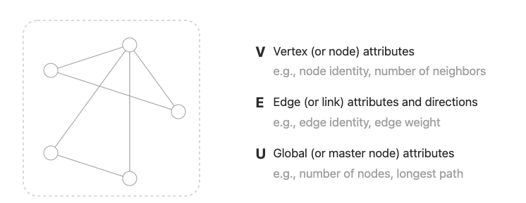
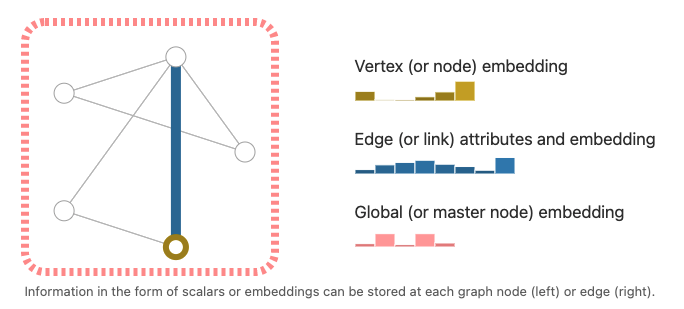
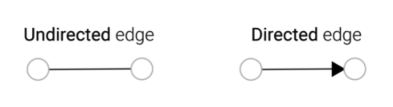
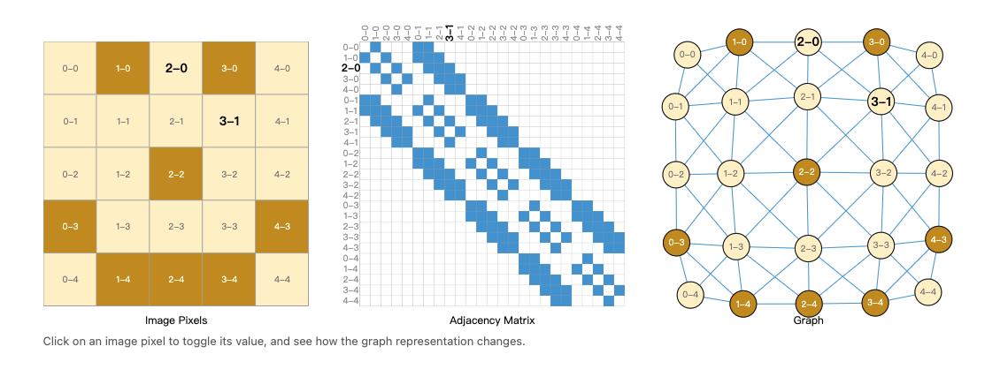
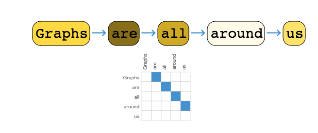
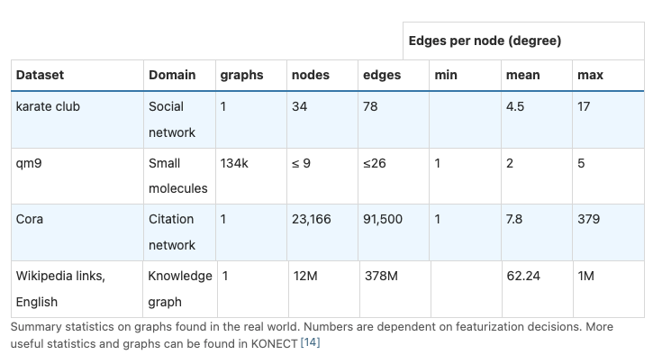
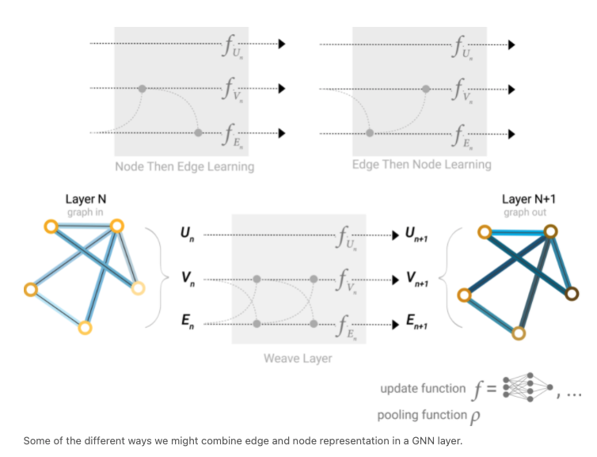
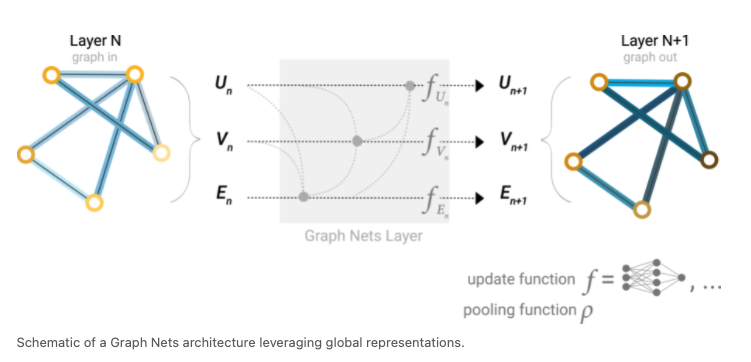
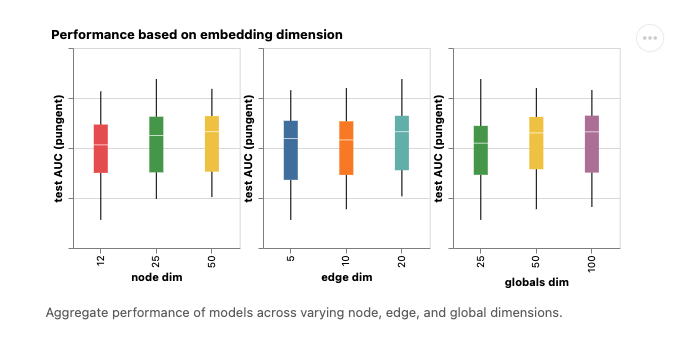
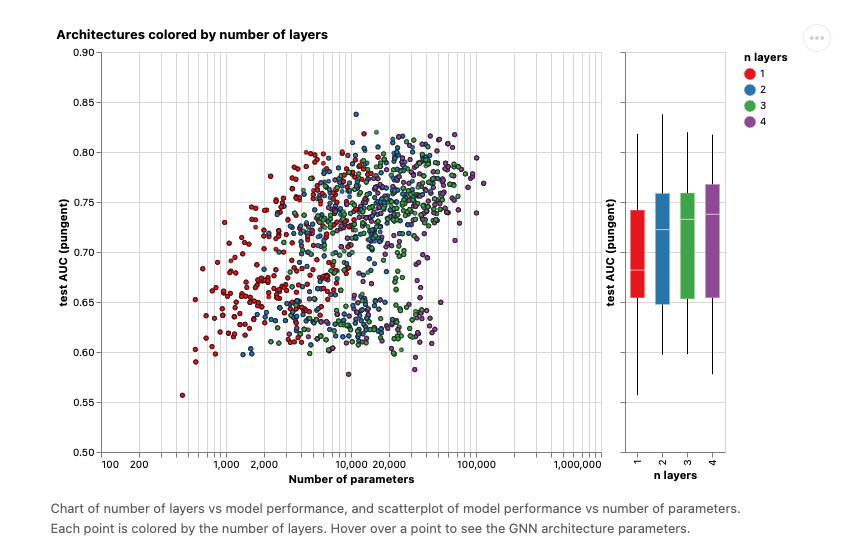

# GNN概述

> by WangYC_99
>
> @ NWPU changan Jan.14th 2022
>
> 本篇为学习记录。
>
> 参考Blog： <a herf="https://distill.pub/2021/gnn-intro/"> A Gentle Introduction to Graph Neural Networks </a> 
>
> 参考视频讲解：<a>Bilibili @ 跟李沐学AI：《零基础多图详解图神经网络（GNN/GCN）【论文精读】》</a>

## 1. What is Graph?

$$
Graph \begin{cases}
Vertex (or\ node)\ attributes \\
\\
Edge (or\ link)\ attributes\ and\ directions \\
\\
Global (or\ master\ node)\ attributes
\end{cases}
$$

其中每个顶点、边或者全局信息都可以通过embedding来用一条向量来表示：

有向边和无向边：

将Image用Graph表示：

将text用Graph表示：

常见Graph的生活场景数据集：

| Dataset     | Intro                      |
| ----------- | -------------------------- |
| Karate club | 空手道俱乐部的人际合作关系 |
| qm9         | 分子图，单图小，总量多     |
| Cora        | 文章引用关系               |
| Wikipedia   | wiki的知识存储图           |

## 2. What is GNN?

**A GNN is an optimizable transformation on all attributes of the graph (nodes, edges, global-context) that preserves graph symmetries (permutation invariances)**

GNN是一种对Graph中所有信息（包括node，edge和global向量）进行优化的一种变换。

注：GNN是不会改变Graph的结构特征的。

### 2.1 GNN的处理过程：

从输入的图开始，分别针对其edge、node和global来得到相应的MLP（多层感知器，参考：<a herf="https://www.bilibili.com/video/BV1bx411M7Zx?spm_id_from=333.999.0.0">Bilibili@3blue1brown 《【官方双语】深度学习之神经网络的结构 Part 1 ver 2.0》</a>），可多次将本过程进行叠加来构造更深层的GNN。

又倒数第二层得到最后一层预测值（下游任务为节点的分类）是通过在节点的向量表示后加上一个全连接层后进行softmax来完成的。

> **softmax vs hardmax：**
>
> hardmax最大的特点就是只选出其中一个最大的值，即非黑即白。但是往往在实际中这种方式是不合情理的，比如对于文本分类来说，一篇文章或多或少包含着各种主题信息，我们更期望得到文章对于每个可能的文本类别的概率值（置信度），可以简单理解成属于对应类别的可信度。所以此时用到了soft的概念，Softmax的含义就在于不再唯一的确定某一个最大值，而是为每个输出分类的结果都赋予一个概率值，表示属于每个类别的可能性

### 2.2 异常情况：node或者edge的特征缺失的情况

通过node的相邻变或者edge的相邻node的embedding来pooling得到此node或者edge的

### 2.3 处理缺陷：

仅仅考虑进了节点的特征，而没有考虑图的拓扑结构。

### 2.4 消息传递机制：

为了解决2.3中的问题，GNN采用消息传递机制。

1. 最简单的做法是：

在每次输入到mlp进行变换之前，先将每一个节点的embedding值和其邻居节点的embedding值进行相加。将得到的新内容放到mlp中进行处理。

2. 复杂一点的做法涉及到边的信息汇聚到节点上或者节点的信息汇聚到边上：

也就是图中的从V到E或者从E到V的过程。

而U则是一个抽象出来的master节点数据类型。

## 3. GCN PlayGround

### GCN训练超参数

| para                 | intro                        |
| -------------------- | ---------------------------- |
| Depth                | GCN卷积层数                  |
| Aggregation function | 聚合的方法（平均/求和/最大） |
| Node embedding       | 节点特征向量的大小           |
| Edge embedding       | 边的特征向量的大小           |
| Global embedding     | 全局特征向量的大小           |

可以看到不论是节点，边还是全局信息，其embedding的表示的大小并不会对auc产生很大的影响。

不同的颜色代表不同的层数，图中x轴表示要学习的参数，y轴表示auc。自然层数越深那么要学习的参数就越多。可以大体看出一个趋势是学习的参数越多则auc的上限会越高。

## 4. Conclusion

Graph是一个非常强大的工具，基本上所有的数据都可以表示成为一个Graph。

但是Graph的强大也带来了它的问题，也即在Graph上做优化是一件非常困难的事情。因为Graph是一个稀疏、动态的结构，如何在cpu、gpu或者加速器上进行计算是一件非常困难的事情。

此外GNN对于超参数、网络的架构和采样的方法以及优化的方法都非常敏感。

有关Graph netwrok的相关研究也吸引了大量的研究者投入其中。但是目前在工业界的应用还不是非常广泛。