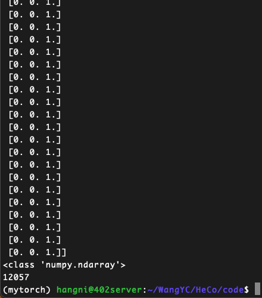
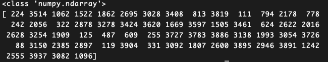
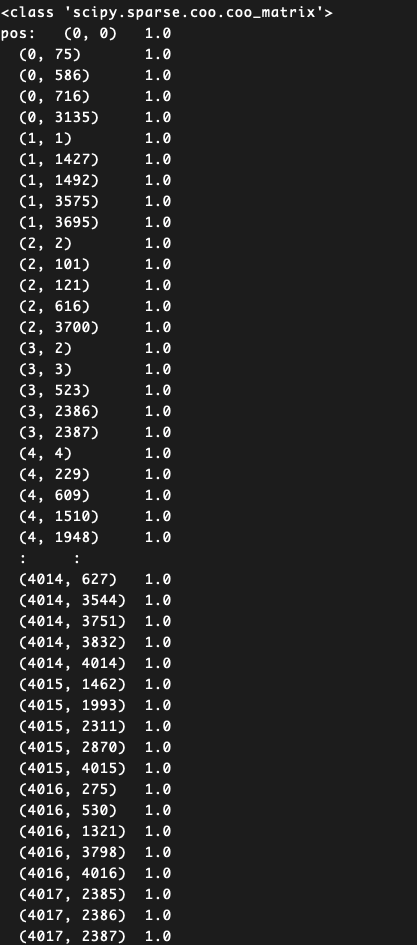
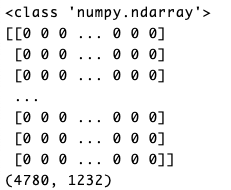

# HeCo实验

> by WangYC
>
> @NWPU changan Mar.23rd-25th 2022

## 一、原有数据集调研以及新数据集引入

### 1.1 acm


#### 1.1.1 数据集含义

来源：《Heterogeneous Graph Attention Network》


数据集收录了ACM上发表的论文，分为P A S三个类别，P的特征是依据bag-of-words表达来形成的。

Bag-of-words模型是信息检索领域常用的文档表示方法。

在信息检索中，BOW模型假定对于一个文档，忽略它的单词顺序和语法、句法等要素，将其仅仅看作是若干个词汇的集合，文档中每个单词的出现都是独立的，不依赖于其它单词是否出现。（是不关顺序的）

Wikipedia上给出了如下例子:

> John likes to watch movies. Mary likes too.
>
> John also likes to watch football games.

根据上述两句话中出现的单词, 我们能构建出一个**字典** (dictionary):

> {"John": 1, "likes": 2, "to": 3, "watch": 4, "movies": 5, "also": 6, "football": 7, "games": 8, "Mary": 9, "too": 10}

该字典中包含10个单词, 每个单词有唯一索引, ***注意它们的顺序和出现在句子中的顺序没有关联. 根据这个字典,*** 我们能将上述两句话重新表达为下述两个向量:

> [1, 2, 1, 1, 1, 0, 0, 0, 1, 1]
>
> [1, 1, 1, 1, 0, 1, 1, 1, 0, 0]

这两个向量共包含10个元素, 其中第i个元素表示字典中第i个单词在句子中出现的次数. 因此BoW模型可认为是一种***统计直方图** (histogram)*. 在文本检索和处理应用中, 可以通过该模型很方便的计算***词频***.

参考：https://zhuanlan.zhihu.com/p/29933242

#### 1.1.2 文件夹目录结构：

```
|-- a_feat.npz
|-- labels.npy
|-- nei_a.npy
|-- nei_s.npy
|-- p_feat.npz
|-- pa.txt
|-- pap.npz
|-- pos.npz
|-- ps.txt
|-- psp.npz
|-- test_20.npy
|-- test_40.npy
|-- test_60.npy
|-- train_20.npy
|-- train_40.npy
|-- train_60.npy
|-- val_20.npy
|-- val_40.npy
`-- val_60.npy
```

#### 1.1.3 数据内容

* labels.npy 应该是各个文章的labels，但是实际大小与介绍中paper的大小不一样

  

  one_hot:

  

* p_feat.npz

  

* train_20:

  

* train_40:

  

* pos.npz:

  

* pap.npz

* Nei_a.npy

#### 1.1.4 load_data内容

 ```python
 def load_acm(ratio, type_num):
     # The order of node types: 0 p 1 a 2 s
     path = "../data/acm/"
     label = np.load(path + "labels.npy").astype('int32')
     label = encode_onehot(label)
     nei_a = np.load(path + "nei_a.npy", allow_pickle=True)
     nei_s = np.load(path + "nei_s.npy", allow_pickle=True)
     feat_p = sp.load_npz(path + "p_feat.npz")
     feat_a = sp.eye(type_num[1])
     feat_s = sp.eye(type_num[2])
     pap = sp.load_npz(path + "pap.npz")
     psp = sp.load_npz(path + "psp.npz")
     pos = sp.load_npz(path + "pos.npz")
     train = [np.load(path + "train_" + str(i) + ".npy") for i in ratio]
     test = [np.load(path + "test_" + str(i) + ".npy") for i in ratio]
     val = [np.load(path + "val_" + str(i) + ".npy") for i in ratio]
 
     label = th.FloatTensor(label)
     nei_a = [th.LongTensor(i) for i in nei_a]
     nei_s = [th.LongTensor(i) for i in nei_s]
     feat_p = th.FloatTensor(preprocess_features(feat_p))
     feat_a = th.FloatTensor(preprocess_features(feat_a))
     feat_s = th.FloatTensor(preprocess_features(feat_s))
     pap = sparse_mx_to_torch_sparse_tensor(normalize_adj(pap))
     psp = sparse_mx_to_torch_sparse_tensor(normalize_adj(psp))
     pos = sparse_mx_to_torch_sparse_tensor(pos)
     train = [th.LongTensor(i) for i in train]
     val = [th.LongTensor(i) for i in val]
     test = [th.LongTensor(i) for i in test]
     return [nei_a, nei_s], [feat_p, feat_a, feat_s], [pap, psp], pos, label, train, val, test
 ```

**变量含义**：

feat_a: the feature of author

数据的读取利用了函数np.eye()：

这个函数的用法并非单单制造一个对角矩阵，而是通过其来将一个label数组，大小为(1,m)或者(m,1)的数组，转化成one-hot数组。例如他可以将类别总数为6的labels=[1,2,3,0,1,1]的数组转化成数组[[0,1,0,0,0,0],[0,0,1,0,0,0],[0,0,0,1,0,0],[0,0,0,0,0,0],[0,1,0,0,0,0],[0,1,0,0,0,0]]这就是所谓的one-hot的形式。

参考：https://blog.csdn.net/m0_37393514/article/details/81455915

结果：

看到是一个存储稀疏矩阵的形式，共7167个内容，表示的大概是一个对角为1，其他为0的稀疏矩阵(因为没有初始特征因而采用了one_hot形式的编码生成，而不是一个已经有的文件)

### 1.2 引入数据集IMDB

#### 1.2.1 需要的文件

* m_feature.npz(movie feature)

  参考HAN对于DBLP的处理

  ```python
  all_keyword_list = []
  p_path = "..."
  with open(p_path, 'r', encoding='utf-8') as f:
    for line in f.readlines():
      line = line.lower()
      line = line.strip('\n').split('\t')
      # print(line)
      line[1] = re.findall('[a-zA-Z0-9]+', line[1])
  
      all_keyword_list.extend(
          [tmp_key for tmp_key in line[1] if tmp_key not in sp_word])
  cnt = collections.Counter(all_keyword_list)
  
  selected_keyword = []
  for k, v in cnt.items():
    if v > 50:
      selected_keyword.append(k)
  # 最终选择 334 个selected_keyword
  
  with open(p_path, 'r', encoding='utf-8') as f:
    for line in f.readlines():
      line = line.lower()
      line = line.strip('\n').split('\t')
      # print(line)
      line[1] = re.findall('[a-zA-Z0-9]+', line[1])
      paper2key[str('P' + line[0])] = [tmp_key for tmp_key in line[1] if
                                       tmp_key in selected_keyword]
  #
  
  author_word = []
  from sklearn.preprocessing import OneHotEncoder, LabelBinarizer, MultiLabelBinarizer
  for author in selected_author:
    tmp = []
    for pi in adj_dict_ap[author]:
      tmp.extend(paper2key[pi])
    author_word.append(tmp)
  ohe = MultiLabelBinarizer()
  author2feature = ohe.fit_transform(author_word)
  ```

* labels.npy(movie对应的label)

* ma.txt(movie和actor的链接)

* md.txt(movie和directors的链接)

* train、val和test的标签文件

#### 1.2.2 已经有的资源

HAN的参考代码中作者附了一份预处理后的imdb的数据集，文件格式为.mat类型

打印出结果：

```python
import scipy.io as sio
path = "imdb5k.mat"
data = sio.loadmat(path)
print(type(data))
print(data)
```


可以看到用scipy解析后得到的是字典类型的数据，其中包括了

* 大概是one_hot过以后的feature
* 几种meta path的内容
* 已经处理好的label的内容
* Train val test 的标签

### 1.2.3 处理工作

#### 解析dic到文件

feature:



Label:已经是onehot处理过的


#### 从csv中获取链接信息

分为m和d与m和a

## 二、模型修改实验

* 改成最后一层也attemtion试一下？（优先级放到最后）

## 三、聚类分析实验

见下一条blog

## 三、疑问

* acm为例 为什么提供了a的feat但是最终用了自己生成的one-hot编码的数据？

