# Knowledge Graphs知识图谱

> by WangYC_99
>
> @NWPU Dec.11th 2021
>
> 注:部分图片版权所有 浙江大学 知识图谱导论

## 知识图谱概述

### 1. 什么是知识图谱？

人脑依靠所学知识进行思考和推理，具有**表示、获取、学习和处理知识**的能力是人类的心智区别于其他物种的重要区别。其中，语言是知识的最主要的表示载体，**语言**与**知识**是实现认知智能的最重要的两个方面。

***知识图谱**是一种结构化的**知识表示方法***，类似于语言、文本，它与语言的区别就是知识图谱相比于文本更容易被机器所**查询**和**处理**，因而在**搜索引擎**、**智能问答**、**大数据分析**等领域被广泛应用。

**语言与知识的向量化表示**、**利用神经网络实现语言与知识的处理** 是ai技术的发展趋势。

### 2. 知识图谱与ai技术的关联？

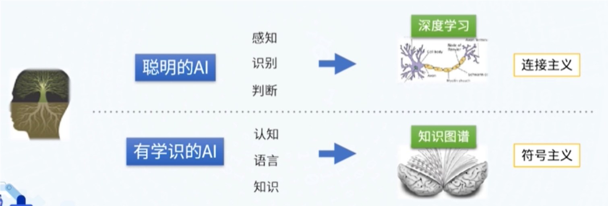

连接主义：模仿人脑的生理结构，当前成果为神经网络技术。解决的问题是识别和判断。

符号注意：模拟人类的心智，利用符号记录人脑中的记忆，表示人脑所学知识。成果知识图谱，解决认知问题。

知识图谱是实现认知人工智能的关键一环。

### 3. 机器如何理解知识？

语言是人类知识的载体。但是机器对于人类语言的理解不易。

当前通过机器来理解文本中的知识有两大技术方向：

1. 抽取技术，从文本中提取实体以及逻辑关系。
2. 文本预训练，利用神经网络将文本中的知识蕴含到含**参数化的向量模型**中。

向量化的模型是机器容易理解的，因此这是一种方向。

而另一种方向就是利用**知识图谱**了。

知识图谱是一种结构化的表示方法，利用**图**的结构建模、识别和推断**事物之间的复杂关联关系**和**沉淀领域知识**。

相比于文本，不仅容易被机器查询和处理，同时图的结构比起单一的字符串序列能够表达更丰富的语义。

### 4. 知识图谱的由何而来？

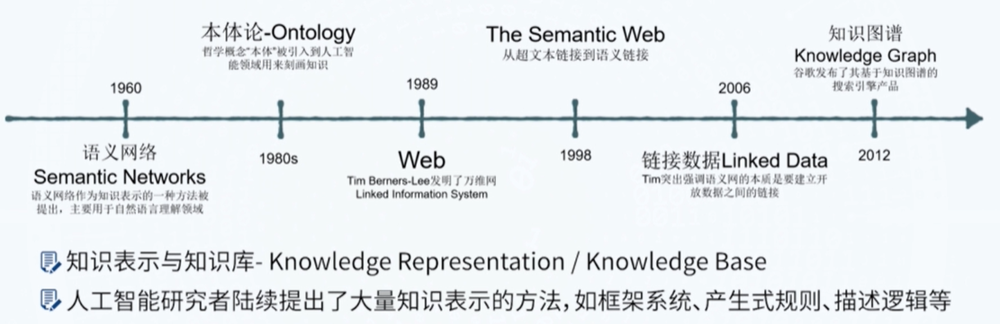

典型的KG项目：

谷歌知识图谱实体图谱库Things, not Strings、FreeBase、WikiData、 Schema.org、早期语义网项目DBPedia、后端知识库YAGO、词典知识库WordNet、关系知识库ConceptNet、多语言知识库BabelNet、中文开放知识图谱OpenKG.CN

互联网与人工智能催生了知识图谱的发展。

### 5. 知识图谱有什么应用场景？

1. 搜索引擎 

2. 智能问答（对话式搜索）

   1. 问答对：易于实现、易于管理，但是难以实现精确回答以及变通性。
   2. 从大段文本中定位答案：语言难以理解，因此比较受局限。
   3. 知识图谱：从结构化的知识图谱中定位答案简单，同时能够基于图之间的关系进行一定程度上的扩展。

3. 推荐系统

   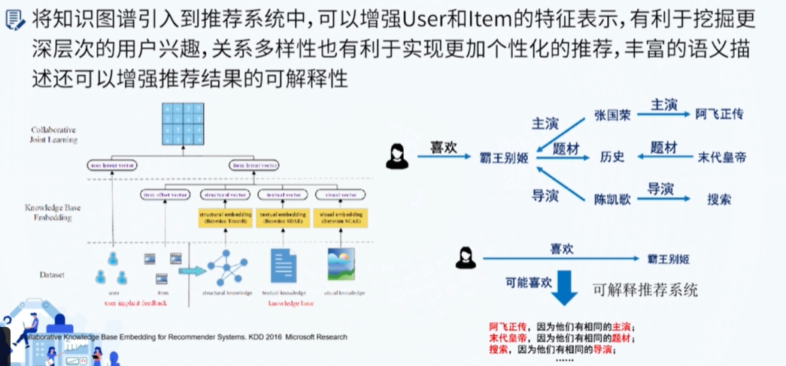

4. 大数据分析

   能够在知识图谱之上叠加图算法，例如图神经网络与图嵌入算法，能够大幅度提升数据挖掘的深度和广度。

5. 物联网技术

不同的领域用到的知识图谱的创建方式和规则会有所不同。 

### 6. 知识图谱的支撑技术有哪些？

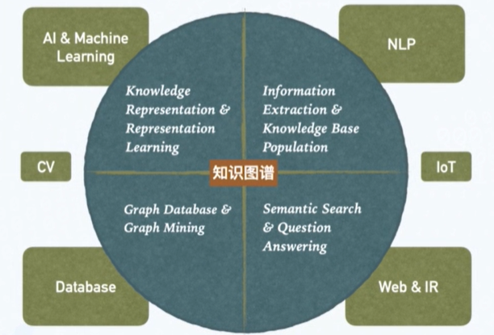

1. AI与机器学习：传统的符号知识表示
2. NLP：从文本中抽取实体与关系、检测事件等信息
3. DB&数据挖掘：图数据库、图嵌入、图挖掘
4. Web：搜索引擎以及推荐系统落地
5. cv、区块链等其他领域也会有其他知识的涉及

### 7. 知识图谱中的基础问题：

知识 + 图谱

1. 知识（ai技术知识与推理）
   1. 如何表示概念和实体？
   2. 如何刻画概念、实体之间的关系？
   3. 如何表示公理、规则等更加复杂的关系？
   4. 如何利用向量表示实体和关系？
2. 图与web
   1. 怎样存储大规模的图数据？
   2. 怎样利用图的结构对图数据进行推理和挖掘与分析？

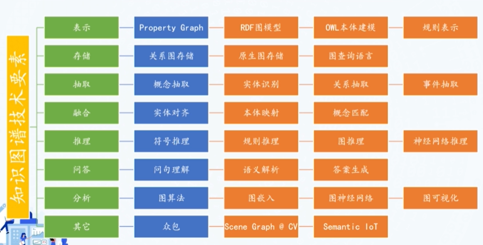

### 8. 知识图谱个基础方向的总结：

1. 知识图谱的表示

   有向标记图：

   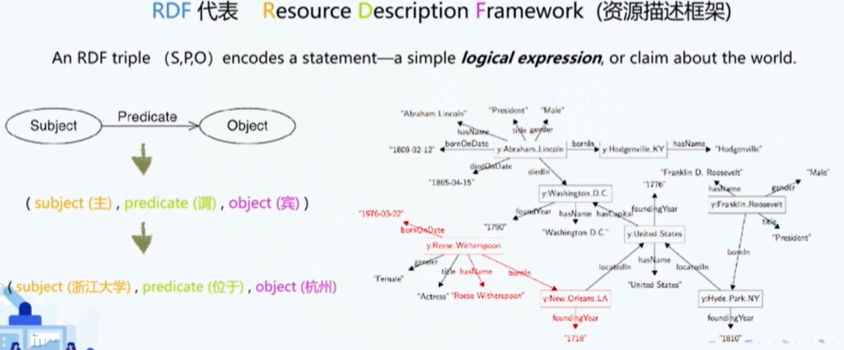

   以RDF为例，知识图谱的最基本单元是三元组，包含主谓宾，是最简单而且最接近人语言的表达模型。图的表达方式更加接近人脑的知识存储方式。

2. 知识图谱存储

   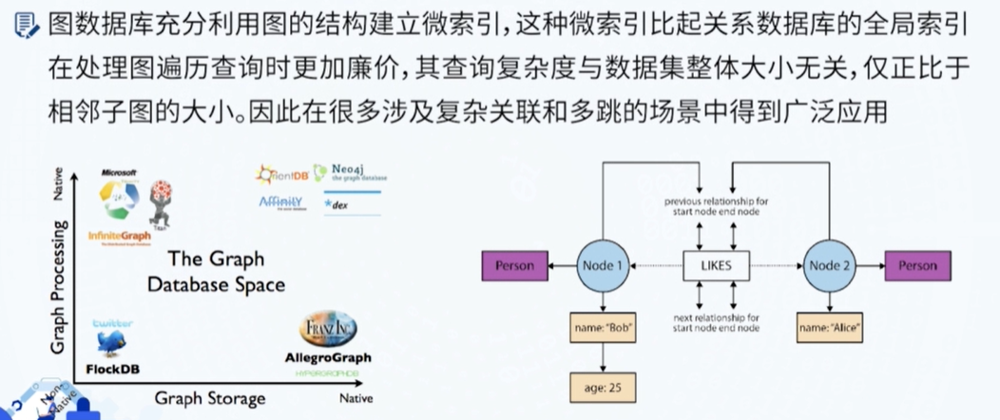

   图数据库并非知识图谱存储的唯一方式。

3. 知识抽取

   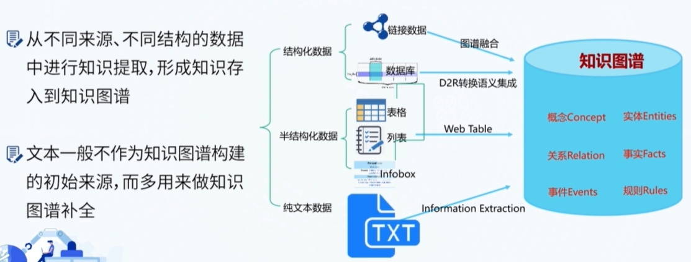

   机器抽取 + 人工众包是主要技术路线。

4. 知识图谱融合

   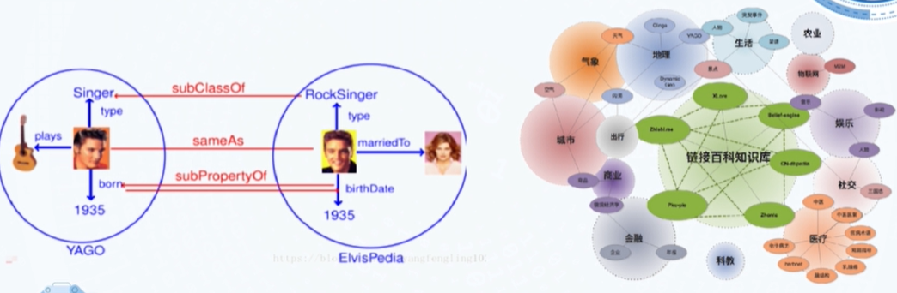

   不同的知识图谱的表达上会有细微的差别。

5. 知识图谱推理

   基于符号逻辑&基于表示学习

   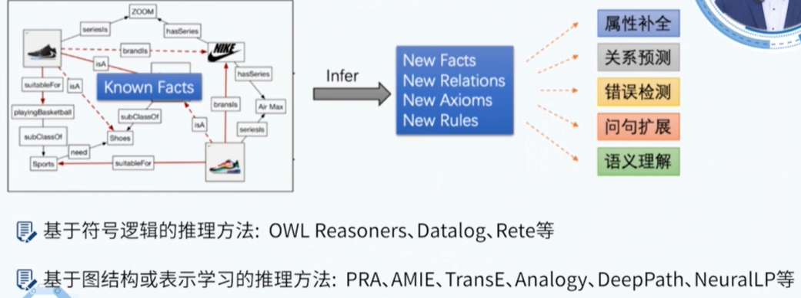

6. 知识图谱问答

7. 知识图谱分析

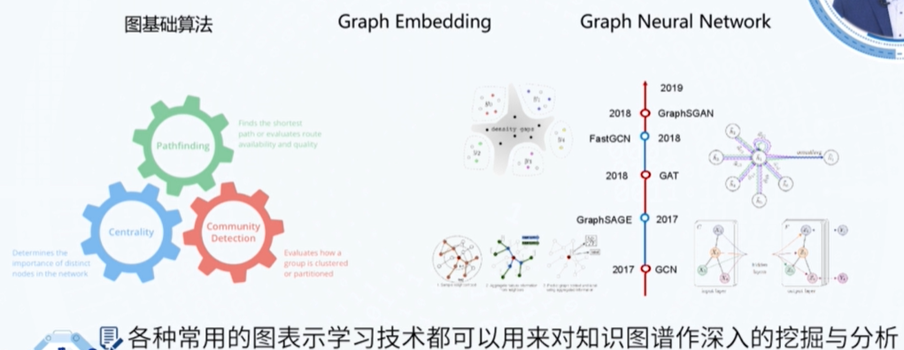

知识图谱不是单一的技术，要有系统思维。

