# [ACL2022]Knowledge-enhenced_NLG_Survey

> by WangYC
>
> @NWPU chang'an Jun.1st-9th
>
> 原文连接：http://arxiv.org/abs/2010.04389
>
> 

[toc]

## 1. Introduction

NLG是NLP领域的一个重要课题，其任务是从多种形式的输入中产生可理解的人类语言。

其中text-to-text是NLG最重要的应用之一，简称text-generation,。

text-generation以text为输入，从中产生中间语义表达，最后生成目标text。

text-generation的具体的任务场景包括机器翻译、总结、问答以及对话系统等。

随着深度学习技术复兴，许多深度模型在理解语义上表现不凡。

一个基础的text-generation任务是2014年提出的seq2seq。从那以后，涌现出了很多text-generation模型，最主要的包括：

* RNN
* CNN
* Transformer

然而上述工作知识从有限的输入对语言和语义进行理解，这相比于人类在日常对话或问答时通过大量知识来辅助有着很大差距。因此我们需要想办法从输入以外的知识得到帮助。

> This research direction of **incorporating knowledge into** **text generation** is named as knowledge-enhanced text generation

### 1.1 knowledge-enhanced text generation

knowledge source 可以分为内部和外部两类。

> since knowledge can be obtained from different sources, we first divide existing knowledge enhanced text generation work into two categories**: internal knowledge enhanced and external knowledge enhanced** text generation. The division of internal and external knowledge is widely adopted by **management science**, which can be analogous with knowledge enhanced text generation
>

内部知识包括topic、keywords等，从输入中可以提取到的知识。

外部知识指从外部源获取到的知识信息，包括knowledge base, external knowledge graph以及grounded text等等。

目前已经有许多knowledge- enhanced的model在text generation任务上表现非凡。

### 1.2 the survey itself

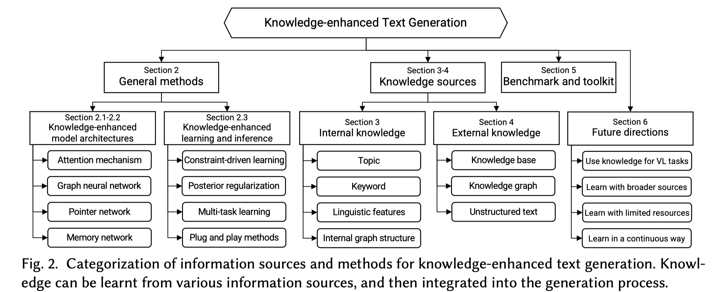

> To the best of our knowledge, this is the first survey that presents a comprehensive review of knowledge-enhanced text generation.

——本文是第一篇关于knowledge enhanced text generation的综述

### 1.3 challenges

1. 从众多knowledge source中获取有用的、相关的知识

   section 2-4

2. 如何高效地理解和充分利用获取到的知识来进行语义理解

   各section中的 M1, M2, and etc

   

总结来说，这篇综述讨论了自2016年以来的超过80篇文章提炼出的7个主流应用。

Section2 ：基础的NLG模型和总体的将knowledge应用到text-generation的方法

Section3 ：内部方法和应用（topic, keyword, linguistic features and internal graph structures）

Section4 ：外部方法和应用（ knowledge bases, knowledge graphs, and grounded text）

Section5 ：NLGbenchmarks

Section6 ：未来展望以及总结

## 2. General method of Integrating knowledge into NLG

### 2.1 basic text generation model

整体框架：encoder-decoder framework
$$
P(Y|X) = P(y_1, \cdots, y_m | x_1, \cdots, x_n) = \prod_{t = 1}^mp(y_t|X, y_1, \cdots, y_{t - 1})
$$
将y当作是独立同分布的，因此可以转化成为概率相乘的形式。

encoder：
$$
(h_1, h_2, \cdots, h_n) = ENCODER(e(x_1), e(x_2), \cdots, e(x_n))
$$
decoder & readout：
$$
s_t = DECODER(s_{t - 1}, e(y_{t - 1})),
\\p(y_t|y_{t - 1}, y_{t - 2}, \cdots, y_1) = READOUT(s_t)
$$
优化思路&loss：将生成任务看作是一个序列的多标签分类任务，可以采用negative log likelihood (NLL) loss，优化策略maximum likelihood estimation (MLE)

### 2.2 knowledge-enhanced model architecture

一个将knowledge引入的思路就是设计特定的能够反映特定knowledge的模型架构。

由此引入众多能够提取全局信息的网络架构：

#### 2.2.1 attention

在做decoder的时候，上下文向量$c_t$被引入：
$$
s_t = DECODER(s_{t - 1}, e(y_{t - 1}, c_t))
$$
**RNN seq2seq decoder:**
$$
c_t = \sum_{t = 1} ^n\alpha_{ti}h_i, where \  \alpha_{ti} = \frac{exp(\eta(s_{t - 1}, h_i))}{\sum_{k = 1}^nexp(\eta(s_{t  - 1}, h_k))}
$$
其中的$\eta()$为mlp或者其他线性函数，目的是为了能够计算梯度。

以前的工作列举了有六种$\eta$的替换函数 。

**Transformer decoder:**
$$
S_t = TRANSFORMER-DECODER(S_{t - 1}, e(y_{t - 1}), H)
$$
**添加knowledge的attention方法：**

一个常用的思路就是在这个$c_t$上下功夫，将知识向量加到这个上下文向量中。
$$
\widetilde{c_t} = c_t \oplus c_t^K
$$
其中的$c_t^K$是通过knowledge representations上attention得到的，例如在knowledge graph中的topic vectors, node vectors

#### 2.2.2 copy and pointing

copyNet 和 Pointer-Generator(PG)从输入中找子集序列将其重新组织顺序放在输出序列的合适位置。

二者最终输出的可能性分为两个模式：generation-mode和copy-mode。

二者的区别在于如何加权两个mode：

copyNet: $p(y_t) = p_g(y_t) + p_c(y_t)$

PG: $p(y_t) = p_m(g) \cdot p_g(y_t) + (1 - p_m(g)) \cdot p_c(y_t)$

相当于构建了一个vocabulary：
$$
V_{ext} = V_{global} \or V_{X} \or {unk}
$$
**将knowledge引入：**

加入一个新的mode，knowledge mode: 从knowledge base中挑选序列并在输出中按顺序输出。

相当于vocabulary拓展：

$$
V_{ext} = V_{global} \or V_X \or V_{knowledge}
$$

#### 2.2.3 memory network

memory network的思路就是这个名字所表示的，利用类似于内存的机制，将长对话的语境信息等保存起来，随后在对输入求embedding的时候循环遍历内存矩阵，求加权和作为序列的embedding的一部分。利用输入的序列 $ h_k$作为索引来进行遍历，最后将$o^K$作为embedding送到decoder中。
$$
p_i^k = softmax((h_X^k)^T C_i^k)
\\ \ 
\\ \
\\o^k= \sum_ip_i^kC_i^{k+1}
\\ \ 
h_X^{k + 1} = h_X^k + o^k
$$
**将knowledeg引入的方法：**

利用knowledge base 以及topic

decoder在生成过程中能够同步检索memory中的信息

#### 2.2.4 graph network

近期的GNN采用聚合邻居信息的方式来表征节点。

后续章节会对图结构在MLG上的应用进行具体介绍：

knowledge graph (Section 4.2), dependency graph (Section 3.3.2-3.3.3), and open knowledge graph (OpenKG) (Section 3.4)

#### 2.2.5 pre-trained LMs

预训练language model目的是在大规模无标签语料库上进行自监督训练。

在处理与knowledge相关的任务的时候出现两个困难：

1. PLMs很难提取到关系以及概念等常识信息；
2. 由于预训练的时候有特定的领域，因此在跨领域的情景上无法有良好的泛化性能。

解决方案：

1. 从外部knowledge source中计算相关知识的表示并将entity直接表示进PLM中（例如将这些entity作为辅助输入）

   但是这种方法存在的问题是从外部source中提取表示的这个过程与内部信息的处理过程是解偶的，意味着从两部分获取到的信息会有明显的差异或不连续的问题。

2. 直接通过做knowledge相关的任务来进行预训练，例如CALM将knowledge打包进参数，并同时做generative 和 contrastive的NLGtasks。

### 2.3 knowledge-enhanced learning & inference

除了在模型结构上做调整以外，也可以在训练策略上着手将knowledge引入。一个通用的方法就是通过supervised knowledge learning

#### 2.3.1 learning with knowledge-related task

可以将任务本身设计成knowledge相关的，因此模型可以学到知识相关的信息。

##### knowledge as target

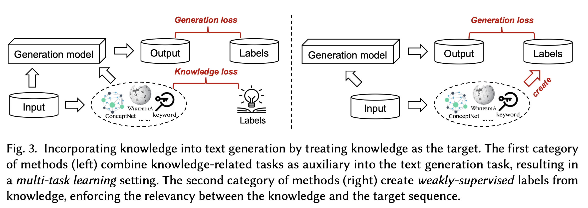

直接将knowledge作为生成目标的一部分，主要有以下两种思路：

1. 从input中提取部分knowledge，与knowledge的label做对比求一个knowledge loss，再用input正常走模型得出的output与labels做一个generation loss，最后这两个loss合并作为总的loss。
2. 弱监督思想：直接将knowledge融入到标准输出中，作为label的一部分。

##### knowledge as condition

将knowledge当作是一种条件，也就是在相同的输入情况下，有不同类knowledge的条件下，输出应该有相应的变化。
$$
p_\theta(Y|X, K)
$$
实际操作上常采用soft enforcing algorithms例如 attention mechanism以及copy/pointing mechanism

还有一种很通行的方法是利用**VAE**来做knowledge条件下的text generating

#### 2.3.2 learning with knowledge constraints

将knowledge作为一种限制条件，最终的学习任务为优化问题：
$$
\max_{\theta,q}L(\theta) - KL(q(Y|X)||p_\theta(Y|X))+ \xi
\\ \ 
s.t. E_q[f(X, Y)] > \xi
$$

#### 2.3.3 inference with knowledge constraints

如果不调整模型结构的话，很难做到knowledge 的引入或利用特定data进行fine-tune，从而控制language generation

Plug and play language model PPLM模型提出了利用knowledge作为限制进行推理的新方法。

## 3. NLG enhanced by internal knowledge

### 3.1 by Topic

topic指的是一个语句序列中提炼出来的中心话题。

通过topic来enhance的NLG应用：

1. 对话系统 2. 机器翻译 3. 释义

通过topic来进行NLG的思路有以下几种：

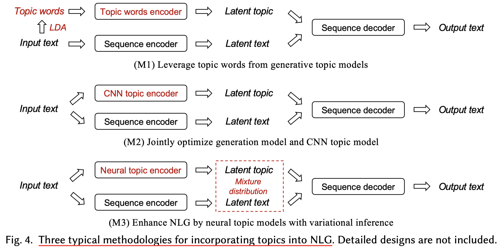

#### 3.1.1 leverage topic words from generative topic models

直接从input中通过generative topic model抽取出topic words。

LDA是generative topic model中的一种，是Latent Dirichlet allocation的缩写，可以做从指定序列中提炼出topic word的工作。

#### 3.1.2 jointly optimize generation model and CNN topic model

CNN topic model通过卷积以及下采样等手段来从topic中直接提取topic的embedding，虽然表现很好但是缺乏理论解释和鲁棒性。

#### 3.1.3 enhance NLG by neural topic models with variational inference

之所以把neural方法和CNN分开来谈是因为CNN的反向传播与传统的neural方法有很大不同，这里讲到的neural方法指可以高效利用反向传播训练的模型。

neural方法综合了神经网络以及概率模型的优势，可以提炼更加有层次、更连贯的topic

但是neural方法共有的一个问题就是，topic的划分被认为是一个混合高斯分布，导致模型对于topic之间的关系特征无法很好的提炼？

> topic distribution is assumed to be an isotropic Gaussian, which makes them incapable of modeling topic correlations

文章总结了一些topic模型，分别用于几个不同的任务上，有相应的表现情况：

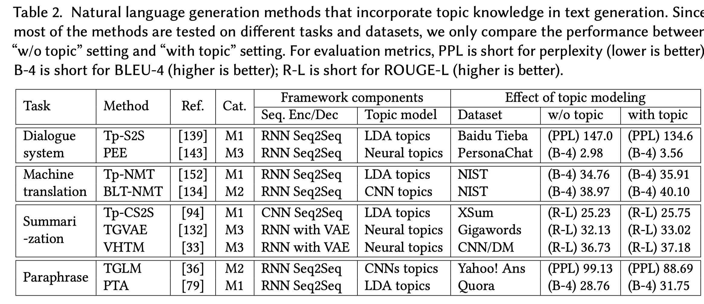

### 3.2 by Keywords

keywords可以视作一种对于输入的文件或者文本序列的一种高凝练度的概括，对于提取keyword有以下应用场景：

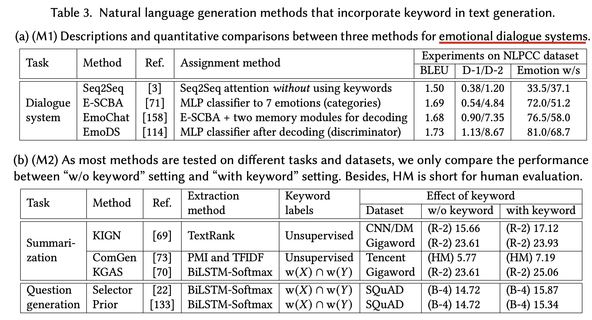

分成以下两种大的主流方案：

1. 关键字赋值（从外部找到合适的关键字）
2. 关键字提取（从输入中找关键字）

#### 3.2.1 Incorporate keyword assignment into text generation

##### 3.2.1.1 Adding assigned keyword into the decoder

从外部vocabulary中找到合适的关键字，有一个很生动的例子：

> **For example,** a dialogue utterance “If you had stopped him that day, things would have been different.” expresses sadness but it does not have the word “sad.”

有点类似于一种情感分类器，是一种分类任务。

##### 3.2.1.2 Assigning keyword for generated sequence

上面一种方法的问题就是某一个情感的分类概率会远大于其他情感，导致其他的情感无法体现出来，比方说句子是一个悲中带喜的情感，但是由于悲伤的成分更大，因此最终的关键字可能会是sad，完全表示不出来happy的成分。还有一个问题就是关键词会大部分都是情感类词汇，没其他东西了。

而这种方法是利用情感来指导生成的文本，比如提炼出了特定情感happy，那么就从表示happy的vocabulary中找关键字。

#### 3.2.2 Incorporate keyword extraction into text generation

字面意思，直接从输入的文件或者序列中找关键字。

一种常用的做法是用multitask的思想，训练keyword extractor和 generating summaries的共同模型，因为二者的目的类似，可以相辅相成，参数共享。

总结来说，用keyword最好是在总结提炼这类的任务中，而不是在生成的任务中，因为一旦提取错误，生成模型的后续生成结果全都跑偏了，影响过大了。

### 3.3 by Linguistic Features

语言特征包括词性、词义、与句之间的依赖关系等

#### 3.3.1 POS tags and NER tags

POS指词性，添加词性信息可以提高机器对于语句序列的理解能力，例如打词性标签noun (N), verb (V), adjective (A).。

NER指的是Namedentity recognition (NER)，实体标注，例如person (P), location (L), organization (O)

常用工具：CoreNLP

#### 3.3.2 Syntactic dependency graph

结构依赖关系图，

> For example, in the sentence “The monkey eats a banana”, “monkey” is the subject of the predicate “eats”, and “banana” is the object

处理方法有三种思路：

1. 将graph线性化后采用序列模型处理。
2. 采用路径化思想，通过图求距离，如果两个词的距离越远，那在最终表示的时候所占的权重就越小。
3. 直接采用GNN来处理依赖关系

#### 3.3.3 Semantic dependency graph

同时采用序列encoder以及graph encoder，对序列的信息和graph表示的语义依赖信息进行encoding，最后将图信息注入到语义表示中。

### 3.4 by Open Knowledge Graphs

KG可以按照是否完全根据输入的信息构建来分为internalKG以及externalKG

通过internalKG来加强NLG的方法：

Step1:首先要能从输入的信息中构建一个internalKG：OpenIE

Step2:从KG中提取表示并将其用在生成模型中：一篇工作中利用GAT学KG的信息，然后通过transformer来进行编码和解码

## 4. NLG enhanced by external knowledge

### 4.1 by Knowledge Base

KB是一个三元组集合，每个三元组中有subject, pre, object 将KB用于NLG任务的方法为给定input后在KB中检索相关性最高的几个条目进行辅助生成。

#### 4.1.1 Design Supervised Tasks around KB for Joint Optimization

常用的方法为多任务系统，语言生成任务与问题理解与fact检索等任务协同训练，称为所谓的“Supervised Tasks”

具体实现的工作典型有KBCopy以及CoreQA

其中CoreQA的思路是利用检索模型从input中做question understanding任务以及fact检索任务，来得到KB中与input相关的几个fact，然后对input和fact做attention，来得到最终的语言序列。

其中question understanding经过编码后得到大的回答结构，结构中具体的信息通过fact来填空。

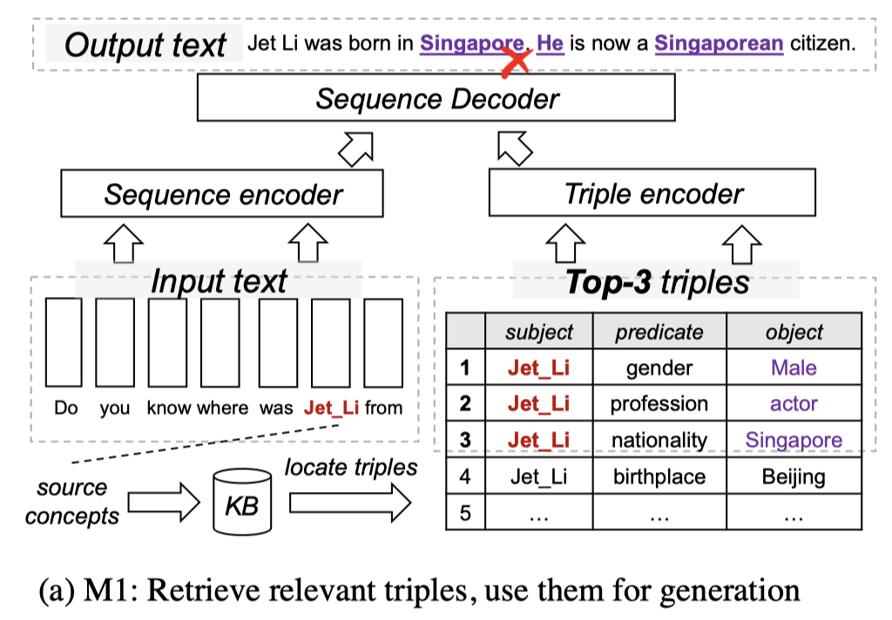

#### 4.1.2 Enhance Incorporation by Selecting KB or Facts in KB

上述方法的问题后续文本的生成过于依赖之前生成的文本信息了。

于是提出了一种利用KL散度来选择正确的fact的方法。

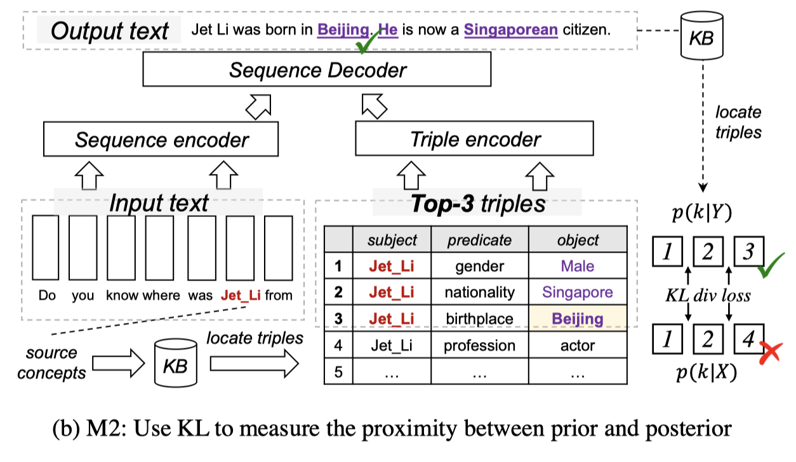

### 4.2 by Knowledge Graph

KG是一种结构化的知识表示，由实体、关系以及语义解释构成，与KB不同的是KG以Graph为结构基础，能够表示更加复杂的实体间的连接关系。

KG在NLG方面的应用主要有：

* Commonsense Reasoning
* Dialogue system
* Creative writing

KG定义：
$$
G = (U, \varepsilon, R)
$$
其中U是实体，$\varepsilon$ 是路径，$\varepsilon \subseteq U \times R \times U$ , 这个R就是指定的模式（给定的某种或某几种关系）

语句相关的KG子图的定义：
$$
G_{sub} = (U_{sub}, \varepsilon_{sub}, R)
$$
表示K条范围内的子图。

利用KG的方法可以大致总结为四种：

1. Incorporate Knowledge Graph Embeddings into Language Generation
2. Transfer Knowledge into Language Model with Knowledge Triplet Information
3. Perform Reasoning over Knowledge Graph via Path Finding Strategies
4.  Improve the Graph Embeddings with Graph Neural Networks

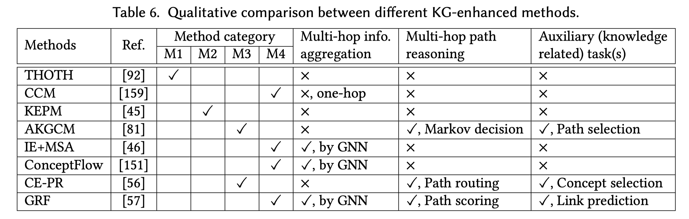

#### 4.2.1 Incorporate Knowledge Graph Embeddings into Language Generation

KGE是一项对KG的节点表示的方法，将节点以及边进行向量化表示，以在表征空间中体现实体之间的关系。

例如经过TransE表示的KG，表示出的结果满足关系：若有节点之间的连接关系($u_i, \varepsilon, u_j$ ), 则在表征空间中有$e_{u_i} + e_{\varepsilon} = e_{u_j}$

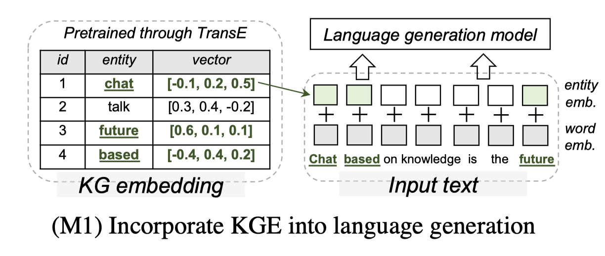

#### 4.2.2 Transfer Knowledge into Language Model with Knowledge Triplet Information

直接利用graph2seq模型将KG中的实体之间的连接关系转化成为语言序列，经过预训练注入到模型参数中。

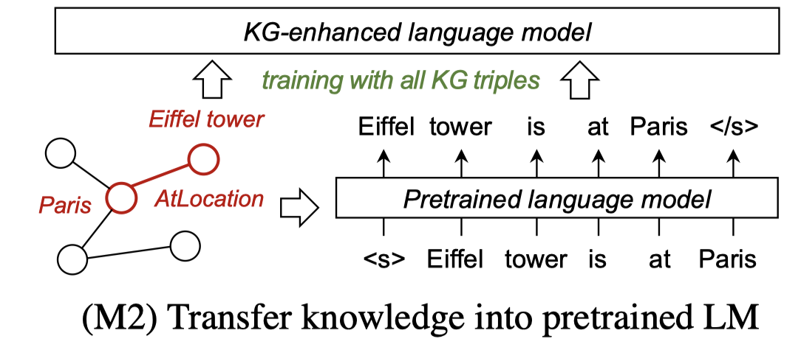

#### 4.2.3 Perform Reasoning over Knowledge Graph via Path Finding Strategies

通过路径查找算法来进行推理，可以充分利用KG的Graph结构优势。

分为path ranking base的方法以及强化学习方法：

##### 4.2.3.1 Path routing and ranking

path ranking algorithm(PRA)在large-scaled的KG上表现不凡，利用随机游走算法，深度优先搜索的思想，找到可能的关系，搜索目标实体。

##### 4.2.3.2 Reinforcement learning based path finding

强化学习方法自然是通过奖励函数机制来辅助KG上的推理过程。

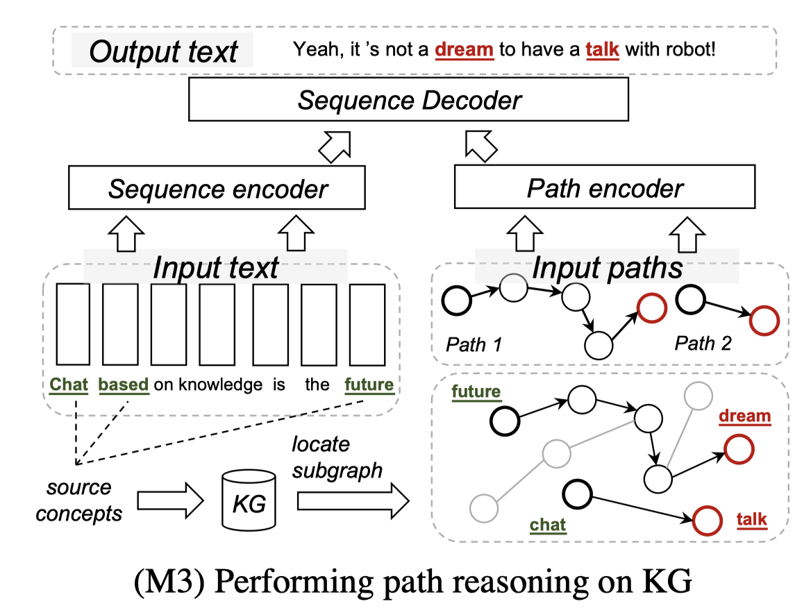

#### 4.2.4 Improve the Graph Embeddings with Graph Neural Networks

GNN可以充分聚合实体的多跳连接关系。

一个通用的思路是：

1. 通过预先定义的子图映射来将语句中的词汇对应到KG中的实体中：$U \times X \rightarrow U_{sub}$
2. 对于每一个上述的$U_{sub}$,找到一个由K跳邻居构成的子图$G_{sub}$
3. 对于每一个子图中的节点，做一个embedding : $u$
4. 对于所有的子图中的节点做一个readout得到一个子图的embedding : $h_{subG} = READOUT(\{u^{(k)}, u \in U_{sub}\})$
5. 将这个$h_{subG}$作为embedding融入到sequence的embedding中。

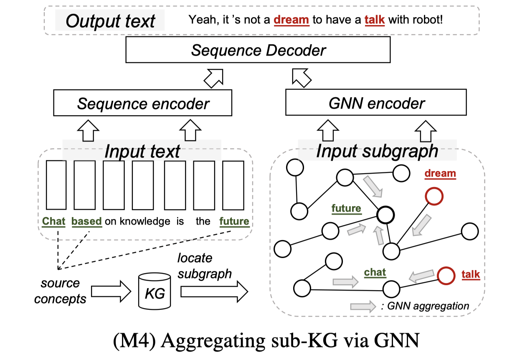

#### 4.2.5 KG总结：

* KGE是最早提出的有关于利用KG来辅助MLG的方法。它存在的一个问题是对于Graph的embedding以及对于seq的embedding两个过程是分开的，因为二者可能不在一个向量空间上，导致融合的时候会出现问题。

* 为了解决这个空间不一致的问题，直接利用Knowledge Triplet Information的方法干脆就把KG转化成seq了，有效对上述问题进行了解决。

但是这两个方法都有两个十分明显的问题：

1. 只能处理一跳邻居关系
2. 不支持在进行下游任务的时候访问KG中的信息来基于此进行推理。

* 基于路径的KG利用方法可以支持在KG结构上进行推理，并且拥有很好的可解释性。但是这种方法仍然存在问题：由于路径数量的限制（随机游走），无法保证可以提取到全部数据上的信息；基于强化学习的思路存在的问题是对于噪声数据十分敏感。
* 最后一种是利用GNN来处理KG，这种方法能够同时结合KG的结构以及语义信息，并且可以同时对Graph encoder以及 text encoder利用BP进行训练，相比于其他方法独立地对待KG以及text，利用GNN可以让Graph和text的结合更加紧密。

但是后两种方法同样存在问题：

1. 复杂程度相比于前两种方法要大很多。

2. 对于有用信息的覆盖率还是不够高。

   > For example, people use ConceptNet, a widely used commonsense KG, to retrieve the subgraph on three generative commonsense reasoning tasks. The task datasets are ComVE [57], 𝛼-NLG [7], and ROCSories [46]. We found 25.1% / 24.2% / 21.1% of concepts in the output could be found on ConceptNet, but only 11.4% / 8.1% / 5.7% of concepts in the output can be found on the retrieved 2-hop sequence-associated subgraph, respectively. It means that a large portion of relevant concepts on the KG are not utilized in the generation process.

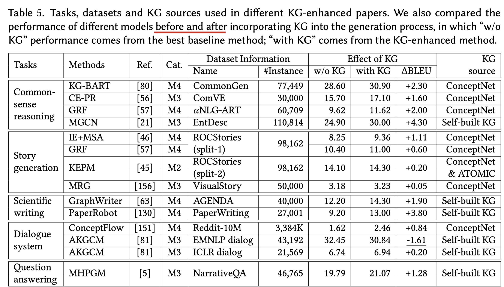

### 4.3 by Grounded Text

上述的几种方法都局限于先利用人工将知识收集起来然后让模型去学习，而利用grounded text的方法的思路是尝试从外部自主获取knowledge，例如百科网、社交平台、购物平台等。

如何处理grounded text以及输入序列关系，方法分为以下两种：

* Guiding Generation with Retrieved Information
* modeling background knowledge into response generation

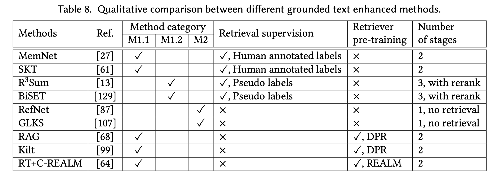

#### 4.3.1 Guiding Generation with Retrieved Information

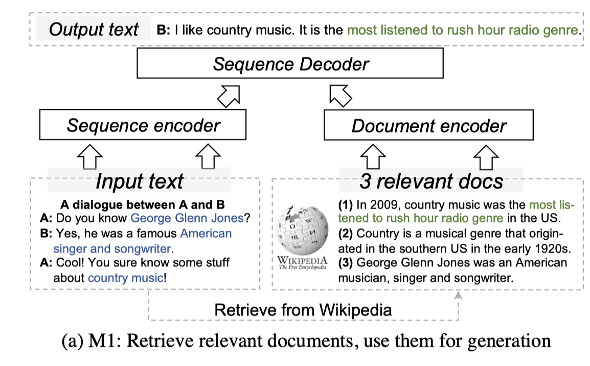

希望从外部数据源中检索有用的知识，面临外部数据噪声较多的问题，因此要设计特殊的数据检索以及利用方法，分为以下两种：

##### 4.3.1.1 Retrieval-augmented generation (RAG)

retrieve-then-generate，一种二阶方法，具体的实施办法包括：

1. 通过给定的数据来从数据源进行matching
2. 利用统计学方法（例如BM25）来对大量数据源进行打分
3. neural的方法（DPR）

##### 4.3.1.2 Retrieve, rerank and rewrite ($R^3$)

目的是要找到能够rewrite和editing的最合适、最明确的数据源。

通过soft templates方法从知识源中提取相关的总结，rerank找到其中最符合的template，最后rewrite：同时利用source以及template来进行text generation

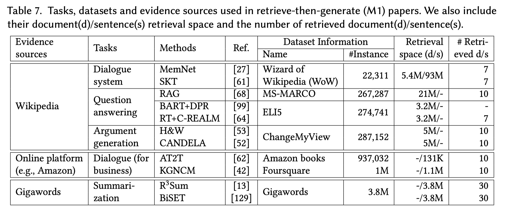

#### 4.3.2 modeling background knowledge into response generation.

背景信息类似于topic，目的是让生成的序列不要偏离大的方向。

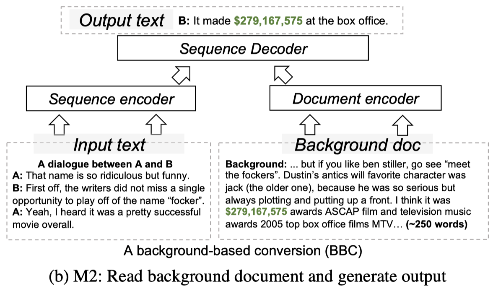

## 5. BENCHMARK, TOOLKIT AND LEADERBOARD PERFORMANCE

本文选取了9个以knowledge-enhenced为特点的benchmark数据集，

筛选的标准：

1. 公开
2. 关注于多样任务
3. 同类任务最多选3个
4. 内部、外部数据源均有所收纳
5. 更偏向于采用多参考性的数据集

文章对每个收录的数据集进行了详细介绍，在文章原文中呈现，此处不列举。

## 6. FUTURE DIRECTIONS

* Incorporate Knowledge into Visual-Language Generation Tasks

  例如描述可视化场景、图片相关的问答等。可以将更多的外部知识融入其中，应该会有比现在更好的效果。

  可以尝试以图片、文本等多种类型的数据作为知识进行检索来辅助解决opendomainQA等

* Learning Knowledge from Broader Sources

  可以将knowledge的来源不仅仅局限于文本、KG、KB等，可以尝试从字典、网站、表格等多种源头来获取数据。

  另外，从预训练模型中提取knowledge的方法目前还比较局限，在story generation的任务上预训练 + 微调方法也一直得不到好的效果，因此探索类似于知识蒸馏的从预训练模型中提取有效knowledge的方法也被迫切的需要。

* Learning Knowledge from Limited Resources

  当NLG任务面临一个新的领域的时候，经常由于样本数量极少从而导致模型效果不好，也就是泛化能力不够强。也就是我们需要让模型拥有quick domain adaptation。

  目前一个很热门的思想叫做meta-learning，放到NLG上就是在训练过程中让模型具有领域识别能力，从而能够让模型在十分有限的数据上适应新的任务，而无需重新在新的任务上重新训练。

* Learning Knowledge in a Continuous Way

  类似于让模型具有持续学习的能力这个概念，人的知识是在与日俱增的，但是现在的模型大多数还是仅仅在静态的知识源中获取知识。一个有意思的尝试是让对话机器人在日常对话中不断去学习。这个方向上可以探索的技术有KG的增长（动态KG）等。

