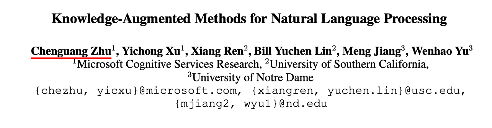
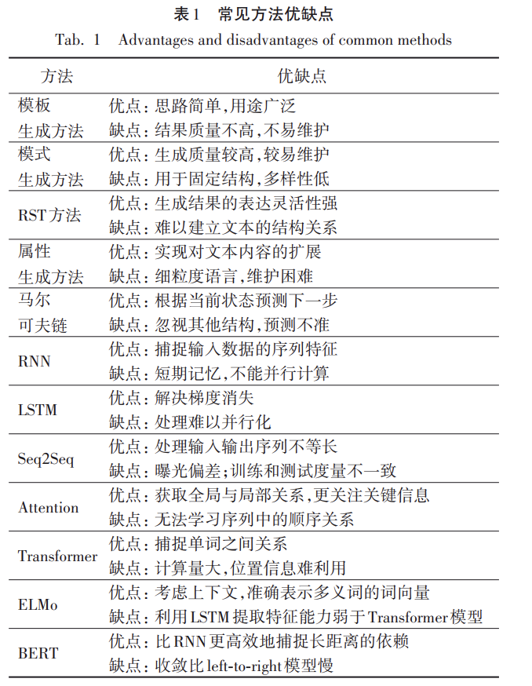
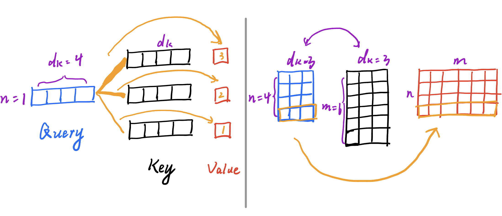
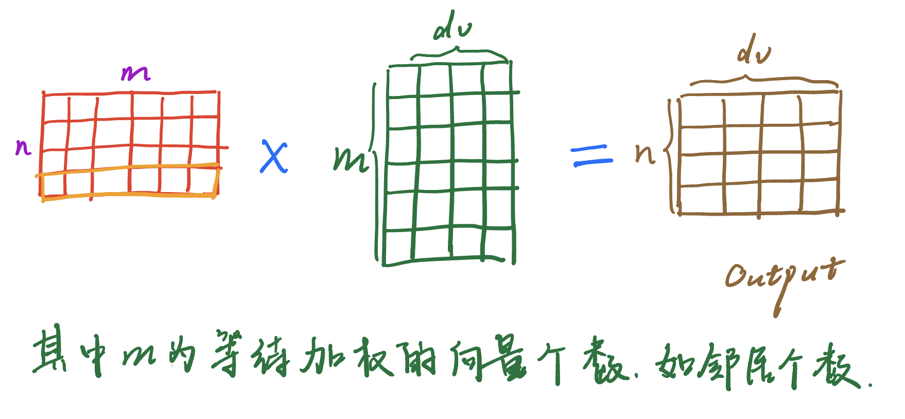
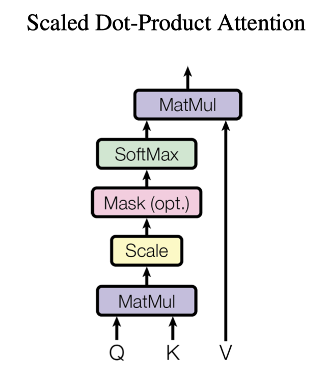

# [ACL2022] Knowledge Augmented methods Tutorial

> by WangYC
>
> @NWPU chang'an May.29th 2022
>
> 原文：http://arxiv.org/abs/2105.09111

[toc]

## 1. Overview

* tutorial

* 介绍近期在language understanding，language generation 以及 commensense reasoning领域的利用knowledge进行augment的sota工作

## 2. Contents

### 2.1 NLU

> In natural language understanding (NLU), the task is to make predictions about the property of words, phrases, sentences or paragraphs based on the input text

NLU这个领域本身是对单词、短语以及句子或段落的特性或者说含义进行预测，常见的任务包括文本分类、命名实体识别、关系抽取、阅读理解等等

* 命名实体识别：将句子中的人名、地名、时间、日期、组织机构、货币量、百分数等特有名词识别出来的任务。有基于规则的方法，如利用标点符号或者称谓词进行识别的，有基于统计识别的机器学习方法，有基于深度学习的方法。
* 文本分类：对输入的信息进行分类，可以针对情感、主题、问答任务、意图、自然语言推理等方向进行分类
* 关系抽取：从输入的文本中提炼出三元组关系，如（主体，关系，客体）

#### 关于knowledge的核心问题

1. 如何将输入转化到Knowledge domain
2. 如何表征knowledge
3. 如何将knowledge应用到NLU上

#### 针对不同knowledge sorce的方法：

##### 1. Structured Knowledge

1. Explicit methods (例如在entity embeddings上做文章)

   e.g. ERNIE:利用TransE，借助KG做entity embeddings的预训练

   e.g. EAE将representation作为模型参数（意思应该是利用预训练将知识首先学习到了参数里面）

2. Implicit methods (entity masking prediction)？

   e.g. KEPLER利用基于描述文本的预训练模型进行entity-embedding

补充：近期的工作尝试将KG和language module协同训练, 一篇工作中提出利用KG来对text进行表示，同时KG中的节点的初始特征又是通过LM来得到的（这样的话KG中节点的表示也可以做到text相关）。

##### 2. Unstructured Knowledge

非结构化的知识模型通常是一个检索模型来从**语料库**中发现知识信息。

>  关于QA系统的博客：https://zhuanlan.zhihu.com/p/93347083

e.g. Lee等：利用完形填空任务，针对open-domain QA来同时对retriever以及reader进行训练，

e.g. DPR：利用监督学习训练retriever，从而在ODQA上达到了更好的效果。

等

### 2.2 NLG

> The goal of natural language generation (NLG) is to produce **understandable text in human language** from **linguistic or non-linguistic data** in a variety of forms such as textual data, image data, and structured knowledge graph.

#### 相比于NLU的结构特点：

> NLG methods are typically under the **encoder-decoder** generation framework , which poses unique challenges for l**everaging knowledge into decoding** the next tokens during generation.

2021国内NLG综述中的总结：

#### 将knowledge嵌入NLG模型的几个思路：

1. 设计特有模型架构

   e.g. knowledge-related attention， knowledge-related copy/printer

2. 学习以及训练方式层面：通过训练将knowledge注入模型。

    e.g. 用knowledge做弱监督信号进行训练等

#### 针对不同knowledge source 的几种NLG方法：

##### 1. Structured knowledge

1. 将预先计算好的knowledge注入到LM中（预训练）；
2. 将knowledge转化为利用三元组的信息的LM中；
3. 在图结构上利用路径查找算法进行推理；
4. 利用GNN对KG embedding进行加强。

补充：近期有工作研究将知识注入预训练模型中。

##### 2. Unstructured knowledge：

1. 利用检索到的信息来guide generation
2. 将background信息利用到NLG任务中

### 2.3 Commensense in NLP reasoning

要求模型能够利用commonsense来进行推理，包括一些平时不会经常在交流中涉及到的物理规律以及行为日常（与infer是一个概念？），这本身就是一种knowledge augmenting

#### 文章中设计到的内容

1. 常识数据源（以ConceptNet为典型）
2. 推理方法整理
3. 现有模型分析

总结了评估commonsensen的数据集，分为以下三类：

1. multi-choice QA
2. open-ended QA
3. constrained NLG

针对以上类型，总结了以下将commonsense融入的方法：

1. 对于multi-choice的场景：总结了neuro-symbolic方法
2. 对于open-ended的场景：总结了两种基于virtual knowledge graph设计的内容
3. 对于NLG场景的：总结了生成commonsense的方法

除去以上具体应用的内容，还总结了一些分析工作和原理解释工作。

## 3. Related Information

### 3.1 NLP工作

近期的NLP相关工作受益于large-scale model, training strategies 和 great availability of data

e.g. 

* BERT(https://arxiv.org/abs/1810.04805)
* RoBERTa(https://arxiv.org/abs/1907.11692)
* GPT

#### transformer

Attention is all you need https://arxiv.org/abs/1706.03762

* 传统RNN缺点：序列按照顺序计算，$h_t$通过$h_{t - 1}$以及$t$位置的内容来共同决定，会存在算到后面时早先信息丢失或者内存负载过大的问题。

* Attention以前已经被应用到了从encoder到decoder的衔接过程中。

* 相比于RNN，Attention机制的并行性是亮点。

* 卷积网络替换RNN的问题：比较长的信息难以融合到一起。但是transformer没有这个问题。但是卷积的优点是可以输出多通道的模式，因此transformer提出multi-head的attention。

* transformer中比较关键的点是自注意力的attention。

* 当时的较为popular的网络结构是encoder-decoder (其中encoder做的事情是将输入的n个词条转化为同样的n条向量，即做一个向量表示；decoder则利用self-regressive机制，之前所有的输出都可以作为当前时刻的输入)

* 

* residual connection：在每一层结束后都再加上一个输入，$f(x)$ -> $f(x) + x $，这样可以避免某一层的梯度为0的情况，因为此时梯度有一个恒等项1:$f'(x) + 1$。

* transformer的encoder: $LayerNorm(x + Sublayer(x))$ 用这样的自回归残差连接需要输出和输入的大小一样，否则要做投影。其中两个超参数，第一个是$N$，意思是整个过程重复多少层，第二个就是输入输出的向量的大小$d_{model}$。

* LayerNorm和batchNorm：一般所说的归一化指的是batchNorm，意思是一个batch中所有向量同一个位置的内容的列向量归一化。而LayerNorm则是每个样本自己归一化，每个语句序列的不同词的embedding之间进行归一化。

* Attention: 通过QKV来决定参数。
  $$
  Attention(Q, K, V) = softmax(\frac{{QK}^T}{\sqrt{d_k}})V
  $$
  如下图，其中n是需要计算参数的向量的个数，m是需要加权的项数，如邻居的个数。dk为输入向量本身的长度。

* 两种最常用的attention机制：additive attention（允许Q和K的长度不相同）；dot-product attention（点积注意力，如上图所示）

* Scaled dot-product attention: 如以上attention公式所说，要除以$\sqrt {d_k}$ , 原因是怕向量长度太长以后点积的结果会出现每一个值都很大的情况。不这样的话在softmax以后会出现梯度很小，训练不动的情况。

* 本文中使用的mask机制：

  

  这个mask是为了保证在研究第k个词的时候不要看到第k个词以后的词的结果，也就是不能把未来的词汇也聚合到当前的表示中。实现方法就是在得到了参数矩阵以后将未来时刻对应的参数都设置成绝对值很大的负数，这样的话在过一个softmax以后就可以得到趋近于0的权重。

* Multi-head Attention:
  $$
  MultiHead(Q, K, V) = Concat(head_1, head_2, ..., head_h)W^O
  \\where\ head_i = Attention(QW_i^Q, KW_i^K, VW_i^V)
  $$
  之所以采用multihead的一个最直接的原因就是如果只用dot-product的话就没有什么可以学习的参数在里面，因此采用multihead来多几个参数矩阵。实现的过程就是先把n维的输入拆成h个小部分（利用线性层进行降维投影），分别进行attention以后concat到一起，成为最终的参数矩阵（这个concat的过程又加了一个参数矩阵）

* 自注意力机制（QKV都是一样的）

* 只有Q不同的注意力机制（KV相同，Q与KV不同）:跟谁像，谁在我最终结果的表示里面占到的权重就多一点。（我更关注谁，谁在我最后的表示里面占的比重就多一点）

* Feed-Forward：
  $$
  FFN(x) = max(0, xW_1 + b_1)W_2 + b_2
  $$
  说白了其实就是：$linear(relu(linear(x)))$,作用就是做语义空间的转换。

* 使用positional encoding来加入时序信息。词嵌入将一个词表示成为一个指定长度的向量，但是没有词的时许信息。为了让transformer能够提取到词的顺序信息，采用positional encoding的方式来对位置信息进行编码。具体的计算方法是通过以下公式来完成的：
  $$
  PE_{pos, 2i} = sin(pos/10000^{2i/d_{model}})
  \\PE_{pos,2i + 1} = cos(pos/10000^{2i/d_{model}})
  $$

* 学习率计算：
  $$
  lr = d_{model}^{-0.5}*min(step_num^{-0.5}, step\_num * warmup\_steps^{-1.5})
  $$

* 实践：

  https://zh-v2.d2l.ai/chapter_attention-mechanisms/transformer.html

### 3.2 Knowledge

> It has been shown that these pretrained language models can effectively characterize linguistic patterns in text and generate highquality context-aware representations.
>
> However, these models are trained in a way where the only input is the source text. As a result, these models struggle to grasp external world knowledge about *<u>concepts, relations, and common sense</u>*

这些所谓的概念、关系和尝试就是普通的单纯看文本训练的模型所无法获取到的Knowledge。

***

> -End-
>
>  如需引用，请标明出处
>
> www.wyc-personal.cn

