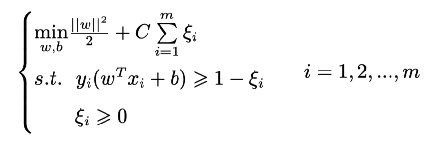
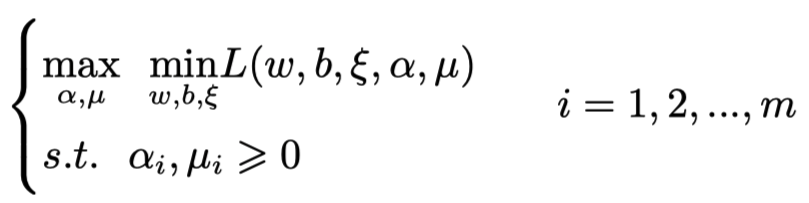
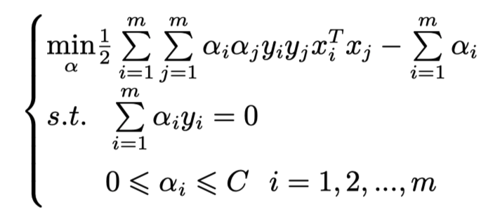
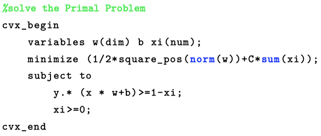
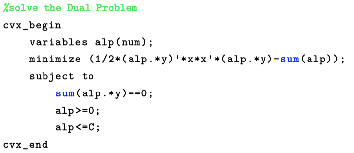
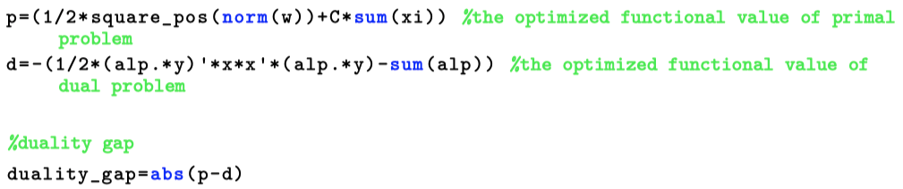
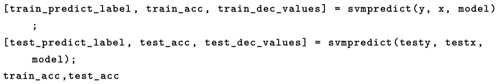
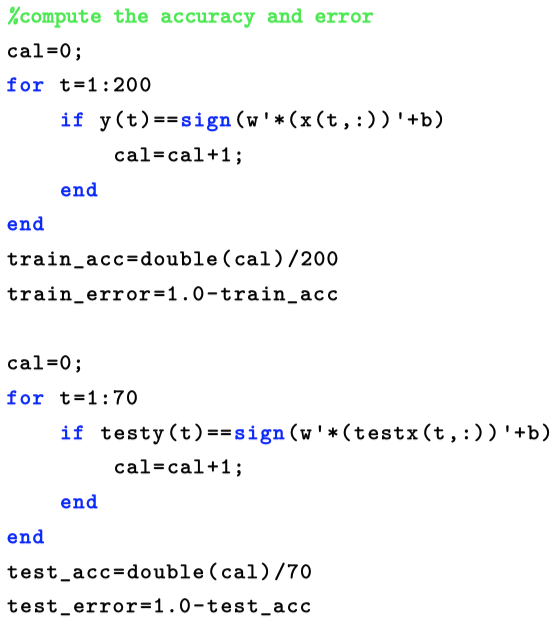

# SVM原理及对比实践

> by 王元淳 2019300099
>
> @NWPU《模式识别与机器学习》2022春季实验报告

[toc]

## 一、理论推导

### 1.1 SVM 概述

SVM作为一种经典的机器学习算法，在处理“小样本”问题时效果非常显著。

支持向量机（support vector machines, SVM）是一种二分类模型，它的基本模型是定义在特征空间上的间隔最大的线性分类器，间隔最大使它有别于感知机；SVM还包括核技巧，这使它成为实质上的非线性分类器。

SVM的的学习策略就是间隔最大化，可形式化为一个求解凸二次规划的问题，也等价于正则化的合页损失函数的最小化问题。

SVM的的学习算法就是求解凸二次规划的最优化算法。

#### 1.1.1 带约束优化问题的求解

带约束优化问题的一般式如下：
$$
min \ f(\omega)
\\s.t. g_i(\omega) \leq 0, i = 1, ..., m
\\h_i(\omega) = 0, i = 1, ..., n
$$
若约束条件比较复杂，则很难求解，因此可以转化为无约束的优化问题。定义拉格朗日式：
$$
L(\omega, \alpha, \beta) = f(\omega) + \sum_{i = 1}^{m}{\alpha_i} \times g_i(\omega) +\sum_{i = 1} ^{n} \times h_i(\omega)
$$
新的无约束表达式就是$\theta_p(\omega) = max_{\alpha, \beta, \alpha_i \geq 0}L(\omega, \alpha, \beta)$
$$
\theta_p(\omega) = 
\begin{cases}
f(\omega), \ \ \ \ \  \omega\ subject\ to \ 'primal\ constrain'
\\+\infty, \ \ \ \ \ otherwise
\end{cases}
$$

#### 1.1.2核函数

在进行特征变换的时候，通常都要使用“kernel trick”，核函数可以把原始特征映射到高维空间，同时不会增加计算量。常用的核函数有高斯核、sigmoid核、多项式核、线性核等（线性核意味着在原始空间中进行，不进行特征变换）
$$
k(x, z) = (x^Tz)^2 = (\sum_{i = 1}^{n}x_iz_i)(\sum_{j  = 1}^nx_jz_j) = sum_{i = 1}^n\sum_{j = 1}^n(x_ix_j)(z_iz_j) = \phi(x)^T\phi(z)
$$
其中，$\phi(x)$表示变换域的特征向量。

#### 1.1.3 SVM原问题

SVM的集合意义是寻找一个最优分隔超平面，时期能够吧数据空间的两类点分开。记超平面方程为$\omega^T + b = 0$，任意一点$x_i$到超平面的距离公式为
$$
d_i = \frac{|\omega^Tx_i + b|}{||\omega||}
$$
因此目标函数为
$$
\mathop {max}_{\omega, b}\ \mathop{min}_{i \in {1,...,N}} \frac{|\omega^Tx_i + b|}{||\omega||}
$$
约束条件：
$$
y_i(\omega^Tx_i + b) > 0, i \in \{1,...,N\}
$$

#### 1.1.4 SVM对偶问题

SVM的原问题不容易求解，但是由于原为题为二次规划问题，满足strong duality的关系，因此可以转而求解对偶问题。
$$
\mathop{max}_{\alpha, b, \alpha_i \geq0}\ \mathop{min}_{\omega} L(\omega, \alpha, \beta) = \mathop{max}_{\alpha, \alpha_i \geq0}\ \mathop{min}_{\omega, b} \{\frac{1}{2}||\omega||^2 - \sum_{i = 1} ^ N\alpha_i[y_i(\omega^Tx_i + b) - 1]\}
$$
令偏导数等于零可以解得
$$
\omega^* = \sum_{i=1}^N\alpha_iy_ix_i,\ \  \sum_{i = 1}^N\alpha_iy_i = 0
$$
转化后的决策方程可以表示为
$$
(\omega^*)^Tx + b = (\sum_{i = 1}^N\alpha_iy_ix_i)^Tx +b
$$
上式中，看上去是对所有训练样例和测试样例做内积，计算量大，其实不然，从KKT条件可知，对偶问题解出的$\alpha$参数，仅support vectors的$\alpha_i$非零，其余全0。
此外，引入对偶问题，除了简化“无约束”最优化过程外，还为核函数做了铺垫，而kernel function可以将原始样本映射到高维空间，使其变得“更有可能线性可分”（根据常识，数据越稀疏越可分）

### 1.2 软间隔SVM

很多时候不能保证数据完全线性可分，这时候的优化需要忽略一些错误点的影响，引入损失函数，这里以常用的 hinge 损失为例。

同样，应用拉个郎日乘子法，得到Primal Problem的变形式，再根据strong duality 得到其Dual Problem：

求偏导后得到最终的对偶问题形式：

### 1.3 一些说明

* **支持向量** 支持向量的概念以上多次提及，在软硬间隔的 KKT 介绍部 分也都有阐释。这里再简要概括一下，支持向量就是满足边界条件的点，它们是真正对优化过程有影响的样本点。硬间隔中 SV 就是 两类样本中距离目标超平面最近的样本点，即最大间隔边界处的样本点；软间隔中 SV 是两个最大间隔边界及其之间的所有样本点，但只有边界上的点用于计算偏移项 b。

* **最大化间隔** 数据线性可分时存在无穷多个超平面可以将其分开，间隔最大化可以求得唯一的超平面。并且并且这个超平面是最优的，因为最大化间隔求得的模型鲁棒性最强，泛化能力最强。

* **泛化误差和误差上界** 不同于训练误差，泛化误差是用来衡量一个学习机器推广未知数据的能力，即将从样本中学习到的规律能够应用到未知的全新数据的能力。泛化误差可以分解为偏差、方差和噪声之和。 泛化误差越小，表示模型的推广能力越强，泛化性能越优。

  泛化误差上界是指泛化误差允许的最大值，可理解为模型学习能力的 “出错上限”。影响泛化误差主要有两个因素: 数据量和模型复杂度，而泛化误差上界与样本数成正比，与假设空间包含的函数数量（即模型 复杂度）成反比。

## 二、实验

本实验使用的是 libsvm 自带的 heart_scale 数据集，数据集有 270 个 样本点，每个样本点有 13 个特征和一个标签，对其使用 SVM 软间隔方法进行二分类。

划分数据集时，选取软间隔常数 C 为 1，取前 200 个样本为训练集，后 70 个样本为测试集。

本实验代码在压缩包中，其中的 README 文件里有具体的文件结构和代码功能说明。

### 2.1 基于cvx的软间隔SVM实验

#### 2.1.1 Primal Problem

cvx实现的formulation代码：其中num样本数，dim为特征数，xi为松弛变量。

#### 2.1.2 Dual Problem

其中alp为拉格朗日乘子。

#### 2.1.3 模型优化参数对比

由下表可以发现，w，b 的结果基本相同，仅存在一定误差，符合理论推导。

| w in Primal Problem | w in Dual Problem  | w gap                 |
| ------------------- | ------------------ | --------------------- |
| -0.203629373693909  | -0.203627906273829 | -1.46742008058642e-06 |
| 0.387148209552455   | 0.387147906219913  | 3.03332542361812e-07  |
| 0.660460898084464   | 0.660460689549197  | 2.08535266832399e-07  |
| 0.488660915603919   | 0.488659338285528  | 1.57731839101061e-06  |
| 0.164588851231741   | 0.164589020483894  | -1.69252152543153e-07 |
| -0.147976140749529  | -0.147975992368103 | -1.48381425479904e-07 |
| 0.179733275744184   | 0.179733711711176  | -4.35966992423653e-07 |
| -0.929330323423062  | -0.929329137081890 | -1.18634117263206e-06 |
| 0.209012645567207   | 0.209012858728550  | -2.13161343048940e-07 |
| 0.200070079210168   | 0.200071272100368  | -1.19289019986923e-06 |
| 0.143405756329228   | 0.143404845790495  | 9.10538732412647e-07  |
| 1.08024076578166    | 1.08024086566535   | -9.98836826582306e-08 |
| 0.528327616509726   | 0.528327373067828  | 2.43441897640473e-07  |

| b in Primal Problem | b in Dual Problem | b gap                 |
| ------------------- | ----------------- | --------------------- |
| 0.553870992130955   | 0.553871013576671 | -2.14457158698167e-08 |

#### 2.1.4 Duality Gap

Primal objective value（原问题目标函数最优值）p = 67.6616；Dual objective value（对偶问题目标函数最优值）d = 68.8424；对偶间隙 duality gap 为 1.1808。

根据强对偶关系 duality gap 应为 0。由下表可以发现，primal 的最优 目标函数值甚至小于对偶问题的最优目标函数值，存在一定误差，但与函数值相比可忽略不计，因此符合理论推导。

### 2.2 libsvm对照

| w via libsvm | w via cvx |
| ------------ | --------- |
| -0.2033      | -0.2036   |
| 0.3868       | 0.3871    |
| 0.6603       | 0.6605    |
| 0.4892       | 0.4887    |
| 0.1615       | 0.1646    |
| -0.1482      | -0.1480   |
| 0.1794       | 0.1797    |
| -0.9298      | -0.9239   |
| -0.2088      | -0.2090   |
| 0.1998       | 0.2001    |
| 0.1441       | 0.1434    |
| 1.0803       | 1.0802    |
| 0.5284       | 0.5283    |

| b via libsvm | b via cvx |
| ------------ | --------- |
| 0.5527       | 0.5539    |

由上表可以发现，两种方法计算的参数 w 和 b 差别很小。 α 为 200 维 向量，维数和样本数相同，因为数量太多其具体值此处不再一一列举，不过 在 libsvm 和 cvx 实验中可以发现，支持向量（α > 0）的个数均为 77 个， 处在最大间隔边界的支持向量（0 < α < C）有 14 个，两者数量均一致。因 此，可以说明 SVM 实验结果基本正确。

### 2.3 误差评估

本实验划分了 200 个训练样本和 70 个测试样本。以下分别在 libsvm 和 cvx 中计算了训练误差和测试误差，可以发现两者相同，进一步可说明 实验结果基本正确。

#### 2.3.1 libsvm误差评估

libsvm 有内置的svm_predict功能：

结果：

| training error | testing error |
| -------------- | ------------- |
| 13.4%          | 15.6%         |

#### 2.3.2 cvx误差评估：

自行设计计算错误率的代码：

结果：

| training error | testing error |
| -------------- | ------------- |
| 13.4%          | 15.6%         |

## 三、实验心得

我认为本次实验为我提供了一个很好的机会，让我回顾了 SVM 并加深了对它的理解。同时我熟悉了 Matlab 语法、基本掌握了适用于科研的凸优化工具 cvx，报告的撰写也让我对 latex 的使用更加熟练。

总而言之，本次实验我收获颇丰。相信本课程以及本次试验经历会在我未来的学术以及职业道路上为我的前进助力。

## 四、参考

知乎博客https://zhuanlan.zhihu.com/p/31886934

csdn博客https://blog.csdn.net/diligent_321/article/details/53396682

latex技巧https://www.latex-project.org/

机械工业出版社 《机器学习入门：Python语言实现》 ISBN：978-7-111-69524-0

人民邮电出版社《MATLAB机器学习》ISBN：978-7-115-53203-9