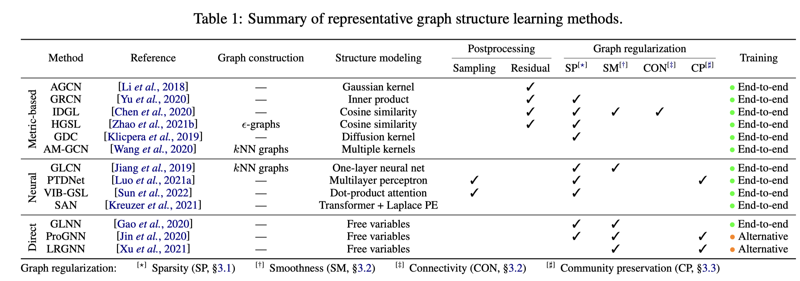

# [文章笔记] GSL图结构学习综述

> by WangYC
>
> @NWPU chagnan Mar.12th-Mar15th
>
> 文章原文：https://sxkdz.github.io/files/publications/IJCAI/GSL.pdf

## 1. 文章思路

**文章的背景：**

如今很多GNN模型算法兴起，取得了很好的效果，加深了人们对于图的理解。但是RNN通常十分依赖与数据集，若是有噪声或者不完整的图就会对整体的效果产生很大的副作用。因此人们引入了GSL Graph Structure Learning的概念，来学习Graph的结构，以优化原有的图结构更好地服务于下游任务。

**文章干了四件事情：**

1. 阐述了GSL的概念，形成了一个总体的大纲。
2. 将近期GSL的相关工作分成了三个类型:
   1. Metric based 度量学习
   2. neural based 神经网络学习
   3. direct approaches 直接学习
3. 展示了GSL的应用
4. 列出了当前工作面临的挑战并且指出了未来工作的一些方向。

## 2. 相关知识

### 2.1 metri learning度量学习

metric learning的目标就是学习一个变换函数（线性非线性均可）L把数据点从原始的向量空间映射到一个新的向量空间，在新的向量空间里相似点的距离更近，非相似点的距离更远，度量更符合任务要求，从而让KNN的表现更好。而deep metric learning，就是用深度神经网络来拟合这个变换函数。（概念上有点类似于对比学习？）

参考文献：CVPRhttps://openaccess.thecvf.com/content_CVPR_2019/html/Wang_Ranked_List_Loss_for_Deep_Metric_Learning_CVPR_2019_paper.html

### 2.2 graph regulation 图正则化

#### Sparsity 稀疏度

#### Smooth 平滑度

## 3. 细节理解

### 

## 4. 疑问

* 度量学习和对比学习的区别？

## 部分参考

度量学习：https://zhuanlan.zhihu.com/p/108920087