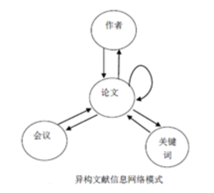
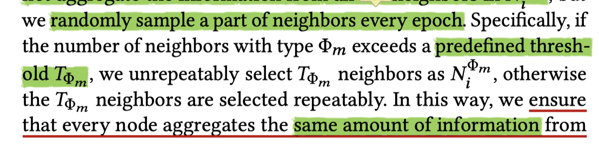

# [文章笔记] 异质图神经网络学习机制HeCo

> by WangYC
>
> @NWPU chagnan Mar.11th-12th
>
> 文章原文：https://dl.acm.org/doi/abs/10.1145/3447548.3467415

## 1. 文章思路

**文章做了三件事情：**

1. 提出了一种新的对于HIN来分析的自监督网络，命名为HeCo。其中提出的embedding的新思路：同时利用network schema和meta path来表示。
2. 针对HeCo，为了提高网路的表现，设计了利用view mask的学习机制以及两种HeCo的延伸。
3. 附上了自己的很多试验结果来进行说明。

**提出的问题：**

有关于如何设计HGNN：

1. 如何设计异构对比机制
2. 如何选择合适的view
3. 如何设置比较难的对比任务（从而能够增强网络的表现）

**文章工作的贡献（地位）：**

1.第一个基于跨view对比学习的自监督异质图的研究

2.创新性的提出两个view协同监督

3.Heco性能优异

## 2. 相关知识

### 2.1 contrastive learning对比学习

一种训练思路，与半监督、无监督概念同级。

定义规则来区分何为相似，何为不相似，进而无需label训练。

相关文章：https://openaccess.thecvf.com/content_CVPR_2020/papers/He_Momentum_Contrast_for_Unsupervised_Visual_Representation_Learning_CVPR_2020_paper.pdf

(MoCo cvpr2020最佳论文)

### 2.2 HIN异构信息网络

HIN技术视频讲解https://www.bilibili.com/video/BV1iy4y1z75h?from=search&seid=16875869540867123939&spm_id_from=333.337.0.0

类别多于2的Graph网络

#### Network Schema网络模式

可以理解为从HIN中获取路径信息的模版和方式。

模式就是网络中所有的对象类别和他们之间相互可能的引用关系。

以上图为例，表示了一个文献信息网络的模式，其中所有的节点和可能的引用关系就在上面这个图中表示了出来。

#### Meta path元路径

按照不同的路径解读异构信息网络的时候会得到不同的语义，定义那些可以直观地描述用户之间不同类型的关联，包含不同语义信息的的路径。

#### 数据集构造

多种多样 最经典的是随机游走。构造正负样本。

#### Meta Graph 元图

与meta path不同，path只能是一个sequence，若两点之间可以通过多个不同路径相互到达，表达同一个语义的话，那么可以直接引入meta graph的概念，因此可以表示一个多钟可能的路径。

#### 异构信息网络的表征

最终元路径可以像node embbding一样将不同的元路径在同一个向量空间中表示出来。

#### 空间节点嵌入的思路

视频中借用了NLP的skip-gram的模型思想。可以作为参考。

### 2.3 Attention机制

神经网络的输入和输出是不定长序列的时候可以利用encoder和decoder来完成工作。

参考文献：https://arxiv.org/abs/1406.1078

从中抽象出来的 **编码器-解码器** 机制：

将输入表示成为最终向量表示的过程叫做encode；

从上面过程得到的中间结果来进行下游任务叫做decode。

## 3. 细节理解

### 3.1 HeCo细节：

文章重点在于搭建了一个自己的针对于HIN的网络。

**具体实现思路：**

1. 首先将不同类类型进行transform，来使得节点能够以统一形式的向量进行表征。

2. 分别针对schema和meta-path进行encoder的设计：

   1. schema view：

      对于一个节点i来说，他的邻居会有与他同一个类型的，也会有与他不同类型的。在对节点i进行embedding的时候，同类邻居和不同类的邻居的贡献应该是不一样的。

      1. 首先针对每个类别的邻居进行embedding：

         利用公式求算一个针对特定类别的系数，然后求和并非线性激活。

         

         

         

         

         特别：在这里会设定一个threshold，当节点数多于这个ts的时候那么不重复选择这个类别的节点。如果少于这个threshold，那么就重复选择。

      2. 对于i节点的邻居中有的所有类别（其中每个类别已经在上述过程中进行了embedding）进行encode：

         

         其中的beita表示的就是对应类别的权重，通过以下公式计算：

          

         

   2. meta-path view：

      在这个meta-path的view中，文章重新定义了节点i的neighbor的概念：不再是那些与节点i有直接联系的那些节点了，而是通过meta-path的首位相互链接的节点。比如说节点i是一个P类型的节点，那么通过P-A-P这个meta-path最终到达了同样是P类型的节点j，那么就将i和j是为neighbor。

      文章通过GCN来对这样的某个特定neighbor类别进行embedding。

      然后通过加权求和得到i节点的所有类别整体的embedding：

      

      

3. view-mask机制

   通过2中的这种embedding的设计，能够实现两个view的embedding的来源完全不是一个思路，因此可以相互监督进行学习。

4. 对比学习优化

   在这一部分中定义了训练和优化的具体思路：

   1. 通过多层感知器分别对schema和metapath的向量进行进一步的embedding，以此来定义正负样本规则。
   2. 定义如果两个节点通过多个meta-path相连，那么定义他们是正样本。left-node定义为负样本。
   3. 分别定义两个view的Loss
   4. 由于正负样本是从schema view中得到的，因此embedding结果从meta-path得到。
   5. 整体loss由公式计算：
   6. zmp用于下游任务。

### 3.2 模型延伸：

#### HeCo-GAN

HecoGAN 使用generator生成高质量负样本继续训练heco

#### HeCo-MU

高效地混合较高质量负样本生成更高质量的负样本

## 4. 疑问

* 在设计schema-view的邻居节点的内容的时候。如果一个类别的neighbor的数量多于threshold，那么是随机挑选还是怎样挑选？文章中没有说清楚。

* 数据集是什么样子的？为什么文章中有randomly sample a part of beighbors every epoch的说法？

* 在4.5部分中提到的船体过程的W和b是共享的，是否是一种transform的思想在里面？
* 两个view究竟是如何实现相互监督的？
* 为何文章定义的正负样本方式能够很好地展现local structure？

## 5. 实验验证：

to be continued~

## 部分参考

HIN：https://zhuanlan.zhihu.com/p/149975979

HIN：https://www.bilibili.com/video/BV1iy4y1z75h?from=search&seid=16875869540867123939&spm_id_from=333.337.0.0

对比学习：https://openaccess.thecvf.com/content_CVPR_2020/papers/He_Momentum_Contrast_for_Unsupervised_Visual_Representation_Learning_CVPR_2020_paper.pdf