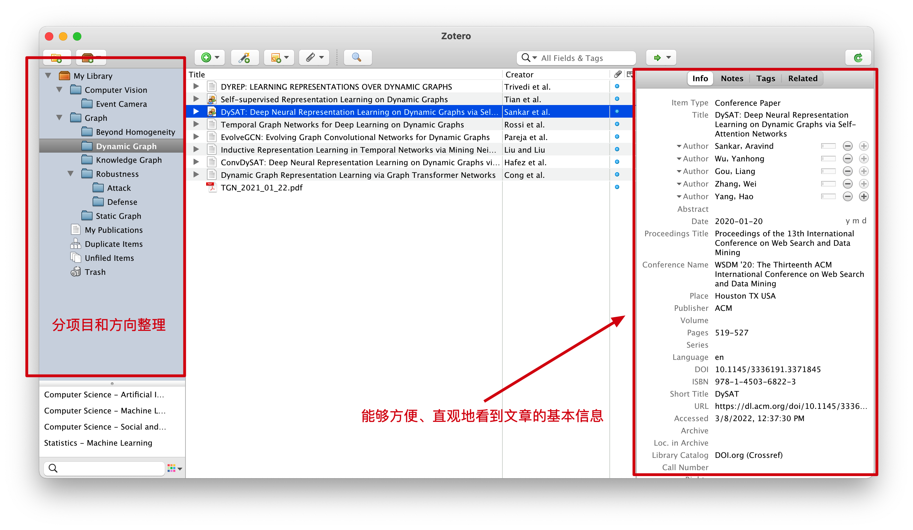
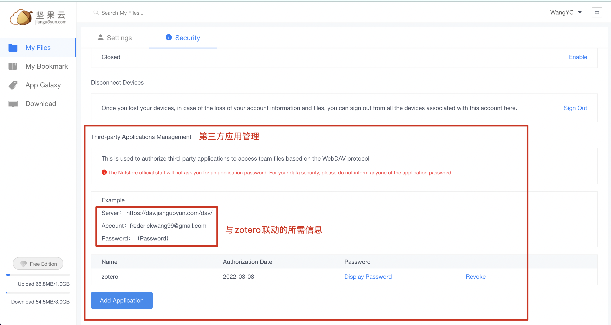
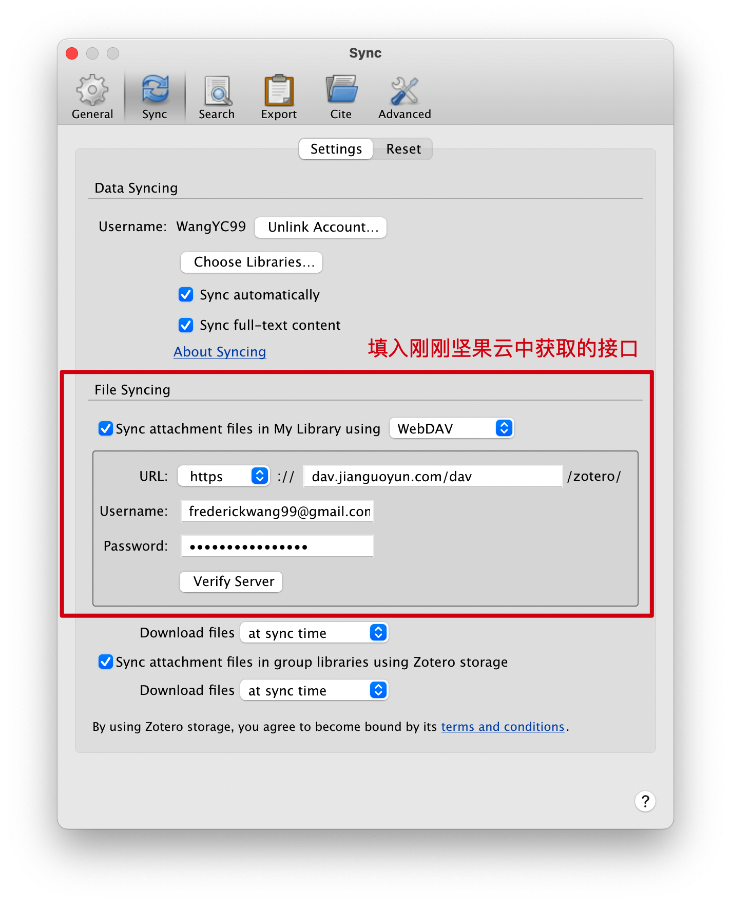

# 【TOOL】文献管理工具与文献云备份

> by WangYC
>
> @NWPU changan Mar.9th 2022

## 1. 文献管理工具zotero

在阅读某一领域方向的前期成果时，会面临需要阅读大量文献的情况。这时一个好的文献整理习惯以及功能强大的文献管理工具就十分可贵。

zotero就提供了这样一种论文管理服务，它不仅能够实现分门别类地整理和备份文献，同时以下几项服务让我认为它是这个领域的一款十分优秀的工具：

1. 文章基本信息自动提取（如发表时间、发表会议、文章领域、文章摘要等会直接显示在简介中）。
2. 支持与云备份服务提供方联动实现云备份（第二部分详细介绍）。
3. 能够与chrome等浏览器联动，无需下载pdf源文件即可直接导入文献。
4. free to use（🐶）

## 2. 借助坚果云实现zotero云备份

第一部分中提到可以利用云备份服务提供方来实现文献的备份，原理是利用WebDAV protocol。下面以坚果云为例进行详细介绍。

### 2.1 坚果云的第三方接口获取：

### 2.2 在zotero中关联坚果云

验证服务成功以后即可实现文献的云备份了。

当然如果不利用第三方的备份工具，zotero本身也提供备份服务，只不过可用的备份空间只有300M。

实现云备份后就可以多端分别编辑pdf后同步到云端了，即实现了不同硬件之间的联动，再也不用提着电脑在寝室和工位之间来回跑了！（只有一台机器的自动忽略hh）

