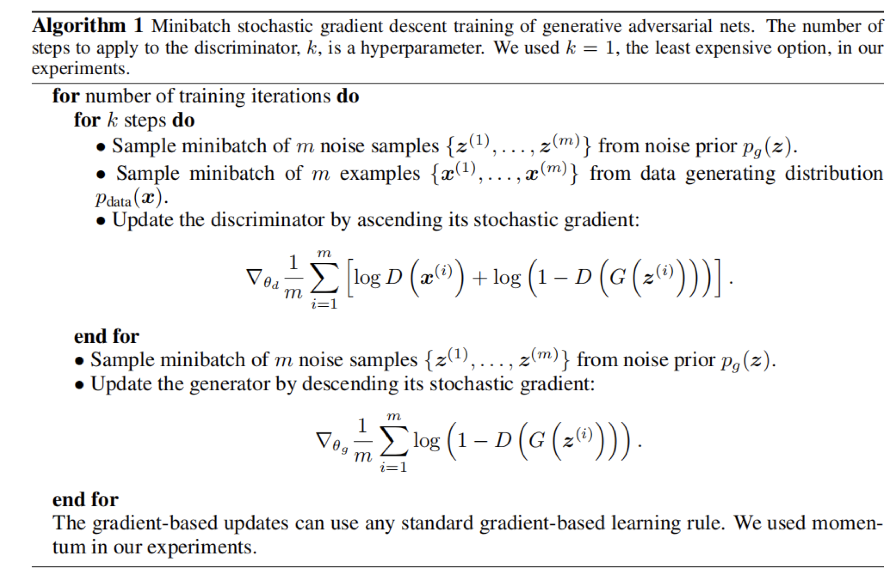
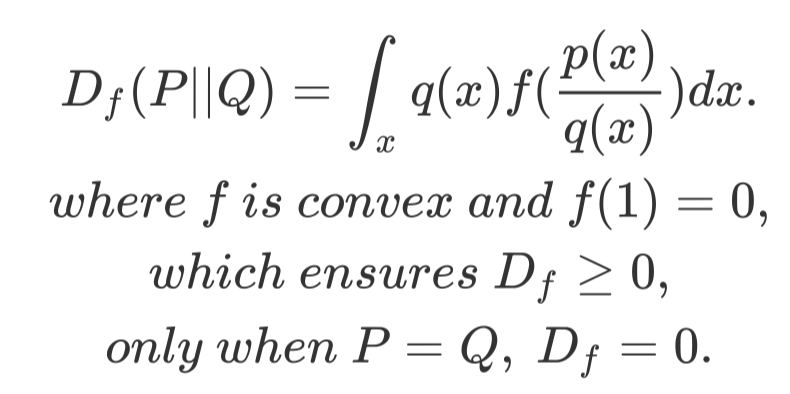
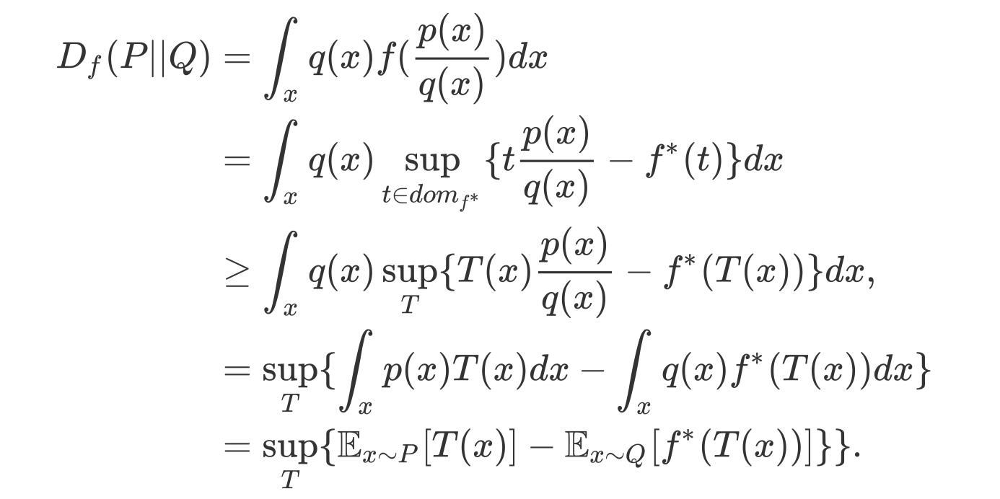
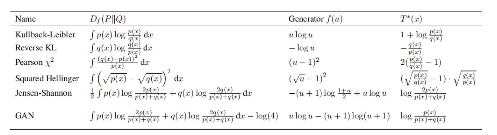
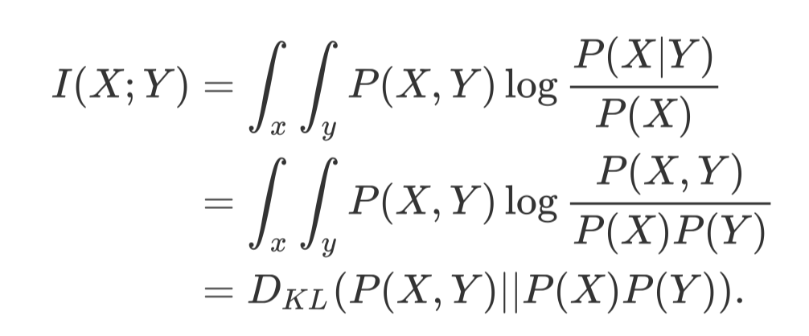
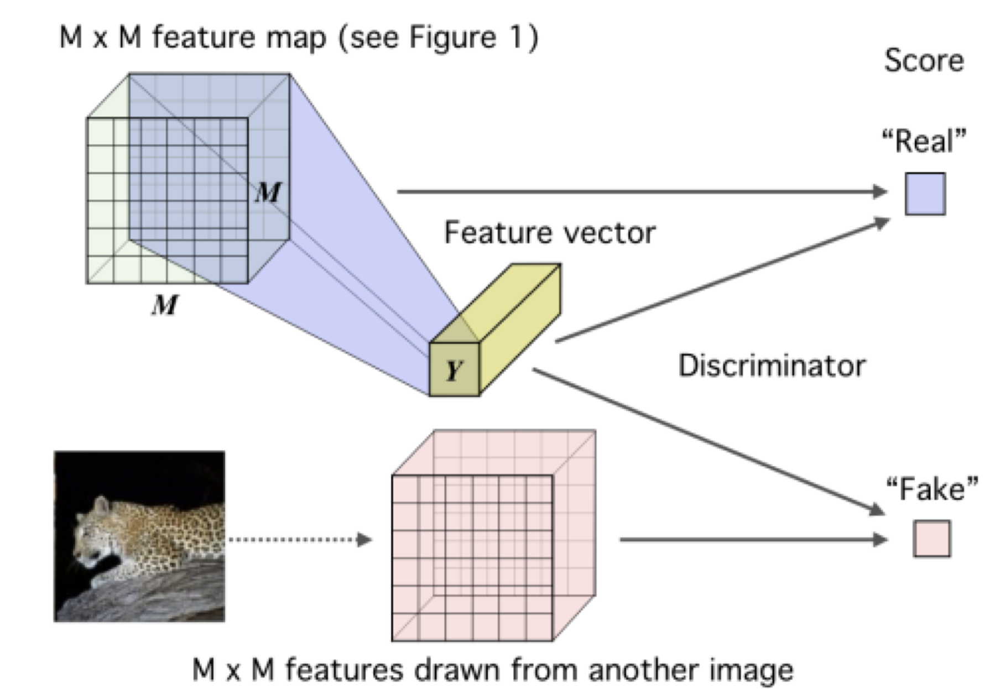

# 从GAN到InfoMax

> by WangYC_99
>
> @NWPU changan Mar.21st-22nd 2022

不久前与小伙伴进行讨论，从HeCo的对比学习机制，来到GAN提出的利用生成器和检验器来进行相互博弈，再来到了利用散度（Divergensy）来解释GAN，提出了GAN其实就是一种对于真实数据以及生成数据之间散度的估计与优化，至此所有的散度计算都可以通过神经网络来逼近（由于F-Divergensy可以由GAN的形式呈现，而所有的Divergensy可以通过F-Divergensy统一）；最后来到DIM，DIM的目标是设计一个良好的encoder，也就是通过输入到representation的表达器，这里采用了互信息（两个变量之间的非线形依赖关系）的概念，定义什么是一个好的结果呢？那就是representation出的tensor与输入的原始信息的互信息最大化时认为是好的；这里引入KL散度与互信息之间的严格数学推导，综上，我们可以通过神经网络来最大化逼近互信息，于是，DIM的encoder诞生。

## 一、由GAN开始

GAN是14年提出的对抗生成网络，通过随机噪声来生成真实图像。

GAN原文：https://arxiv.org/abs/1406.2661

上图来自知乎专栏https://zhuanlan.zhihu.com/p/34287744

图中展示出了GAN的工作过程，随机噪声noise通过生成器G得到生成数据，这个生成数据与真实数据通过检测器D来进行比较，通过反复迭代来训练生成器和检测器的参数，最终达到生成的数据与真实数据无限逼近的一个工作。

整个工作几个比较关注的地方：

1. 整个工作中存在着G和D两个关键环节，而二者的目标是相互矛盾的：G希望自己生成的数据能够“骗过”D，而D则希望自己能够完美识别出哪些信息是真实数据，哪些信息是G生成的“混子”。
2. 整个过程虽然听起来像是一个很妙的利用了博弈的工作，但是背后的数学原理如何解释呢？换句话说，D要怎样知道G和真实数据到底是像还是不像呢？如何去定义这个“像”？

针对第一个问题，这就是GAN设计的一个亮点了：

文章中的采用的算法思路是：第一步，定D优化G；第二部，定G优化D。两部持续循环往复。

至于第二个问题，请看第二部分↓↓↓

## 二、从GAN到散度

第一部分中提到了GAN的工作机制，其中一个尚未解决的问题就是，识别器D的工作机理是什么？也就是如何定义生成的数据和真实的数据是像还是不像。

由此，引入散度Divergensy的概念。

一下来自文章https://arxiv.org/pdf/1606.00709.pdf

散度是概率统计中衡量两个分布之间距离的概念：

f散度是所有具体散度的抽象形式。

这个散度是可以通过某种方式来进行逼近的：

其中的T(x)可以理解为对于f*的自变量t的估计值。

对于不同的散度，可以利用不同的f和t来进行逼近，清单：

这里一个非常值得注意的点就在最后一行，oh，是我们的GAN！

文章解释道，GAN的机制实际上是在不断地迭代来让随机生成的数据与咱们的真实数据之间的散度最小。

我认为这是对于神经网络可解释性不强的问题的一个重要回应，用散度来解释网络中的hidden layer究竟在干嘛。

同时，我们也得到了一个重要信息：可以通过神经网络来对散度进行最小化逼近模拟。

## 三、从散度到互信息

说完散度，再来提一个概念，互信息Mutual Infomation。

互信息是一个用来衡量两个变量之间的非线形依赖关系的数学概念。

听起来和刚才的散度有那么一丢丢累死的地方，好像都是在衡量两个对象之间的关系。

于是18年的https://arxiv.org/abs/1801.04062这篇文章《MINE-Mutual Information Neural Estimation》就提到了二者之间的严格推导关系。

文章给出kl散度和mi之间的严格数学推导：

是的，互信息可以直接由kl散度表示，而咱们的kl散度又可以通过神经网络来进行近似估计。

至此，我们可以通过神经网络来近似估计互信息MI。

## 四、从互信息到InfoMax

DIM这篇文章https://arxiv.org/abs/1808.06670提到的是一个自监督学习的encoder设计。

无监督学习一个重要的问题就是学习有用的 representation，本文的目的就是训练一个 representation learning 函数（即编码器encoder） ，其通过**最大编码器输入和输出之间的互信息(MI)**来学习对下游任务有用的 representation。

这其中的概念我们今天看其实就是一个对比学习的过程，只不过当时还没有提出这个概念，这给咱们提供了一个十分好的思路：利用互信息的数学原理来解释对比学习这个概念。

## 五、部分参考

小伙伴的知乎博客：