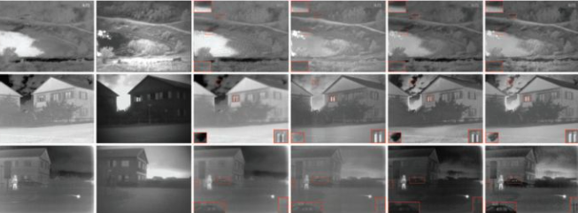
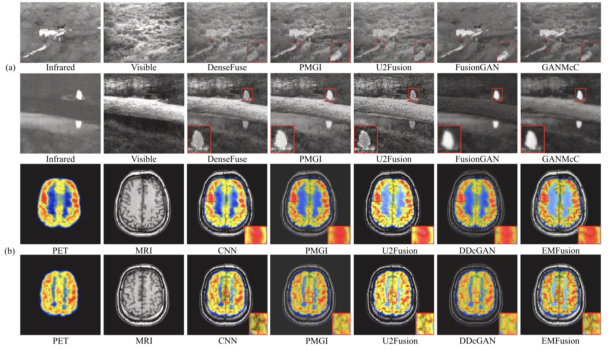

# 多源图像融合调研（多模态图像融合方向）

> by 王元淳 2019300099
>
> @NWPU 《模式识别与机器学习》2022年春季学期 实验报告

[toc]

## 0. Abstract

随着传感器的多样化以及信息处理需求的增长，Image Fusion已经在诸多领域显现出了必要性以及重要性。

本文作为《模式识别与机器学习》课程的期末调研报告，重点聚焦于多模态图像融合，总结现有的方法，指出现有方法的瓶颈并提出未来的展望。

## 1. Introduction

Image Fusion，图像融合，顾名思义是要将不同的图像融合为一张图像。

一般认为这里所谓的“不同的图像”指的是来源于不同传感器的图像信息。

> Fusion of images is defned as an alignment of noteworthy Information from diverse **sensors** using various mathematical models to generate a **single compound image**. 

之所以要进行多源图像的融合是因为单个传感器来源的图像很难将场景的信息和细节捕捉全面。利用图像融合，可以实现利用每个传感器各自的优势来共同提高整体图像的质量。目前，图像融合成为了robot vision, aerial, satellite imaging, medical imaging, and a robot or vehicle guidance等领域的一个重要的预处理步骤。目前有各种不同level的基于spatial或transform的方法以及应用。

在图像融合中，一类较为具体的方向是多模态图像融合（Multi-modal image fusion)。

多模态图像融合的特点：

- 不同传感器的成像原理不同，它们捕获的多模态图像在描述场景时的重点也有很大的不同。
- 通过融合不同模态图像中互补和有益的信息，可以对成像场景或目标提供更全面的描述。
- 两种最具代表性的多模态图像融合任务是红**外与可见光图像融合**和**医学图像融合**。

## 2. methods & discussions

### 2.1 红外光与可见光图像的融合方法

- 两种图像的特点：红外图像具有明显的对比度，即使在恶劣天气下也能有效地从背景中突出目标。可见光图像包含丰富的纹理细节，更符合人类的视觉感知。
- 图像融合目标：产生高对比度和丰富纹理的效果。
- 方法类型：AE，CNN和GAN方法

#### 2.1.1 AE方法

- 思想：自动编码器（Encoder：特征提取+Decoder：图像重建）+ 图像融合策略*（手工计算：图像融合）
- 局限性：设计图像融合策略是关键，手工计算方法是粗糙的，会限制融合效果的提升

#### 2.1.2 CNN方法

* 方法1：端到端（关键：损失函数、网络结构）
  * 网络结构：对于网络结构的设计，最常用和有效的方法是剩余连接（the residual connection）、密集连接（the dense connection）和双流结构（the dual-stream architecture）。
  * 损失函数：损失函数的设计在于表征融合结果与源图像之间对比度和纹理的相似性。主流的损失函数项包括强度损失（the intensity loss）、梯度损失（gradient loss）、SSIM损失（SSIM loss）和感知损失（perceptual loss），它们的权重比（weight ratio）决定了信息融合的趋势。
* 方法2：预训练模型特征提取+CNNt生成特征权重图进行图像融合+图像重建
  * 使用预先训练的网络（如VGGNet）从源图像中提取特征，并基于这些特征生成融合权重图。
  * 卷积神经网络只实现了融合。
  * 无论是特征提取还是图像重建，带来的融合性能都非常有限。

#### 2.1.3 GAN方法

* 思想：端到端（内容损失（content loss）和对抗性损失（adversarial loss））
* 内容损失：与CNN方法相似，CNN方法最初用于融合源图像
* 对抗损失：进一步限制了信息融合的趋势。
* 发展：
  * 早期用于红外和可见光图像融合的GAN方法仅在融合图像和可见光图像之间建立对抗性博弈，以进一步增强可见光图像丰富细节的保存。
  * 为了更好地平衡红外和可见光信息，后续方法已开始使用具有多个分类约束的单个判别器或双判别器（a single discriminator with multiple classification constraints or dual discriminators）来同时估计源图像的两个概率分布。
* 总结：一般来说，GAN方法可以产生有希望的融合结果。然而，在训练期间要保持发生器和鉴别器之间的平衡并不容易。

### 2.2 医学图像融合方法

**医学图像**根据所代表的信息可分为**结构图像**和**功能图像**

> 例如，PET和SPECT图像可以描述人体代谢功能的强度，而MRI和CT图像可以反映组织的结构。绿色荧光蛋白（GFP）图像可以显示与生物活细胞分子分布相关的功能信息，而相衬（PC）图像可以描述细胞核和线粒体等结构信息。

- 融合目标：医学图像融合将两种不同类型的医学图像结合起来，生成信息更丰富的单一图像，有利于更准确地诊断疾病。
- 融合方法：CNN方法和GAN方法。

#### 2.2.1 CNN方法

* 方法1：预训练模型特征提取+CNN图像融合+图像重建
  * CNN只参与特征融合。
    这些方法通常使用预先训练的卷积神经网络来测量医学图像像素的活动水平并生成融合权重图。然后，将生成的权重图与传统的拉普拉斯金字塔(Laplacian pyramid)等分解重建策略相结合，实现医学图像融合。
  * 存在的问题：由于网络参数未在医学图像上训练，因此由预训练网络生成的融合权重图可能不合适。

* 方法2：End-to-end
  * 基于所需信息在融合结果和源图像之间构建损失函数，在医学图像上精心训练网络。经过训练的网络能够端到端地完成特征提取、特征融合和图像重建。
  * 优点：与方法1相比，能够获得相对较好的融合性能。

#### 2.2.2 GAN方法

GAN方法通过对抗性学习机制同时对医学源图像中的**显著信息进行建模**。

- 优点：总体而言，GAN方法可以在医学图像融合中取得优异的性能。
- 挑战：由于功能图像的像素强度远大于结构图像，因此纹理信息可能被功能信息掩盖。医学图像融合的这一特点对GAN方法提出了挑战，因为GAN的训练不平衡经常发生。

## 3. future directions

第2部分讨论了目前多模态图像融合中的一些方法以及优缺点。

总结来看不难发现，目前的基于neural的方法对于图像的配准要求比较高。

能否利用神经网络来完成多模态图像之间的配准问题？我认为这是一个值得研究的方向。

目前我可以想到的思路是，如果是基于CNN的方法，那么可以训练图像变换矩阵；如果是GAN方法的话直接就利用图像生成方法训练网络将非配准图像转化为配准图像的能力。

## 4. reference

* Zhang H, Xu H, Xiao Y, et al. Rethinking the image fusion: A fast unified image fusion network based on proportional maintenance of gradient and intensity[C]//Proceedings of the AAAI Conference on Artificial Intelligence. 2020, 34(07): 12797-12804.

* Zhang H, Xu H, Tian X, et al. Image fusion meets deep learning: A survey and perspective[J]. Information Fusion, 2021, 76: 323-336.

* Kaur H, Koundal D, Kadyan V. Image fusion techniques: a survey[J]. Archives of computational methods in Engineering, 2021, 28(7): 4425-4447.
* Wang Z, Ziou D, Armenakis C, et al. A comparative analysis of image fusion methods[J]. IEEE transactions on geoscience and remote sensing, 2005, 43(6): 1391-1402.
* Zhang Y. Understanding image fusion[J]. Photogramm. Eng. Remote Sens, 2004, 70(6): 657-661.

