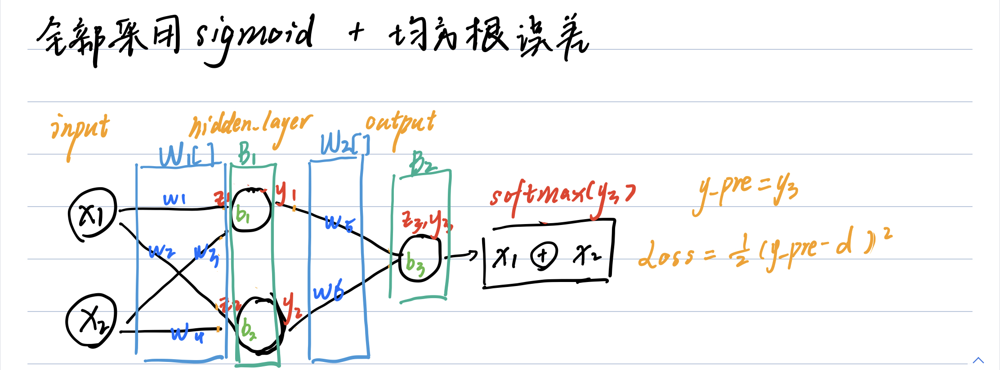
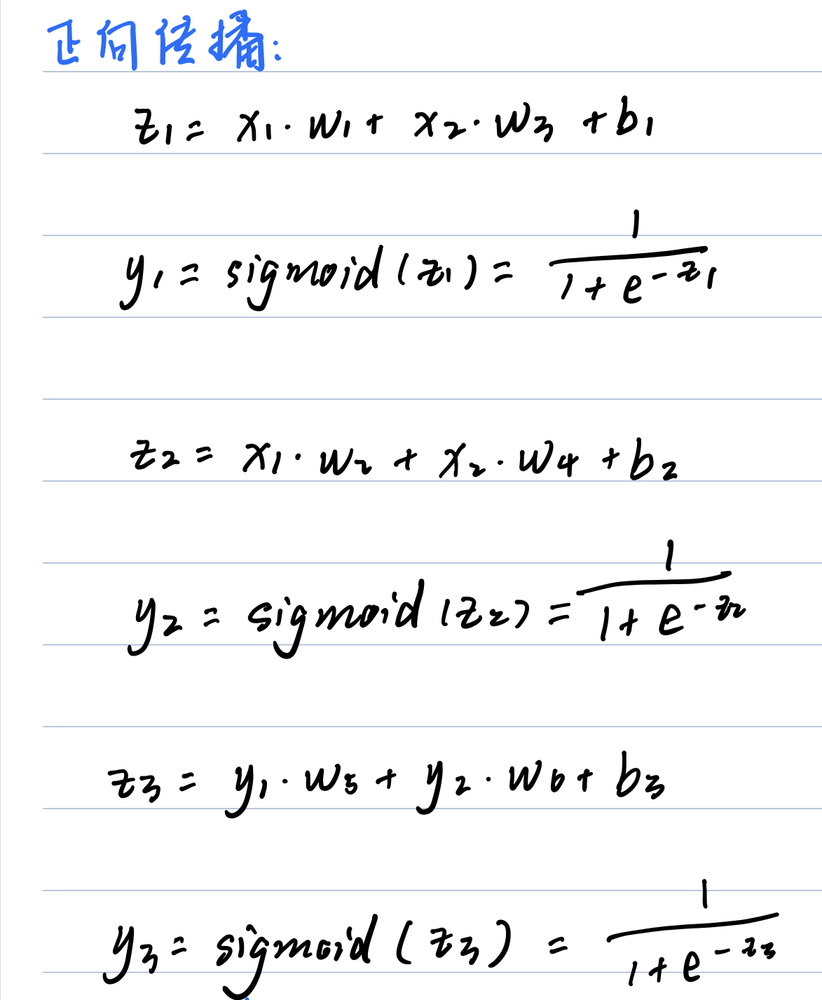
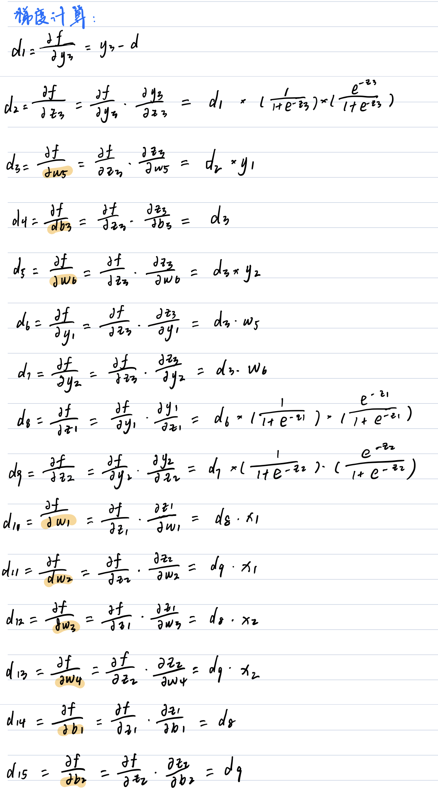
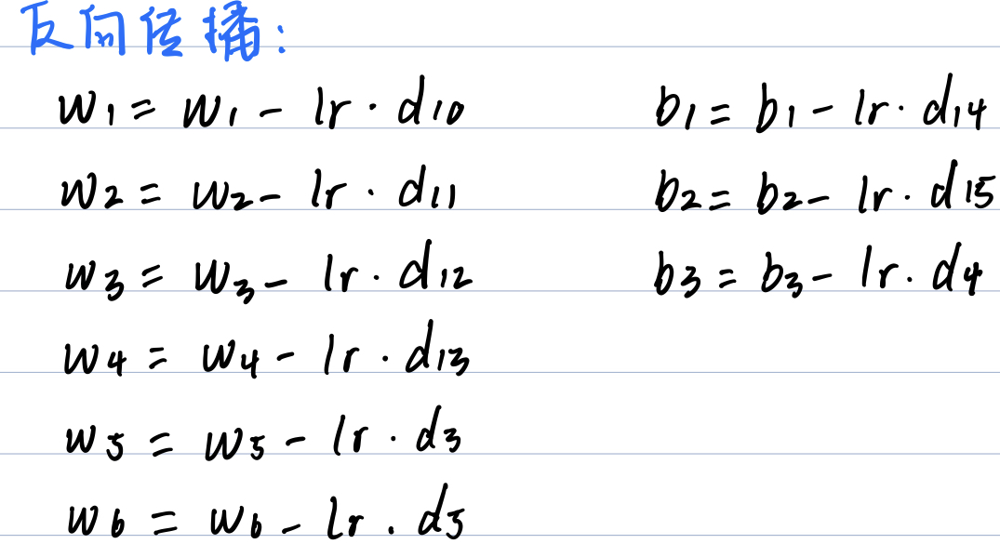
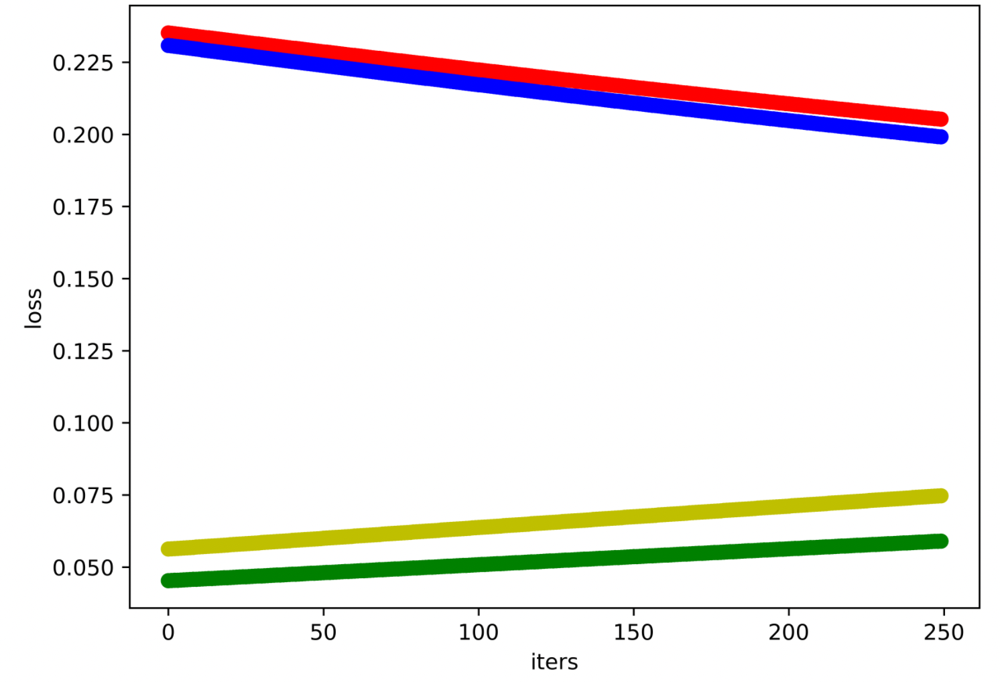
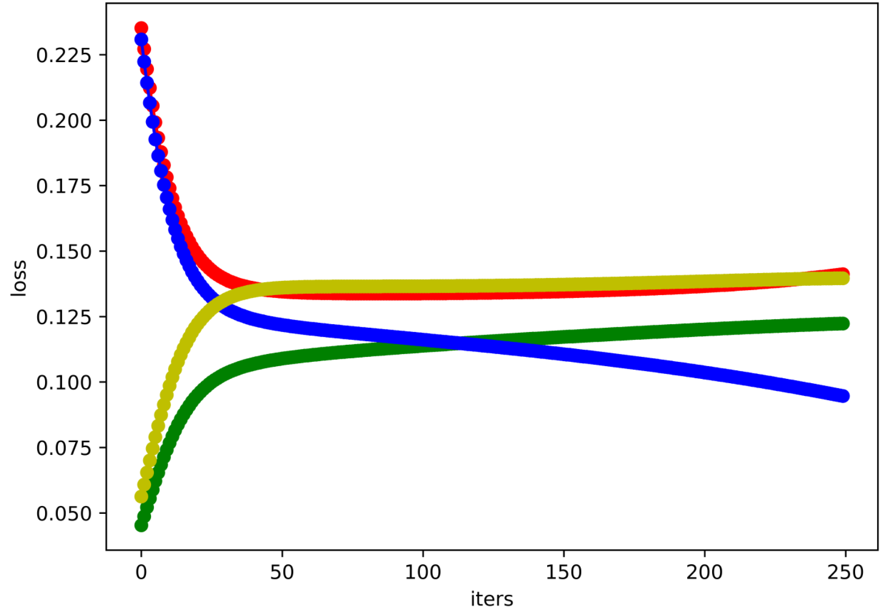
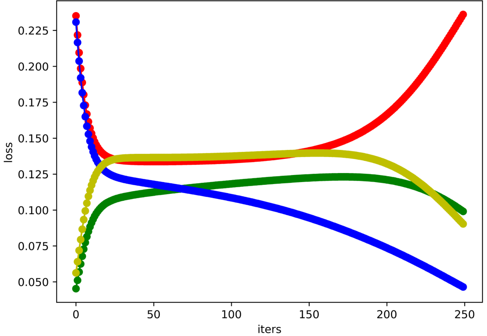
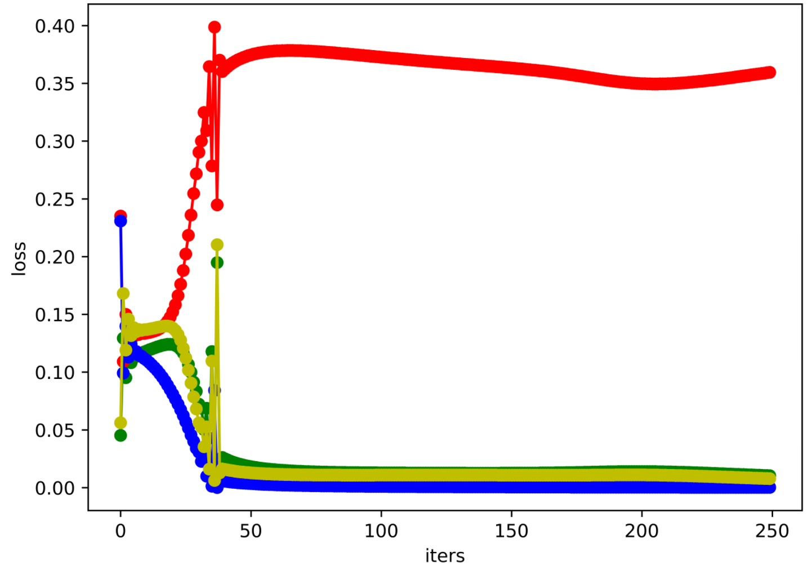
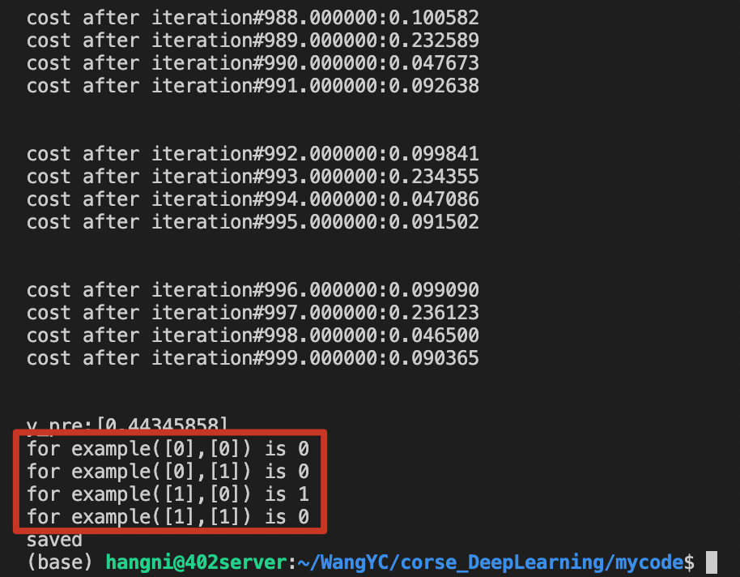
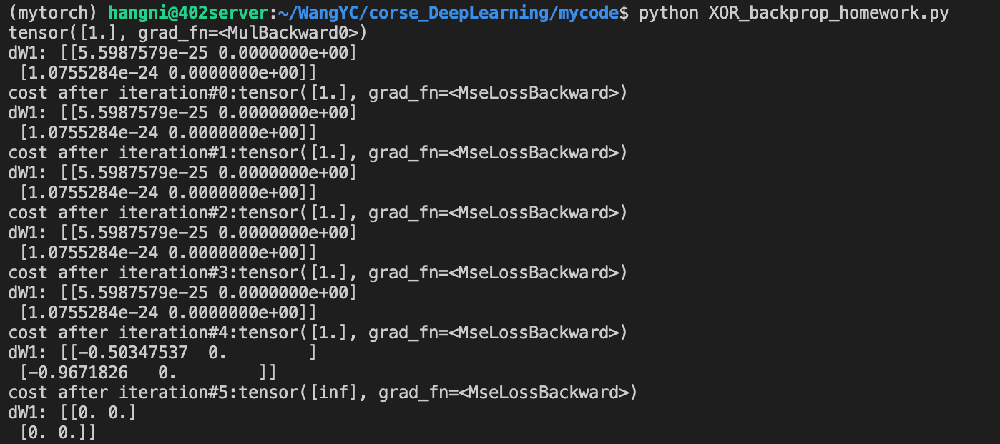

# 实验一：多层感知机实现异或

> by 王元淳 2019300099 教育实验学院
>
> @May.17th 2022
>
> 《深度学习导论》实验报告

## 一、实验目的与要求

1.1熟悉多层感知机定义及模型搭建方法

1.2掌握梯度下降法和反向传播算法基本过程

1.3了解pytorch中自动求导机制及其用法

## 二、实验内容：

2.1搭建多层感知机实现异或

2.2采用链式法则推导反向传播算法

2.3编程实现反向传播算法训练模型

2.4验证所建立模型与pytorch中自动求导机制(autograd)是否一致

## 三、实验过程与结果

### 3.1 多层感知机

#### 3.1.1 MLP结构图

 

#### 3.1.2 激活函数与损失函数

激活函数全部采用sigmoid。

损失函数采用均方差。

### 3.2 前向传播与反向传播推导

#### 3.2.1 前向传播



#### 3.2.2 反向传播

 梯度计算：



参数更新：



### 3.3 XOR_DIY_homework实验结果

给出参数初始化、超参数的取值、损失函数的下降趋势图、测试结果

#### 参数初始化：

```python
def initialize_parameters(n_x, n_hidden, n_y):
    
    # 模型参数用矩阵表示，并随机初始化，或按某分布初始化
    
    W1 = np.random.random((n_hidden, n_x))
    B1 = np.random.randn(n_hidden, 1)
    W2 = np.random.random((n_y, n_hidden))
    B2 = np.random.randn(n_y, 1)

    
    # 将参数打包为dictionary形式
    parameters={"W1":W1,"B1":B1,"W2":W2,"B2":B2}
    
    return parameters
```

#### 前向传播：

```python
def forward_prop(X, parameters):
    # 从字典dictionary里读取出所有的参数
    # 例如 W1=parameters["W1"]
    W1 = parameters['W1']
    W2 = parameters['W2']
    B1 = parameters['B1']
    B2 = parameters['B2']
    
    # 利用矩阵运算，依次计算每层的z和a
    # 例如：
    # Z1=np.dot(W1,X)+b1
    # A1=1/(1+np.exp(-z1))
    Z1 = np.dot(W1, X) + B1
    # print('Z1:', Z1)
    y1 = 1/(1 + np.exp(-Z1[0]))
    y2 = 1/(1 + np.exp(-Z1[1]))

    Y = np.array([y1, y2])
    Z2 = np.dot(W2, Y) + B2
    y3 = 1/(1 + np.exp(-Z2[0]))

    y_pred = y3      # 输出
    # cache={"A1":A1,"A2":A2} # 需要保留到BackProp计算梯度的缓存
    cache = {'W1':W1, 'W2':W2, 'B1':B1, 'B2':B2, 'Z1':Z1, 'Z2':Z2, 'y1':y1, 'y2':y2, 'y3':y3}
    
    return y_pred, cache
```

#### 损失函数设计：

```python
#计算损失函数
def calculate_cost(y_pred,Y):
    
    # 定义损失函数，均方根或交叉熵
    cost = (y_pred - Y)**2 / 2
    
    # 注意：返回的cost是标量
    return cost
```

#### 梯度计算：

```python
def backward_prop(X, Y, y_pred, cost, cache, parameters, learning_rate):
    W1 = cache['W1']
    W2 = cache['W2']
    B1 = cache['B1']
    B2 = cache['B2']
    Z1 = cache['Z1']
    Z2 = cache['Z2']
    y1 = cache['y1']
    y2 = cache['y2']
    y3 = cache['y3']
    x1 = X[0]
    x2 = X[1]

    w1 = W1[0][0]
    w2 = W1[1][0]
    w3 = W1[0][1]
    w4 = W1[1][1]
    b1 = B1[0][0]
    b2 = B1[1][0]
    w5 = W2[0][0]
    w6 = W2[0][1]
    b3 = B2[0][0]
    z1 = Z1[0]
    z2 = Z1[1]
    z3 = Z2[0]

    # 计算每个参数的梯度，可利用forward的缓存cache
    d1 = y_pred - Y
    d2 = d1 * (1 / (1 + np.exp(-z3))) * (np.exp(-z3)/(1 + np.exp(-z3)))
    d3 = d2 * y1
    d4 = d3
    d5 = d3 * y2
    d6 = d3 * w5
    d7 = d3 * w6 
    d8 = d6 * (1 / (1 + np.exp(-z1))) * (np.exp(-z1)/(1 + np.exp(-z1)))  
    d9 = d7 * (1 / (1 + np.exp(-z2))) * (np.exp(-z2)/(1 + np.exp(-z2)))  
    d10 = d8 * x1
    d11 = d9 * x1
    d12 = d8 * x2
    d13 = d9 * x2
    d14 = d8
    d15 = d9
    d_list = np.array([d3, d4, d5, d10, d11, d12, d13, d14, d15])
    # d_dic = {'d3':d3, 'd4':d4, 'd5':d5, 'd10':d10, 'd11':d11, 'd12':d12, 'd13':d13, 'd14':d14, 'd15':d15}
    return d_list
```

#### 参数更新：

```python
def refresh(d_list, cache):
    # 参数更新，例如 W1=W1-learning_rate*dW1
    # print('cache:{}'.format(cache))
    W1 = cache['W1']
    W2 = cache['W2']
    B1 = cache['B1']
    B2 = cache['B2']

    w1 = W1[0][0]
    w2 = W1[1][0]
    w3 = W1[0][1]
    w4 = W1[1][1]
    b1 = B1[0][0]
    b2 = B1[1][0]
    w5 = W2[0][0]
    w6 = W2[0][1]
    b3 = B2[0][0]

    d3 = d_list[0]
    d4 = d_list[1]
    d5 = d_list[2]
    d10 = d_list[3]
    d11 = d_list[4]
    d12 = d_list[5]
    d13 = d_list[6]
    d14 = d_list[7]
    d15 = d_list[8]

    lr = learning_rate
    w1 = w1 - lr * d10
    w2 = w2 - lr * d11
    w3 = w3 - lr * d12
    w4 = w4 - lr * d13
    w5 = w5 - lr * d3
    w6 = w6 - lr * d5
    b1 = b1 - lr * d14
    b2 = b2 - lr * d15
    b3 = b3 - lr * d4
    
    # 返回更新后的参数
    # print('d:{}'.format(d10))

    # print('w1:{}, w3:{}'.format(w1, w3)) 
    w1 = np.append(w1, w3)
    w2 = np.append(w2, w4)
    W1 = np.array([w1, w2])
    w5 = np.append(w5, w6)
    W2 = np.array([w5])
    B1 = np.array([b1, b2])
    B2 = np.array([b3])
    new_parameters = {"W1":W1,"B1":B1,"W2":W2,"B2":B2}

    return new_parameters
```

#### 超参数取值：

epoch取1000，lr分别取如下值：

##### lr = 0.1:



##### lr = 6:



##### lr = 10:



##### lr = 100:



可以看到lr取10的时候的可视化曲线能够较为清晰地反映出四个数据上loss的变化。

其中数据取0，1的这一组loss会逐渐上升到0.36附近，而其他三组的loss会下降到趋近于0 。

预测结果同样，只有0，1这一组数据预测错误，其他三组数据均预测正确。



### 3.4 XOR_backprop_homework实验结果

比较自动求导与DIY中求导结果是否一致

#### 参数初始化：

采用随机分布采样进行初始化数据

```python
def initialize_parameters(n_x, n_hidden, n_y):
    
    # # 模型参数用tensor表示，并随机初始化，或按某分布初始化
    # # 

    # W1=
    # b1=

    
    # # 将参数打包为dictionary形式
    # # 例如： parameters={"W1":W1,"b1":b1,"W2":W2,"b2":b2}

    # # 模型参数用矩阵表示，并随机初始化，或按某分布初始化
    
    # W1 = torch.tensor(np.random.random((n_hidden, n_x)), requires_grad=True)
    W1 = torch.zeros(n_hidden, n_x, requires_grad = True)
    torch.nn.init.uniform_(W1, a=10, b=15)
    # B1 = torch.tensor(np.random.randn(n_hidden, 1), requires_grad=True)
    B1 = torch.zeros(n_hidden, 1, requires_grad = True)
    torch.nn.init.uniform_(B1, a=10, b=15)
    # W2 = torch.tensor(np.random.random((n_y, n_hidden)), requires_grad=True)
    W2 = torch.zeros(n_y, n_hidden, requires_grad = True)
    torch.nn.init.uniform_(W2, a=10, b=15)
    # B2 = torch.tensor(np.random.randn(n_y, 1), requires_grad=True)
    B2 = torch.zeros(n_y, 1, requires_grad = True)
    torch.nn.init.uniform_(B2, a=10, b=15)

    # print('W1:{}, W2:{}, B1:{}, B2:{}'.format(W1, W2, B1, B2))
    
    # 将参数打包为dictionary形式
    parameters={"W1":W1,"B1":B1,"W2":W2,"B2":B2}
    return parameters
```

#### 前向传播：

```python
def forward_prop(X,parameters):
    # 从字典dictionary里读取出所有的参数
    # 例如 W1=parameters["W1"]
    W1 = parameters['W1']
    W2 = parameters['W2']
    B1 = parameters['B1']
    B2 = parameters['B2']
    
    X = torch.FloatTensor(X)
    # 利用torch中的tensor运算，依次计算每层的z和a
    # 例如：
    # z1 = torch.add(torch.matmul(W, X), b1)
    # a1 = 1/(1+torch.exp(-z1))

    # y_pred =        # 输出

    # Z1 = np.dot(W1, X) + B1
    Z1 = torch.add(torch.matmul(W1, X), B1)
    y1 = 1/(1 + torch.exp(-Z1[0]))
    y2 = 1/(1 + torch.exp(-Z1[1]))
    # Y = torch.tensor([y1, y2])
    Y = torch.cat((y1, y2), 0)
    # Z2 = np.dot(W2, Y) + B2
    Z2 = torch.add(torch.matmul(W2, Y), B2)
    y3 = 1/(1 + torch.exp(-Z2[0]))

    y_pred = y3      # 输出
    # cache={"A1":A1,"A2":A2} # 需要保留到BackProp计算梯度的缓存
    # cache = {'W1':W1, 'W2':W2, 'B1':B1, 'B2':B2, 'Z1':Z1, 'Z2':Z2, 'y1':y1, 'y2':y2, 'y3':y3}
    
    return y_pred
```

#### 损失函数设计：

```python
def calculate_cost(y_pred,Y):
    
    # 定义损失函数，均方根或交叉熵
    # cost = (y_pred - Y)**2 / 2
    loss_fn1 = torch.nn.MSELoss(reduction='none')
    cost = loss_fn1(y_pred.float(), Y.float())

    return cost
```

#### 梯度下降：

```python
        # 计算损失函数
        cost=calculate_cost(y_pred, y)

        # 梯度下降并更新参数
        
        # 自动求导
        cost.backward()

        # 查看自动求导之后各参数的梯度，例如：print("dW1:", W1.grad.numpy())，检验是否与DIY的结果一致
        print("dW1:", W1.grad.numpy())

        with torch.no_grad():
            # 参数更新，例如 W1 -= learning_rate*W1.grad
            W1 -= learning_rate * W1.grad
            W2 -= learning_rate * W2.grad
            B1 -= learning_rate * B1.grad
            B2 -= learning_rate * B2.grad

        # 所有参数的梯度归零，例如W1.grad.zero_()（思考为什么要做这个）
        W1.grad.zero_()
        W2.grad.zero_()
        B1.grad.zero_()
        B2.grad.zero_()
```

### 梯度结果：

以dW1为例：



可以看到梯度逐渐趋近于0，符合预测。

但是也许是因为随机初始化方式与diy不同，又或许是loss采用的封装格式与手写的差方和不同，因此与DIY的梯度并不对应，有待继续研究。

但是整体的趋势是一致的，随着迭代的进行grad逐渐趋近于0。