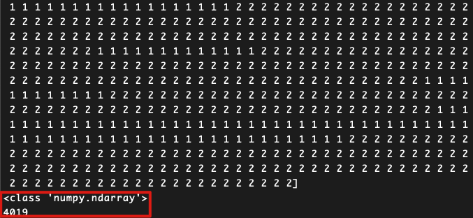
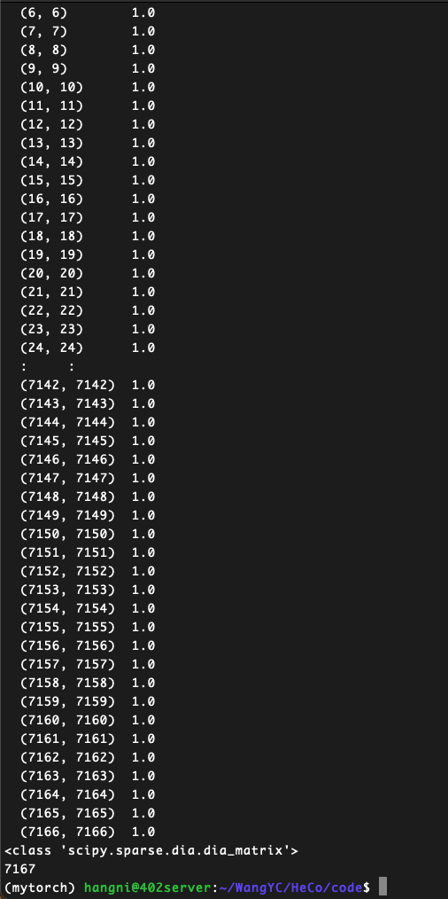

# HeCo实验

> by WangYC
>
> @NWPU changan Mar.23rd 2022

## 一、数据集

### 1.1 acm


#### 1.1.1 数据集含义

来源：《Heterogeneous Graph Attention Network》


数据集收录了ACM上发表的论文，分为P A S三个类别，P的特征是依据bag-of-words表达来形成的。

Bag-of-words模型是信息检索领域常用的文档表示方法。

在信息检索中，BOW模型假定对于一个文档，忽略它的单词顺序和语法、句法等要素，将其仅仅看作是若干个词汇的集合，文档中每个单词的出现都是独立的，不依赖于其它单词是否出现。（是不关顺序的）

Wikipedia上给出了如下例子:

> John likes to watch movies. Mary likes too.
>
> John also likes to watch football games.

根据上述两句话中出现的单词, 我们能构建出一个**字典** (dictionary):

> {"John": 1, "likes": 2, "to": 3, "watch": 4, "movies": 5, "also": 6, "football": 7, "games": 8, "Mary": 9, "too": 10}

该字典中包含10个单词, 每个单词有唯一索引, ***注意它们的顺序和出现在句子中的顺序没有关联. 根据这个字典,*** 我们能将上述两句话重新表达为下述两个向量:

> [1, 2, 1, 1, 1, 0, 0, 0, 1, 1]
>
> [1, 1, 1, 1, 0, 1, 1, 1, 0, 0]

这两个向量共包含10个元素, 其中第i个元素表示字典中第i个单词在句子中出现的次数. 因此BoW模型可认为是一种***统计直方图** (histogram)*. 在文本检索和处理应用中, 可以通过该模型很方便的计算***词频***.

参考：https://zhuanlan.zhihu.com/p/29933242

#### 1.1.2 文件夹目录结构：

```
|-- a_feat.npz
|-- labels.npy
|-- nei_a.npy
|-- nei_s.npy
|-- p_feat.npz
|-- pa.txt
|-- pap.npz
|-- pos.npz
|-- ps.txt
|-- psp.npz
|-- test_20.npy
|-- test_40.npy
|-- test_60.npy
|-- train_20.npy
|-- train_40.npy
|-- train_60.npy
|-- val_20.npy
|-- val_40.npy
`-- val_60.npy
```

#### 1.1.3 数据内容

* labels.npy 应该是各个文章的labels，但是实际大小与介绍中paper的大小不一样

  

  one_hot:

  

* a_feat.npz

  数据的读取利用了函数np.eye()：

  这个函数的用法并非单单制造一个对角矩阵，而是通过其来将一个label数组，大小为(1,m)或者(m,1)的数组，转化成one-hot数组。例如他可以将类别总数为6的labels=[1,2,3,0,1,1]的数组转化成数组[[0,1,0,0,0,0],[0,0,1,0,0,0],[0,0,0,1,0,0],[0,0,0,0,0,0],[0,1,0,0,0,0],[0,1,0,0,0,0]]这就是所谓的one-hot的形式。

  参考：https://blog.csdn.net/m0_37393514/article/details/81455915

  结果：

  

  看到是一个存储稀疏矩阵的形式，公7167个内容，表示的大概是一个对角为1，其他为0的稀疏矩阵。

* p_feat.npz

  

* 
