# 文章复现&实验修改：DMGI

> by WangYC
>
> @NWPU chang'an Apr.8th 2022
>
> 文章原文：http://hanj.cs.illinois.edu/pdf/aaai20_cpark.pdf

## 1. 文章工作

文章提出了一种针对multiplex graph的一种无监督学习的框架DMGI。multiplex graph可以理解为一种特殊的异质图，它不区分节点的类别，只是区分边的类别，也就是只有meta-path的view没有schema的view。DMGI的一个亮点是设计了可以jointly训练不同meta-path的节点embedding的freamework以及鉴别器。

## 2. 方法细节

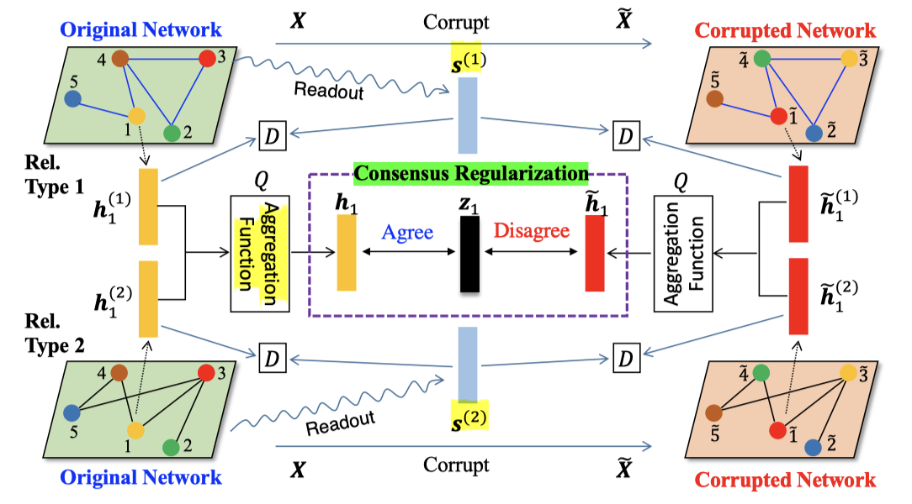

整个工作无监督学习的要点在于设计了对比学习的机制，分为两个大的部分：第一部分是不同的meta-path有不同的对比参考，这里的对比的对象是每个meta-path整个图的readout的全局信息，正样本就是每个meta-path自己的embedding（用的gcn），负样本是每个meta-path打乱特征以后的embedding，两个loss通过attention加起来作为整个的loss; 第二个部分是不区分meta-path的对比，首先将每个meta-path的embedding聚合起来，正负样本的选取还是和之前一样。只不过这里的参照向量是网络训练的参数。

## 3. 实验结果复现

### 3.1 imdb

文章中的imdb只有两个种类的meta-path，因此重新构造数据集。

样例数据集格式输出：主要设计了pickle文件的解析

```python
import pickle
import pprint

file=open("/home/hangni/WangYC/DMGI/data/imdb.pkl","rb")
file_data=pickle.load(file)
pprint.pprint(file_data)
MAM = file_data['MAM']
MDM = file_data['MDM']
feature = file_data['feature']
label = file_data['label']
print('MAM: {}, type:{}. '.format(MAM, MAM.shape))
print('MDM: {}, type:{}. '.format(MDM, MDM.shape))
print('feature: {}, type:{}. '.format(feature, feature.shape))
print('label: {}, type:{}. '.format(label, label.shape))

file.close()
```

其中每一个具体的文件类型都是np的n维向量：

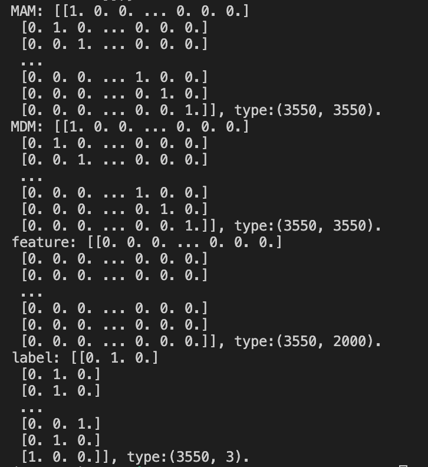

经过HeCo的数据处理后的文件数据样式：

```python
mam = np.load('/home/hangni/HeCo-main/data/imdb/mam.npz')
print('mam: {}, type: {}'.format(mam.files, type(mam.files)))
print('row:{}, col:{}, format:{}, shape:{}, data:{}'.format(mam['row'], mam['col'], mam['format'], mam['shape'], mam['data']))
```

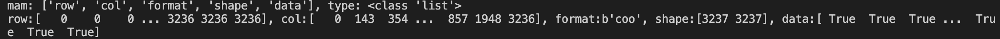

 将上述数据处理成为需要的非稀疏矩阵的形式：

```python
mam = np.load('/home/hangni/HeCo-main/data/imdb/mam.npz')
row = mam['row']
col = mam['col']
data = mam['data']

coo = scipy.sparse.coo_matrix((data, (row, col)), shape=(3270, 3270))
coo = coo.A
coo = coo.astype(int)
```

全部所需要的数据处理：

```python
import numpy as np
import scipy.sparse
from sklearn.preprocessing import OneHotEncoder
import pickle as pkl

def encode_onehot(labels):
    labels = labels.reshape(-1, 1)
    enc = OneHotEncoder()
    enc.fit(labels)
    labels_onehot = enc.transform(labels).toarray()
    return labels_onehot

#MAM
mam = np.load('/home/hangni/HeCo-main/data/imdb/mam.npz')
row = mam['row']
col = mam['col']
data = mam['data']

MAM = scipy.sparse.coo_matrix((data, (row, col)), shape=(mam['shape'][0], mam['shape'][0]))
MAM = MAM.A
MAM = MAM.astype(float)

#MDM
mdm = np.load('/home/hangni/HeCo-main/data/imdb/mdm.npz')
row = mdm['row']
col = mdm['col']
data = mdm['data']

MDM = scipy.sparse.coo_matrix((data, (row, col)), shape=(mdm['shape'][0], mdm['shape'][0]))
MDM = MDM.A
MDM = MDM.astype(float)

#MKM
mkm = np.load('/home/hangni/HeCo-main/data/imdb/mkm.npz')
row = mkm['row']
col = mkm['col']
data = mkm['data']

MKM = scipy.sparse.coo_matrix((data, (row, col)), shape=(mkm['shape'][0], mkm['shape'][0]))
MKM = MKM.A
MKM = MKM.astype(float)

#feature
feat = np.load('/home/hangni/WangYC/imdb_process/m_feat.npz')
feature = scipy.sparse.coo_matrix((feat['data'], (feat['row'], feat['col'])), shape=(feat['shape'][0], feat['shape'][1]))
feature = feature.A

#label
labels = np.genfromtxt('/home/hangni/WangYC/imdb_process/m_label.txt')
label = encode_onehot(labels[:, 1])

#test_idx
test_idx = np.load('/home/hangni/HeCo-main/data/my_data/imdb/test_20.npy')

#train_idx
train_idx = np.load('/home/hangni/HeCo-main/data/my_data/imdb/train_20.npy')

#val_idx
val_idx = np.load('/home/hangni/HeCo-main/data/my_data/imdb/val_20.npy')

print('MAM:{}, MDM:{}, MKM:{}, feature:{}, label:{}'.format(MAM, MDM, MKM, feature, label))

#saving
file_data = {'MAM':MAM, 'MDM':MDM, 'MKM':MKM, 'feature':feature, 'label':label, 'test_idx':test_idx, 'train_idx':train_idx, 'val_idx':val_idx}
pkl.dump(file_data, open('imdb_new.pkl',"wb"), protocol=4)
```

### 3.2 dblp

从npz还原csr矩阵与还原coo矩阵的思路不一样的地方：

```python
#coo_matrix
APTPA = scipy.sparse.coo_matrix((aptpa['data'], (aptpa['row'], aptpa['col'])), shape=(aptpa['shape'][0], aptpa['shape'][1]))
#csr_matrix
feature = scipy.sparse.csr_matrix((feat['data'],feat['indices'], feat['indptr']), shape=(feat['shape'][0], feat['shape'][1]))
```

### 3.3 freebase

与dblp基本相同，但是由于没有初始特征，因此feature的矩阵是生成的单位矩阵。


## 4. 实验设置修改

### 4.1 下游任务修改：

改为与HeCo相同的下游任务。

```python
def evaluate(embeds, idx_train, idx_val, idx_test, label, device
            , nb_classes=3, ratio=20, dataset='imdb_new', lr=0.01, wd=0, isTest=True):

    hid_units = embeds.shape[2]
    nb_classes = label.shape[2] 
    xent = nn.CrossEntropyLoss()
    train_embs = embeds[0, idx_train]
    val_embs = embeds[0, idx_val]
    test_embs = embeds[0, idx_test]

    train_lbls = torch.argmax(label[0, idx_train], dim=1)
    val_lbls = torch.argmax(label[0, idx_val], dim=1)
    test_lbls = torch.argmax(label[0, idx_test], dim=1)
    
    accs = []
    micro_f1s = []
    macro_f1s = []
    macro_f1s_val = []
    auc_score_list = []

    for _ in range(50):
        log = LogReg(hid_units, nb_classes)
        opt = torch.optim.Adam(log.parameters(), lr=lr, weight_decay=wd)
        log.to(device)

        val_accs = []
        test_accs = []
        val_micro_f1s = []
        test_micro_f1s = []
        val_macro_f1s = []
        test_macro_f1s = []

        logits_list = []
        for iter_ in range(200):
            # train
            log.train()
            opt.zero_grad()

            logits = log(train_embs)
            loss = xent(logits, train_lbls)

            loss.backward()
            opt.step()

            # print(loss)

            # val
            logits = log(val_embs)
            preds = torch.argmax(logits, dim=1)

            val_acc = torch.sum(preds == val_lbls).float() / val_lbls.shape[0]
            val_f1_macro = f1_score(val_lbls.cpu(), preds.cpu(), average='macro')
            val_f1_micro = f1_score(val_lbls.cpu(), preds.cpu(), average='micro')

            val_accs.append(val_acc.item())
            val_macro_f1s.append(val_f1_macro)
            val_micro_f1s.append(val_f1_micro)

            # test
            logits = log(test_embs)
            preds = torch.argmax(logits, dim=1)

            test_acc = torch.sum(preds == test_lbls).float() / test_lbls.shape[0]
            test_f1_macro = f1_score(test_lbls.cpu(), preds.cpu(), average='macro')
            test_f1_micro = f1_score(test_lbls.cpu(), preds.cpu(), average='micro')

            test_accs.append(test_acc.item())
            test_macro_f1s.append(test_f1_macro)
            test_micro_f1s.append(test_f1_micro)
            logits_list.append(logits)

        max_iter = val_accs.index(max(val_accs))
        accs.append(test_accs[max_iter])
        max_iter = val_macro_f1s.index(max(val_macro_f1s))
        macro_f1s.append(test_macro_f1s[max_iter])
        macro_f1s_val.append(val_macro_f1s[max_iter])

        max_iter = val_micro_f1s.index(max(val_micro_f1s))
        micro_f1s.append(test_micro_f1s[max_iter])

        # auc
        best_logits = logits_list[max_iter]
        best_proba = softmax(best_logits, dim=1)
        auc_score_list.append(roc_auc_score(y_true=test_lbls.detach().cpu().numpy(),
                                            y_score=best_proba.detach().cpu().numpy(),
                                            multi_class='ovr'
                                            ))

    if isTest:
        print("\t[Classification] Macro-F1_mean: {:.4f} var: {:.4f}  Micro-F1_mean: {:.4f} var: {:.4f} auc {:.4f}"
              .format(np.mean(macro_f1s),
                      np.std(macro_f1s),
                      np.mean(micro_f1s),
                      np.std(micro_f1s),
                      np.mean(auc_score_list),
                      np.std(auc_score_list)
                      )
              )
    else:
        return np.mean(macro_f1s_val), np.mean(macro_f1s)

    f = open("result/result_"+dataset+str(ratio)+".txt", "a")
    f.write(str(np.mean(macro_f1s))+"\t"+str(np.mean(micro_f1s))+"\t"+str(np.mean(auc_score_list))+"\n")
    f.close()
```

### 4.2 early stop机制修改：

不再用loss直接停了，而使用验证集验证效果。

```python
def validate(embeds, ratio, idx_train, idx_val, idx_test, label, nb_classes, device, dataset, lr, wd):

    hid_units = embeds.shape[2]
    nb_classes = label.shape[2]
    xent = nn.CrossEntropyLoss()
    train_embs = embeds[0, idx_train]
    val_embs = embeds[0, idx_val]
    test_embs = embeds[0, idx_test]

    train_lbls = torch.argmax(label[0, idx_train], dim=1)
    val_lbls = torch.argmax(label[0, idx_val], dim=1)
    test_lbls = torch.argmax(label[0, idx_test], dim=1)

    accs = []
    micro_f1s = []
    macro_f1s = []
    macro_f1s_val = []
    auc_score_list = []

    for _ in range(5):
        log = LogReg(hid_units, nb_classes) # in fact just a fc classifier
        opt = torch.optim.Adam(log.parameters(), lr=lr, weight_decay=wd)
        log.to(device)

        val_accs = []
        test_accs = []
        val_micro_f1s = []
        test_micro_f1s = []
        val_macro_f1s = []
        test_macro_f1s = []

        logits_list = []
        for iter_ in range(200):
            # train
            log.train()
            opt.zero_grad()

            logits = log(train_embs)
            loss = xent(logits, train_lbls)

            loss.backward()
            opt.step()
            # if iter_ == 190: print(loss)

            log.eval()
            # val
            logits = log(val_embs)
            preds = torch.argmax(logits, dim=1)

            val_acc = torch.sum(preds == val_lbls).float() / val_lbls.shape[0]
            val_f1_macro = f1_score(val_lbls.cpu(), preds.cpu(), average='macro')
            val_f1_micro = f1_score(val_lbls.cpu(), preds.cpu(), average='micro')

            val_accs.append(val_acc.item())
            val_macro_f1s.append(val_f1_macro)
            val_micro_f1s.append(val_f1_micro)

            # test
            logits = log(test_embs)
            preds = torch.argmax(logits, dim=1)

            test_acc = torch.sum(preds == test_lbls).float() / test_lbls.shape[0]
            test_f1_macro = f1_score(test_lbls.cpu(), preds.cpu(), average='macro')
            test_f1_micro = f1_score(test_lbls.cpu(), preds.cpu(), average='micro')

            test_accs.append(test_acc.item())
            test_macro_f1s.append(test_f1_macro)
            test_micro_f1s.append(test_f1_micro)
            logits_list.append(logits)

        max_iter = val_accs.index(max(val_accs))
        accs.append(test_accs[max_iter])
        max_iter = val_macro_f1s.index(max(val_macro_f1s))
        macro_f1s.append(test_macro_f1s[max_iter])
        macro_f1s_val.append(val_macro_f1s[max_iter])

        max_iter = val_micro_f1s.index(max(val_micro_f1s))
        micro_f1s.append(test_micro_f1s[max_iter])

        # auc
        best_logits = logits_list[max_iter]
        best_proba = softmax(best_logits, dim=1)
        auc_score_list.append(roc_auc_score(y_true=test_lbls.detach().cpu().numpy(),
                                            y_score=best_proba.detach().cpu().numpy(),
                                            multi_class='ovr'
                                            ))
        metric = np.zeros((3))
        metric[0] = np.mean(macro_f1s)
        metric[1] = np.mean(micro_f1s)
        metric[2] = np.mean(auc_score_list)

    return metric
```

### 4.3 几个lr的控制

### 4.4 数据集接口修改

HeCo的数据集接口设置：

```python
train = [np.load(path + "train_" + str(i) + ".npy") for i in ratio]
test = [np.load(path + "test_" + str(i) + ".npy") for i in ratio]
val = [np.load(path + "val_" + str(i) + ".npy") for i in ratio]

eval_train = np.load(path + "train_" + str(40) + ".npy")
eval_test = np.load(path + "test_" + str(40) + ".npy")
eval_val = np.load(path + "val_" + str(40) + ".npy")
eval_train = th.LongTensor(eval_train)
eval_val = th.LongTensor(eval_val)
eval_test = th.LongTensor(eval_test)
```

调用设置：

```python
for i in range(len(idx_train)):
        evaluate(···)
```

于是DMGI的代码调整为：

```python
idx_train = []
idx_val = []
idx_test = []

idx_train.append(data['train_idx_20'].ravel())
idx_train.append(data['train_idx_40'].ravel())
idx_train.append(data['train_idx_60'].ravel())

idx_val.append(data['val_idx_20'].ravel())
idx_val.append(data['val_idx_40'].ravel())
idx_val.append(data['val_idx_60'].ravel())

idx_test.append(data['test_idx_20'].ravel())
idx_test.append(data['test_idx_40'].ravel())
idx_test.append(data['test_idx_60'].ravel())
```

调用的时候也做了相应改变。

另外验证的调用参数改为：

```python
idx_eval_train = data['train_idx_eval']
idx_eval_val = data['val_idx_eval']
idx_eval_test = data['test_idx_eval']
```

数据集生成部分修改：

```python
#idx_20
test_idx_20 = np.load('/home/hangni/HeCo-main/data/my_data/imdb/test_20.npy')
train_idx_20 = np.load('/home/hangni/HeCo-main/data/my_data/imdb/train_20.npy')
val_idx_20 = np.load('/home/hangni/HeCo-main/data/my_data/imdb/val_20.npy')

#idx_40
test_idx_40 = np.load('/home/hangni/HeCo-main/data/my_data/imdb/test_40.npy')
train_idx_40 = np.load('/home/hangni/HeCo-main/data/my_data/imdb/train_40.npy')
val_idx_40 = np.load('/home/hangni/HeCo-main/data/my_data/imdb/val_40.npy')

#idx_60
test_idx_60 = np.load('/home/hangni/HeCo-main/data/my_data/imdb/test_60.npy')
train_idx_60 = np.load('/home/hangni/HeCo-main/data/my_data/imdb/train_60.npy')
val_idx_60 = np.load('/home/hangni/HeCo-main/data/my_data/imdb/val_60.npy')

#idx_eval
test_idx_eval = np.load('/home/hangni/HeCo-main/data/my_data/imdb/eval_test_40.npy')
train_idx_eval = np.load('/home/hangni/HeCo-main/data/my_data/imdb/eval_train_40.npy')
val_idx_eval = np.load('/home/hangni/HeCo-main/data/my_data/imdb/eval_val_40.npy')

print('MAM:{}, MDM:{}, MKM:{}, feature:{}, label:{}'.format(MAM, MDM, MKM, feature, label))

#saving
file_data = {'MAM':MAM, 'MDM':MDM, 'MKM':MKM, 'feature':feature, 'label':label,
            'test_idx_20':test_idx_20, 'train_idx_20':train_idx_20, 'val_idx_20':val_idx_20, 
            'test_idx_40':test_idx_40, 'train_idx_40':train_idx_40, 'val_idx_40':val_idx_40, 
            'test_idx_60':test_idx_60, 'train_idx_60':train_idx_60, 'val_idx_60':val_idx_60, 
            'test_idx_eval':test_idx_eval, 'train_idx':train_idx_eval, 'val_idx':val_idx_eval
            }
```

## 5. 数据集实验结果

### 5.1 imdb_new

Patience = 30:

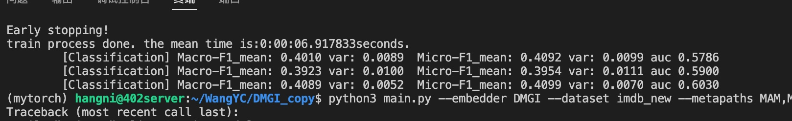

Patience = 50:

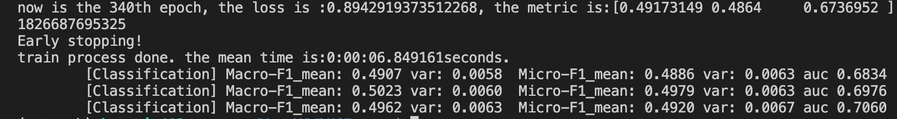

Patience = 100:

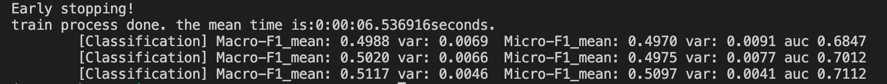

### 5.2 dblp

Patience = 30:

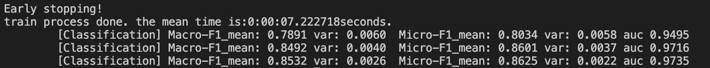

Patience = 50:

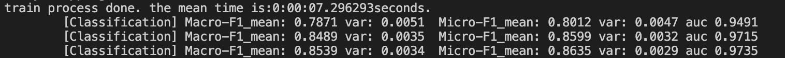

Patience = 100:

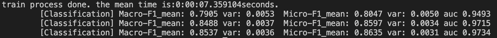

### 5.3 free_base

Patience = 30

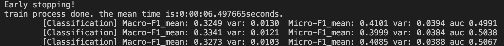

Patience = 50

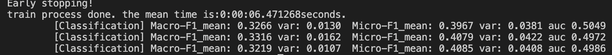

Patience = 100

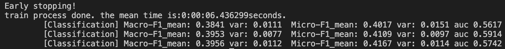

## 6. 问题

为什么consensus regularation里面的参照可以是一个可学习的参数？如果是将两个readout聚合起来不是更合理吗？

