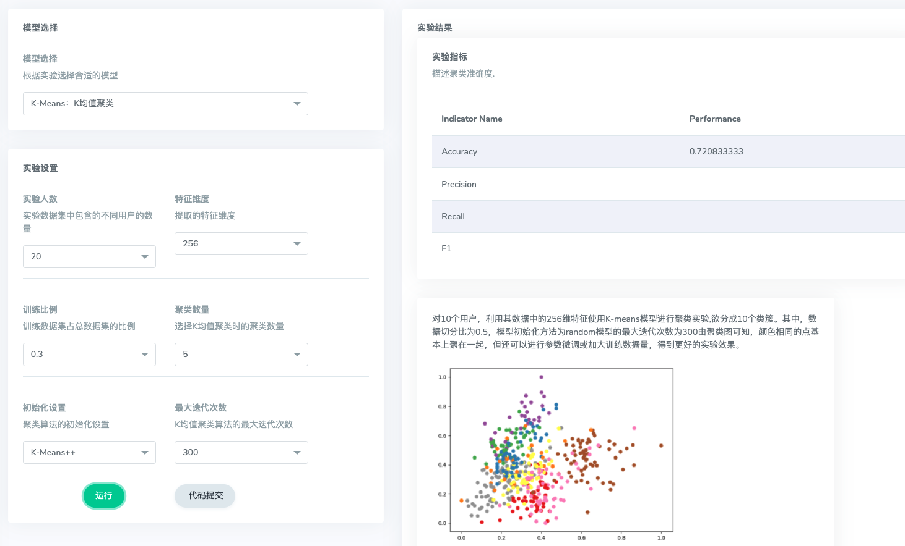
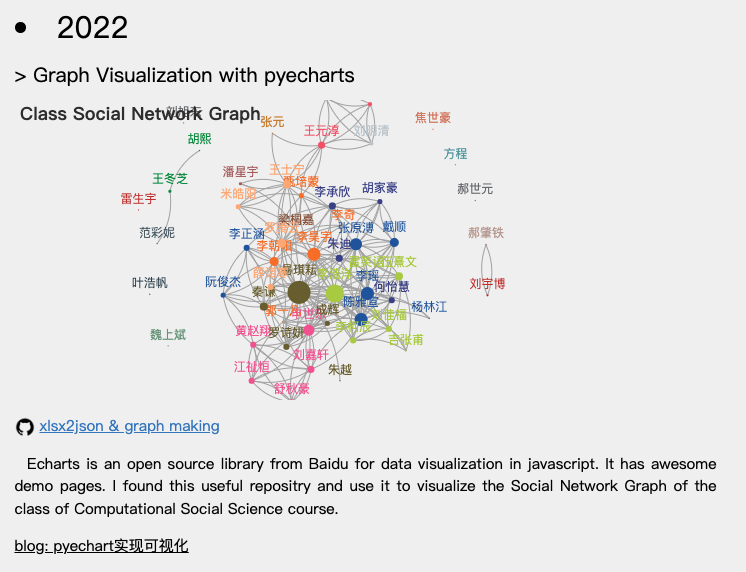

# 计算社会学 虚拟仿真平台观察实验&验证实验

> by 王元淳 2019300099
>
> @Apr.24th 2022

实验平台：http://lab.ai-mate.co/home/

## 一、智慧社区

### 1.1 基于WIFI的动态物体行为感知

基于WiFi的人体行为感知的基本原理是：WiFi信号在传播过程中遇到障碍物会发生反射，折射，衍射以及散射等现象，人体的不同行为对信号传播造成不同程度的扰动，通过分析接收信号的扰动变化特征，便可感知信号传播过程中所遇到人体的状态。

这里定义了菲涅尔区，为一个以发射器和接收器为焦点的同心椭圆。

信号扰动的变化特征为：

物体位于奇数菲涅尔区边界→→反射路径长度与直射路径长度相差奇数倍半波长→→信号经反射后行为改变π→→信号叠加增强
物体位于偶数菲涅尔区边界→→反射路径长度与直射路径长度相差奇数倍半波长→→信号经反射后行为改变π→→信号叠加减弱

也就是说我们可以通过观察信号的扰动情况来判断物体在制定区域内的动态。

我们可以通过调整子载波以及数据处理方法来优化我们的装置，使动态物体在菲涅尔区中的位置变化引起信号变化更明显。

由于实验平台问题，无法看到验证结果。

### 1.2 呼吸检测

模块暂未开放。

### 1.3 基于行为数据的用户身份识别

#### 1.3.1 实验分析：

本技术的研究背景为在越来越多的基于生物信息来进行身份验证的场景下会出现信息不安全、识别不准确等问题。

用来识别的特征信息：

18维宏观特征分别为：步长，步态周期，一个周期内躯干速度的最大值、最小值、均值、方差，胳膊速度的最大值、最小值、均值、方差，腿速度的最大值、最小值、均值、方差，脚速度的最大值、最小值、均值、方差；238维微观特征分别为：119维的加速阶段频谱能量分布，119维的减速阶段频谱能量分布。

我的理解大概就是一个利用图神经网络的聚类分析以及节点分类问题。

提供的算法也大概就是很常见的KNN、Kmeans等。

#### 1.3.2 实验情况：

实验平台不是很灵敏，有时候运行会刷新，大多数时间则是改变参数运行后没有什么变化。

但是我大概可以说一下预期的实验结果。。。

大概就是特征维度越多，分类依据就越多，聚类效果就会越好。

训练集验证集测试集的比例这个，一般是2:3:5比较好？不同的说法也很多。

聚类数量就是体现在颜色的种类上了，这个根据需求定就好。

算法的话kmeans肯定比random要好一点。

最大迭代次数我认为越多越好。

## 二、智慧城市

### 2.1 地址推荐

#### 2.1.1 实验分析：

商业选址的研究，大多基于地理信息服务、POI数据等多元异构信息来选择其最佳位置。具体地，它们首先从多元数据中提取信息来获取各个方面的特征：地理特征（密度、竞争性等）、移动性特征（区域流行度、流入流量等）以及待选址店铺自身特征等，然后利用这些特征进行**线性回归、矩阵分解或迁移学习**等来推荐商业地址。

整体来看就是一个分类预测模型。

评价一个模型的效果是否良好就是看预测的餐馆类别是否在推荐地址列表中。

本实验中分别采用了两个指标进行评价：

 1) HR：它可视化测试集中的餐馆类别u的地址i是否在u的推荐地址列表中。它依赖于推荐列表的长度，假设系统给餐馆类别的推荐列表长度为N，HR为命中次数/列表长度，其中，若在测试集中出现的餐馆类别u与地址i交互，并且地址i出现在了餐馆类别u的推荐地址列表中，则说明该算法命中（u，i）组。随着列表长度的增加，命中率也会增加，最大取值为1。

​    2) NDCG：它是用来衡量排名质量的指标。推荐的地址列表每一项都会有一个相关的评分值，将这些分数相加。另一方面，我们更愿意看到位于列表前面最相关的项，因此，在这些分数相加之前，将每一项除以一个递增的数（通常是该项位置的对数值），得到DCG。

#### 2.1.2 实验情况

可以看出通过调整lr，NDCG的变化情况较为明显，而对HR的影响不是很大。

至于算法的选择上：

每种算法对于推荐列表长度都比较敏感，通常推荐列表长度越大，模型效果就会越好。

其中：

1. svd奇异值分解算法会对正则化系数有较大的依赖，取0.1的效果会不如0.05以及以下。
2. DMF的batchsize提供了64和128两个选择，通过结果看到batchsize变大反而效果变差了。
3. knn可以选择邻居个数，可以看到邻居数量越多，效果就越好。

### 2.2 共享单车投放规则

#### 2.2.1实验分析：

此研究课题面向的社会场景就是在选择共享单车投放点的时候进行智慧优化，让资源更好地调度。

用到了LR和RNN。

RNN循环神经网络对处理时序问题有较好的表现。

#### 2.2.2 实验情况：

可以看到可调整的参数有输入序列长度（第一层输入的维数）、epoch、unit数量以及优化器。

经过实验得到以下结论：

epoch对整个算法的影响程度较大，但是随着epoch提升，效果的提升会不再那么显著，我认为这是因为防止出现过拟合而设计的earlystopping机制对训练进行了中断。

神经元数量对结果的影响也较大，最大可以选择1024个神经元，这时各个模型的表现都基本上会达到同模型最好的状态。

## 三、社交网络计算

### 3.1 网络生成

#### 3.1.1 实验分析：

实验内容主要是研究复杂网络的生成算法。

其中包括BA、ER、WS小世界网络生成算法。

#### 3.1.2 实验情况：

可以看到选择了特定的模型以后，可以自行设置生成的节点的数量以及初始节点的数量。

每次生成后，实验结果会显示整个网络如何通过初始节点一点一点传播到整个网络。

不同的模型生成出来的网络有不同的特点：

1. BA生成的是最普通的邻接图。
2. WS生成链接关系较为复杂的环形图。
3. ER生成关系较为简单的环形图。

### 3.2 信息传播

这项技术面向的社会问题主要是针对假消息传播现象，研究信息在社交网络中如何传播。

影响信息可传播的广度的因素有许多，首先，信息本身的质量是很重要的指标，有事实依据经过理性分析的结论总是要比漫无天际毫无依据的猜想更让人信服；其次，初始用户的数量和质量也在其中起着关键的作用，明星、大V们总是随便发条微博就可以上热搜，然而如果我们想登上热搜榜就必然要联系某些线上媒体让他们帮我们炒作，来使更多人知道我们发布的内容；再比如，用户节点的易感染性也是很关键的，“圣诞老人会翻过烟囱在平安夜为你带来礼物”的故事总是令儿童深信不疑，成年人却心知肚明。以上所讲仅是信息传播的部分影响因素，在真实社交网络中还有各种各样不易被发觉的因素对信息传播有着重要影响。

在本节我们将一同探究信息在社交网络中是如何传播的，并对如何实现影响力最大化进行拓展探究。

由于平台无法正常显示结果，因此没有做更进一步的尝试。

### 3.3 网络可视化

这个项目我自己也在课堂展示上做过更深一步的探索，详见：

http://www.wyc-personal.cn/blogPages/%E8%A7%A3%E6%9E%90xlsx%E7%94%9F%E6%88%90json%20+%20pyecharts%E5%8F%AF%E8%A7%86%E5%8C%96.html

